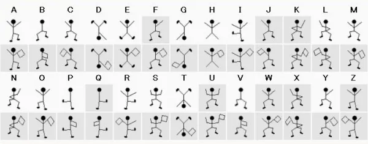
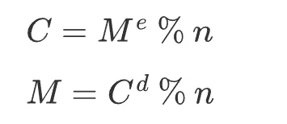

## 楔子

本次来聊一聊如何用 Python 实现 RSA，我们知道 RSA 是一种非对称加密算法，并且应用非常广泛，比如 HTTPS。所以在介绍 RSA 之前，需要先解释一下什么是对称加密和非对称加密。

## 对称加密

在重要信息的传递过程中，人们总是希望信息不会被偷看、不会被篡改，伪造等。为了达到这个要求人们一直在不断努力着。

电报加密所使用的密码本，就是初代网络安全所使用的加密方式，用法为：发信时将内容翻译为密文发出，收到电报的一方，使用相同的密码本才能解密出正确的信息，否则看到的就是一堆乱码。

这种传统的加密方式叫做对称加密，而对称加密所使用的算法包括：DES、3DES、AES、DESX、Blowfish、RC4、RC5、RC6，这些算法就可以看成密钥、或者理解为上面的密码本。这些算法也被称为: "对称加密算法"或者"传统加密算法"，一方使用算法进行加密，然后另一方使用相同的算法进行解密。

我们以《福尔摩斯探案集之跳舞的小人》一案中出现的小人为例。



每一个小人都代表一个英文字符，至于小人手中的旗子则是用来分隔单词的、也就是表示一个单词的边界。传递信息的时候，将信息用小人来代替，然后另一方看到小人的时候，再将出现的小人解析成信息。顺便一提，剧中的女主是黑帮首领的女儿，犯人就是使用这些小人来向女主传递信息，威胁她回去。

这些小人和英文字符之间的对应关系就相当于密钥，此时就属于对称加密。因为无论是发信人还是收信人，使用的是相同的密钥，即：小人代表的含义都是一样的。

因此不难看出，对称加密的安全性非常依赖于密钥，泄漏密钥就意味着任何人都可以对发送或接收的消息进行解密，所以密钥的保密性对通信安全来说至关重要。福尔摩斯在解析出这些小人代表的含义之后，用这些小人发送信息将犯人引诱了出来。因此对于这种对称加密来说，密钥的安全是极其重要的。

**那么对称加密有哪些优缺点呢？**

- 优点：计算量小、加密速度快、加密效率高；
- 缺点：密钥需要传递，难以确保密钥安全性。缺乏签名功能，不能核对发信人身份；

## 非对称加密

在对称加密中，密钥（也就是使用的加密算法，如发电报时的密码本、小人和英文字符的对应关系）的保密性至关重要。战争时期，电报密码本需要通过人工渠道传递，这样发报双方才能放心地使用。

但在如今的网络通信中，显然不可能再使用人工渠道的方式来传递密钥，只有通过网络来传递才高效快捷。这样就有了一个矛盾：密钥是用来保证网络传输安全的，这个对于网络安全至关重要的密钥又需要网络来传递给对方。

保存密钥最安全的方式就是不告诉任何人，不进行传递，但对称加密中，解密方必须要得到对应的密钥，这就又要求密钥必须进行传递，可一旦传递密钥就有丢失的风险。这个"鸡生蛋、蛋生鸡"的问题一直困扰着人们，直到出现了一种算法，这套算法生成的密钥分为两个部分：公钥和私钥。

这个一分为二的密钥对有如下特点：

- 公钥和私钥是一个算法中两个不同、但内在又相关联的参数集合，同时生成，但可以独立使用；
- 公钥加密的数据只有对应的私钥才可以解密（公钥加密后公钥也不能解密）；
- 私钥加密的数据也只有对应的公钥才可以解密；


常见的非对称加密算法有：RSA、DSA、ECC、Diffie-Hellman、El Gamal 等。

## RSA 算法概述

对称加密的模式很好理解，但非对称加密算法的上述特点却让我们感觉很神奇，下面就来简单看看，上述这些特点在数学上是怎样实现的吧。在非对称加密算法中 RSA 是使用最广泛的一种，我们就以 RSA 为例，一会儿再介绍怎么用 Python 实现它。

RSA 算法是 1977 年由共同在麻省理工学院工作的罗纳德·李维斯特（Ron Rivest）、阿迪·萨莫尔（Adi Shamir）和伦纳德·阿德曼（Leonard Adleman）一起提出的。RSA 就是他们三人姓氏开头字母拼在一起组成的。

RSA 加密利用了"单向函数"正向求解很简单，反向求解很复杂的特性。思想如下：

- `p1*p2 = n`，已知 p1、p2 求 n 简单，已知 n 求 p1、p2 很难；
- `(m^e) % n = c`，已知 m、e、n 求 c 简单，已知 e、n、c 求 m 很难；

这个应该很好理解，然后是 RSA 的工作原理，以下是 ChatGPT 告诉我的，我们不懂也没关系。

- 选择两个大的质数 p 和 q，且通常这两个数的大小相近。
- 计算这两个数的乘积 n = p \* q，这个 n 将作为公钥和私钥的一部分。
- 计算 n 的欧拉函数 ϕ(n) = (p - 1) * (q -1)。
- 选择一个整数 e，使得 1 < e < ϕ(n) 且 e 与 ϕ(n) 互质，e 通常选取65537，因为它是一个质数，且为形式为 2 的幂次方加 1。
- 计算 e 关于 ϕ(n) 的模逆元 d，即找到 d 使得 e * d = 1 % ϕ(n)。

然后便可得到公钥 (e, n) 和私钥 (d, n)，而它们满足如下关系。



其中 M 是明文，C 是密文，明文 M 用公钥加密得到密文 C，密文 C 用私钥解密得到明文 M。当然这个过程反过来也是一样，也可以用私钥进行加密，公钥进行解密，这个过程一般用作签名。

RSA 算法的安全性基于 RSA 问题的困难性，也就是基于大整数因子分解的困难性上。这种算法非常可靠，密钥越长，它就越难破解。根据已经披露的文献，目前被破解的最长 RSA 密钥是 768 个二进制位。也就是说，长度超过 768 位的密钥，还无法破解（至少没人公开宣布）。因此可以认为，1024 位的 RSA 密钥基本安全，2048 位的密钥极其安全。

非对称加密的算法比对称加密要复杂且耗时，位数越多越耗时。因此在实际使用中，一般是先用非对称加密过程传递对称加密的密钥，之后再使用对称加密来保证后续的通信，这样安全性与速度就可以达到一个平衡，HTTPS 所使用的就是这种方式。

## Python 实现 RSA

首先需要安装一个库：pycryptodome，直接 pip 安装即可，这个库里面包含了大量实现好的加密算法。

```python
from Crypto.PublicKey import RSA
from Crypto.Cipher import PKCS1_OAEP
import binascii

def generate_keys():
    # 生成长度为 2048 的秘钥
    key = RSA.generate(2048)
    # 生成公钥
    private_key = key.export_key()
    # 生成私钥
    public_key = key.publickey().export_key()
    return private_key, public_key

def encrypt_message(public_key, message):
    cipher = PKCS1_OAEP.new(RSA.import_key(public_key))
    # 使用公钥加密，得到密文（bytes 对象）
    encrypted_message = cipher.encrypt(message.encode())
    # 一般会转成十六进制进行传输
    return binascii.hexlify(encrypted_message).decode()

def decrypt_message(private_key, encrypted_message):
    cipher = PKCS1_OAEP.new(RSA.import_key(private_key))
    # 解密
    decrypted_message = cipher.decrypt(
        binascii.unhexlify(encrypted_message)
    )
    return decrypted_message.decode()

# 生成密钥
private_key, public_key = generate_keys()
message = "高老师总能分享出好东西"
# 使用公钥加密
encrypted = encrypt_message(public_key, message)
print(encrypted)
"""
41bc8709cb82e1f9a13d18f101538c536f760210c11···
"""
print(len(encrypted))
"""
512
"""
# 使用私钥解密
decrypted = decrypt_message(private_key, encrypted)
print(decrypted)
"""
高老师总能分享出好东西
"""
```

以上就是使用 Python 实现 RSA 算法。