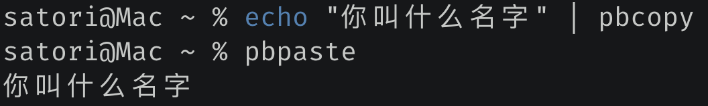
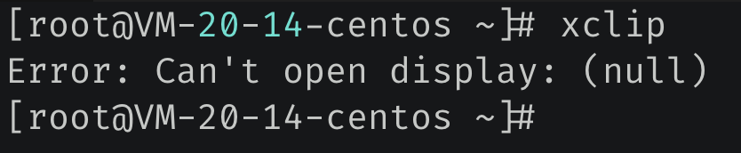

## 楔子

pandas 里面有一个 pd.read_clipboard 函数，可以根据你复制的内容生成DataFrame。是的，就是我们平时选中，然后 Ctrl+C 时拷贝的内容。所以比较神奇，那么 pandas 到底是怎么做到的，它是怎么读出我们使用 Ctrl +C 复制的内容呢。

看了一下源码，不同的操作系统使用的复制方式不同，Windows 比较复杂，方法是使用了ctypes，然后调用了操作系统的一个动态库实现的；而 macOS 和 Linux 比较简单，调用的是内置的命令。

下面我们来看看如何在这三个系统上实现复制粘贴的功能。

## Windows 上的复制粘贴

我们说 Windows 是使用 ctypes 调用动态库实现的，比较麻烦。但是我们知道 Python 有一个 pywin32 模块，对于 Windows 操作系统提供的接口进行了封装。所以在 Windows 上我们会使用 pywin32 来实现复制粘贴功能。

该模块直接通过 pip install pywin32 安装即可。

~~~python
import win32clipboard as wcb
import win32con as wc

# 打开复制粘贴板
wcb.OpenClipboard()
# 我们之前可能已经 Ctrl + C 了
# 这里是清空目前 Ctrl + C 复制的内容
# 但显然没有这一步也无所谓，因为第二次复制会覆盖第一次复制的内容
wcb.EmptyClipboard()
# 将内容写入复制粘贴板，第一个参数是 win32con.CF_TEXT
# 第二个参数是要复制的内容，编码的时候指定为 "gbk"
wcb.SetClipboardData(wc.CF_TEXT, "古明地觉".encode("gbk"))
# 关闭复制粘贴板
wcb.CloseClipboard()
~~~

然后 Ctrl+V 粘贴就会得到 "古明地觉" 这个字符串，另外编码的时候要使用 gbk，因为我当前操作系统默认编码使用的是 gbk，所以会对输入的字节使用 gbk 解码。因此如果使用 utf-8 编码的话，那么粘贴之后得到的就会是乱码。当然具体编码根据你当前的机器决定。

复制我们实现了，下面来看看怎么实现粘贴。

```python
import win32clipboard as wcb
import win32con as wc

wcb.OpenClipboard()
# 获取粘贴板内容，既然是获取，那么只需要一个参数即可
# 会返回已经使用 Ctrl + C 复制的内容
data = wcb.GetClipboardData(wc.CF_TEXT)
# 关闭复制粘贴板
wcb.CloseClipboard()

# 然后随便 Ctrl+C 拷贝一段内容
# 下面就会将拷贝的内容打印出来
print(data.decode("gbk"))
```

还是很简单的，我们上面使用的模块是 win32 系列，所以它只适用于 Windows 系统。那如果我想在 Linux 和 macOS 中实现怎么办呢？也很简单，事实上，这两个系统实现起来反而会更简单，因为自带了相关的命令。

## macOS 上的复制粘贴

macOS 自带了相关命令，我们只需要通过 subprocess 模块去调用即可，举个例子：



非常简单，那么代码要如何实现呢？

~~~python
import subprocess

# 实现拷贝
def copy(text):
    p = subprocess.Popen(["pbcopy", "w"],
                         stdin=subprocess.PIPE,
                         close_fds=True)
    # 将内容拷贝起来，注意 macOS 的编码默认是 utf-8
    p.communicate(input=text.encode("utf-8"))

# 实现粘贴
def paste():
    p = subprocess.Popen(["pbpaste", "r"],
                         stdout=subprocess.PIPE,
                         close_fds=True)
    stdout, stderr = p.communicate()
    # 返回粘贴内容
    return stdout.decode("utf-8")

copy("古明地觉的编程教室")
print(paste())  # 古明地觉的编程教室
~~~

以上代码在 macOS 上执行，由于自带了复制粘贴相关的命令，操作起来就比 Windows 方便多了。

## Linux 上的复制粘贴

Linux 也提供了复制粘贴的命令，叫 xclip，但这个命令不是自带的，我们需要使用 yum 安装。

```python
import subprocess

# 实现拷贝
def copy(text):
    p = subprocess.Popen(
        ["xclip", "-selection", "c"], 
        stdin=subprocess.PIPE, close_fds=True
    )
    p.communicate(input=text.encode("utf-8"))

# 实现粘贴   
def paste():
    p = subprocess.Popen(
        ["xclip", "-selection", "c", "-o"], 
        stdout=subprocess.PIPE, close_fds=True
    )
    stdout, stderr = p.communicate()
    return stdout.decode("utf-8")  
```

但其实在 Linux 上通过命令实现复制粘贴没什么意义，因为我们都是通过 SSH 远程连接到公司的服务器，这种情况下 xclip 是不生效的。



当然，感觉这个功能也没多大用，当做兴趣了解一下就行。

## pyperclip 实现复制粘贴

最后我们再来介绍一个模块，叫 pyperclip，它对不同的操作系统的复制粘贴功能进行了封装，可以简化我们的操作。举个例子：

~~~python
import pyperclip

# 复制
pyperclip.copy("哼哼")
# 粘贴
print(pyperclip.paste())  # 哼哼 
~~~

还是很方便的，以后就可以使用这个模块，自动帮我们屏蔽了操作系统间的差异。另外，这个模块只支持复制文本。