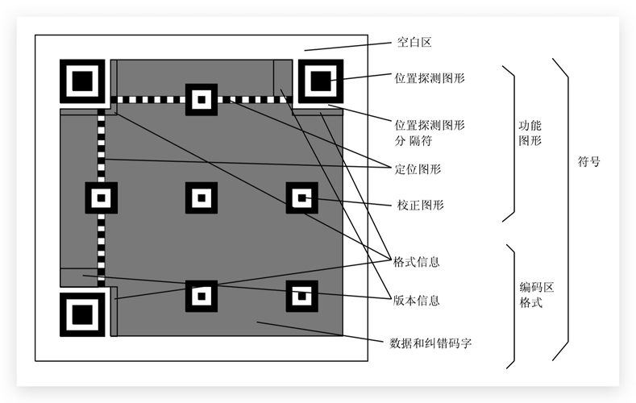

## 楔子

二维码在我们的生活中可以说是必不可少的，不单单是手机支付，其它很多地方也都需要扫描二维码，比如健康宝。那么下面我们就来看看如何使用 Python 来生成二维码，以及识别二维码。

关于二维码，我们来说一下它的结构。当然关于二维码的结构其实不是太重要，这里只是提一下，没兴趣可以不用看。



从图中我们可以看出，二维码结构整体可以划分为功能图形和编码区两大部分，功能图形又细分为：空白区、位置探测图形、位置探测图形分隔符、定位图形、校正图形；而编码区细分为：格式信息、版本信息、数据和纠错码字，来简单了解一下每一部分的功能：

- 空白区：留白，不需要做任何处理
- 位置探测图形：协助扫描软件定位二维码码
- 位置探测图形分隔符：区分功能图形和编码区
- 定位图形：指示标识密度和确定坐标系
- 校正图形：校正图形的数量和位置
- 格式信息：存放格式化数据的信息
- 版本信息：二维码的规格，二维码符号共有 40 种规格的矩阵
- 数据和纠错码字：实际保存的二维码信息和纠错码字（用于修正二维码损坏带来的错误）

## 生成二维码

生成二维码的话，Python 有两个第三方模块：qrcode 和 MyQR，可以帮我们生成二维码，下面来看一下这两个模块的用法。

生成比较简单的二维码就是，当我们扫描的时候，会自动跳转到某个页面。

~~~python
import qrcode
               
# 创建 QRCode 实例
qr = qrcode.QRCode()  

# 调用 add_data，指定 url。
qr.add_data("https://www.baidu.com/")
# 生成二维码图像，颜色为蓝色，背景色为粉色
img = qr.make_image(fill_color='blue', back_color='pink')
# 显示图像，会打开一个临时文件
img.show()
# 当然我们也可以保存到硬盘上
img.save("qrcode.png")

# 事实上这个 img 是通过 PIL 模块得到的
# 所以也可以将它保存为图片对应的字节流
from io import BytesIO

buf = BytesIO()
img.save(buf)  # 将字节流保存到buf里面
with open("qrcode2.png", "wb") as f:
    # 和直接保存为 qrcode.png 是一样的
    f.write(buf.getvalue())  
~~~


此时我们就生成了一个二维码，当扫描该二维码的时候就会跳转到百度。另外我们在 add_data 中指定的是一个 url，我们也可以不指定 url，而是指定一段文字。这样的话，当扫描的时候就会显示我们输入的文字。

最后再来说一下 QRCode 这个类，它里面还支持一些参数，我们看一下。

+ version：二维码的格子大小，可以是1到 40。值越大，格子越大，一般不超过 10，选择 3 比较合适。
+ error_correction：能够容忍的错误率，可选值如下。
  + qrcode.constants.ERROR_CORRECT_M，默认值，允许小于 15% 的错误率。
  + qrcode.constants.ERROR_CORRECT_L，允许小于 7% 的错误率。
  + qrcode.constants.ERROR_CORRECT_H，允许小于 30% 的错误率。
+ box_size：二维码每个小格子包含的像素数量。
+ border：二维码到图片边框的小格子数，默认值为 4。

参数可以根据实际情况进行选择。

以上 qrcode 模块生成二维码，下面来看看 MyQR 生成二维码，它和 qrcode 相比，最大的特点就是可以嵌入图片当背景。

~~~python
from MyQR import myqr

# 主要用到以下几个参数
# words: 可以是一个链接，或者你想说的话(不支持中文)
# picture：你用到的图片，作为背景，不然只是一个光秃秃的二维码
# colorsize：True，表示生成彩图
# save_name：表示生成的二维码图片的名字
myqr.run(words="http://www.bilibili.com",
         picture="satori.jpg",
         colorized=True,
         save_name="bilibili.png")
~~~


当扫描这个二维码的时候，就会跳转到 bilibili。值得一提的是，这里的图片还可以使用 gif 格式的动图，当然生成的图片也要是 gif 格式的。

另外这里生成的二维码都是跳转到一个网址，你也可以写上一段你想说的话，扫描之后会显示出来。但如果要支持中文的话，应该使用 qrcode。

## 解析二维码

除了使用 Python 生成二维码，还可以解析二维码，解析二维码也有两个模块，一个是 zxing，一个是 pyzbar。

首先是 zxing，这个模块有点让人尴尬，因为这个模块调用的是 Java 的接口。也就是说解析二维码的底层工作是 Java 做的，Python 只是负责调用，所以使用这个模块的时候需要你本地有 Java环境。

```python
>>> import zxing
>>> reader = zxing.BarCodeReader()
>>> barcode = reader.decode('bilibili.png')
>>> barcode.parsed
'http://www.bilibili.com'  # 是可以解析出来的
>>>
```

然后看看 pyzbar 模块，这个模块就不需要 Java 了，直接使用 Python 即可。

```python
from PIL import Image
from pyzbar import pyzbar

im = Image.open("bilibili.png")
print(pyzbar.decode(im))
# 返回的信息还是很多的
"""
[
     Decoded(data=b'http://www.bilibili.com',
             type='QRCODE',
             rect=Rect(left=35, top=35, width=263, height=264),
             polygon=[Point(x=35, y=35), Point(x=35, y=297), 
                      Point(x=297, y=299), Point(x=298, y=35)])
]
"""

# 拿到内容
print(
    pyzbar.decode(im)[0].data.decode("utf-8")
)  # http://www.bilibili.com
```

两个模块都是可以正常解析的，以上就是 Python 关于二维码的一些操作。