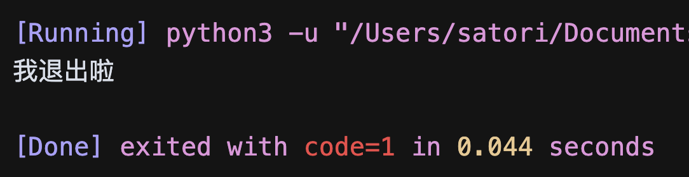
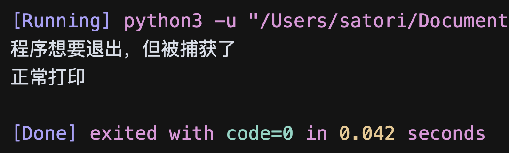
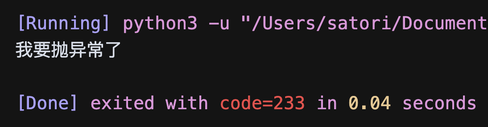
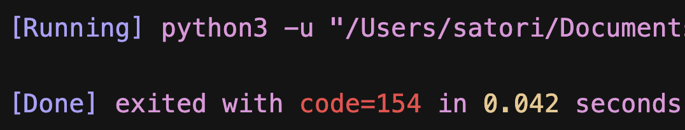

如果想主动退出 Python 程序，那么可以使用 exit, quit, sys.exit, os._exit 这四个函数，而这些函数之间有什么区别呢？

首先来说前三个，exit, quit, sys.exit 退出程序的原理是一样的，只不过 exit 和 quit 用在交互式环境中，sys.exit 用在非交互式环境中。当然啦，无论是交互式还是非交互式，这三个函数都是适用的。至于这个三个函数所做的事情，实际上就是 raise 一个 SystemExit 异常。如果没有捕获这个异常，那么程序就会退出。

```python
import sys
sys.exit(100)
print("程序退出，这里不会打印")
```

当执行 sys.exit 的时候，会抛出 SystemExit，这里我们没有捕获它，所以程序会退出。并且函数接收一个整数，表示程序退出时的状态码。


这里我用的 Cursor，结尾会显示程序退出时的状态码，可以看到结果是我们设置的 100。一般来说，如果程序正常退出，那么状态码为 0；程序执行出错，状态码为 1。当然啦，如果是解释器执行时内部出问题了，那么会抛出一个乱七八糟的状态码，不过这种情况基本只有在写 C 扩展的时候才会遇到。。

我们说 quit, exit, sys.exit 都可以接收一个整数，表示退出时的状态码。但如果接收的不是整数，那么会将参数作为打印信息输出到 stderr（标准错误输出）中，然后退出程序，并且状态码为 1。

~~~Python
import sys
sys.exit("我退出啦")
~~~

执行一下看看。



这三个函数的工作原理是 raise 一个 SystemExit 异常，那如果将其捕获了，程序是不是就不退出了，答案是肯定的。

~~~Python
import sys

try:
    sys.exit(100)
except SystemExit:
    print("程序想要退出，但被捕获了")
print("正常打印")
~~~

执行一下，看看结果。



结果确实如我们所料，将 sys.exit 引发的异常捕获掉之后，程序正常执行。所以最后状态码是 0，因为程序是正常结束的。那么问题来了，我们能不能手动抛一个 SystemExit 呢？

~~~Python
print("我要抛异常了")
raise SystemExit(233)
print("此处不会执行")
~~~

SystemExit 里面也可以接收一个整数，会作为状态码返回；如果接收的不是整数，那么会将参数作为打印信息输出到 stderr 当中，并且状态码为 1。



和 sys.exit 的表现是一样的，因为 sys.exit 本质上就是 raise 一个 SystemExit。并且我们看到在 raise SystemExit 的时候，并没有出现异常回溯栈，或者说没有看到 Traceback (most recent call last): 这样的字眼。所以说 SystemExit 是不像异常的异常，因为没有任何的错误信息出现。并且注意：SystemExit 继承自 BaseException，不是 Exception。

因此结论很清晰了，sys.exit 是通过引发 SystemExit 异常来退出程序的，我们可以捕获此异常做一些清理工作，甚至可以阻挠程序退出。当然，quit 和 exit 这两个内置函数也是同样的工作原理，只不过它们一般用在交互式环境中，但非交互式环境也能用。

~~~python
try:
    exit("我想退出")
except SystemExit:
    print("exit，别做梦了")

try:
    quit("我想退出")
except SystemExit:
    print("quit，别做梦了")

exit("这下我真的退出了")
~~~

前面三个退出函数我们就说完了，再来看看最后一个，也就是 os._exit。它就比较厉害了，在底层会调用 C 语言的 exit 函数，相当于强制退出。

~~~Python
import os

try:
    os._exit(233)
except Exception:
    print("会打印吗")
print("会打印吗")
~~~

下面的 print 会打印吗？执行一下看看。



并没有执行，因此 os.\_exit 属于强制退出，无法被阻止。因此它一般用于子进程的退出，我们在主进程中退出的话一般使用 sys.exit。

最后 os.\_exit 还有一个不同的地方，就是它必须接收一个整数作为退出时的状态码，否则报错。

~~~python
import os

try:
    os._exit("xx")
except TypeError as e:
    print(e)
print("正常执行")
"""
an integer is required (got type str)
正常执行
"""
~~~

此时程序是可以正常执行下去的，因为 os.\_exit 接收的参数类型不对，导致该函数并没有执行，而是直接抛出了 TypeError。

以上就是这几个退出函数之间的区别。