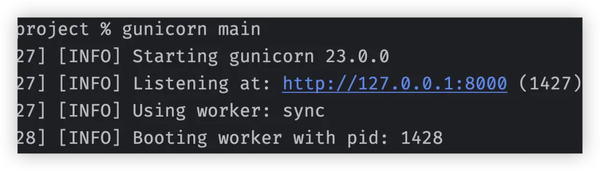
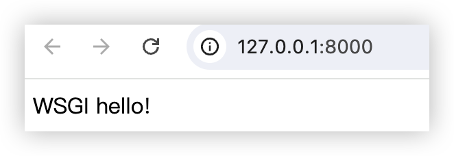
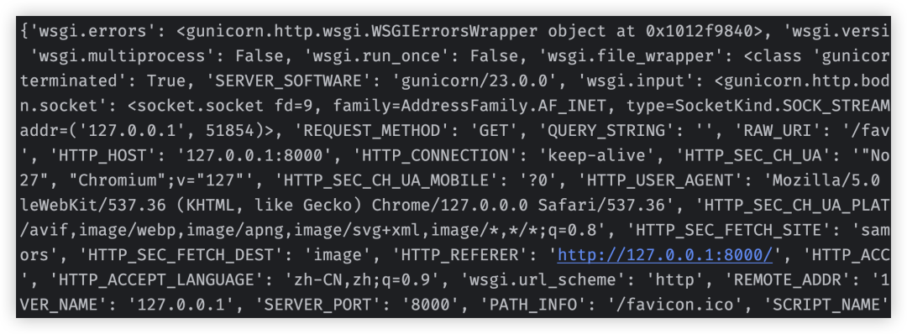
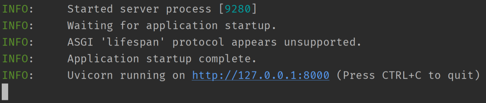
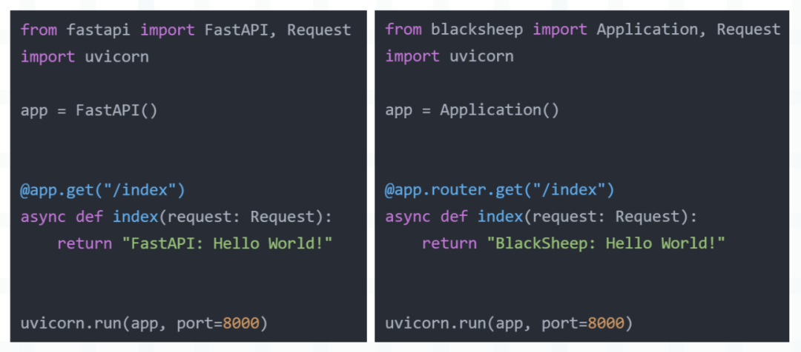
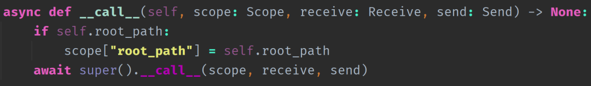
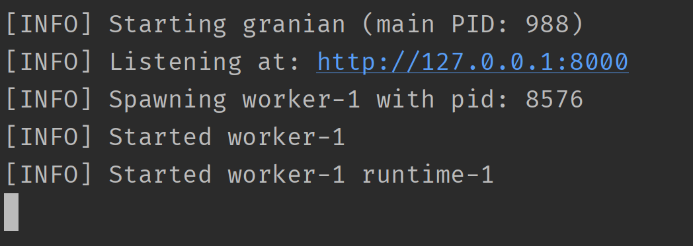

本篇文章推荐个好东西，它就是 granian，不过在介绍之前，需要先补充一些背景知识。在学习 Python Web 开发时，我们肯定会接触到以下几个概念。

- WSGI
- uwsgi
- uWSGI
- Nginx

那么它们之间有什么区别呢？这里总结一下。

<font color="darkblue">**WSGI**</font>

WSGI 的全称是 Web Server Gateway Interface（Web 服务器网关接口），是一种描述 Web 服务器和 Web 应用程序（使用 Web 框架，如 Django、Flask 编写的程序）进行通信的规范、协议。

由于任何一个框架编写的服务都必须运行在 Web 服务器上，所以这两者必须遵循相同的通信规范，而这个规范就是 WSGI。实现了 WSGI 协议的框架，我们称之为 WSGI 框架，实现了 WSGI 协议的服务器，我们称之为 WSGI 服务器。

<font color="darkblue">**uWSGI**</font>

一个实现了 WSGI 协议的 Web 服务器，将使用 Web 框架编写好的应用部署在 uWSGI 服务器上是可以直接对外提供服务的。当然 WSGI 服务器除了 uWSGI 之外，还有 Gunicorn 等等，它们不仅实现了 WSGI 协议，还实现了 uwsgi 协议和 HTTP 协议。

<font color="darkblue">**Nginx**</font>

同样是一个 Web 服务器，但它相比 uWSGI 可以提供更多的功能，比如反向代理、负载均衡、缓存静态资源、对 HTTP 请求更加友好，这些都是 uWSGI 所不具备或者不擅长的。

所以我们将 Web 服务部署在 uWSGI 之后，还要在前面再搭一层 Nginx。此时 uWSGI 就不再暴露 HTTP 服务了，而是暴露 TCP 服务，因为它是和 Nginx 进行通信，使用 TCP 会更快一些，Nginx 来对外暴露 HTTP 服务。

<font color="darkblue">**uwsgi**</font>

Nginx 和 uWSGI 通信所采用的协议，因为 uWSGI 是和 Nginx 对接，所以这两者也要遵循相同的协议，这个协议就是 uwsgi。对于一个 HTTP 请求，Nginx 在收到之后，会进行判断。

- 如果请求的是静态资源，那么 Nginx 直接就处理了；
- 如果请求的是动态资源，那么会将请求转发给 uWSGI，然后再由 uWSGI 调用相应的 Web 服务进行处理，处理完毕之后将结果交给 Nginx，Nginx 再返回给客户端。

Nginx 内部有一个 HttpUwsgiModule 模块，它的作用就是让 Nginx 具备和 uWSGI 通信的功能。

-----

在 WSGI 之前，选择一个框架可能会限制 Web 服务器的可用接口的种类，因为两者之间没有标准化的接口，而 WSGI 则通过提供一个简单的 API 解决了这个问题。2004 年，随着 PEP-333 的出现，现已成为 Web 应用程序部署的实际标准。

我们来构建一个最简单的 WSGI 应用程序。

```python
# main.py
def application(env, start_response):
    print(env)
    start_response("200 OK", [("Content-Type", "text/html")])
    return [b"WSGI hello!"]
```

然后命令行输入 gunicorn main 即可启动。



可能有人好奇，只定义一个 application 函数就可以启动了吗？答案是的，WSGI 协议要求 Python 应用程序必须实现一个名为 application 的可调用对象，并且接收两个参数：一个是包含 HTTP 请求信息的字典对象，另一个是用于发送响应的回调函数。应用程序需要从请求字典中获取请求信息，然后使用回调函数将响应返回。

而服务器会自动调用 application，这是双方约定好的，由 WSGI 协议所规范。我们访问本地的 8000 端口，看看是否会正常输出。



结果正常，再来看看程序中的参数 env 的打印结果。



里面是一些请求信息，而从这些信息中可以看出，WSGI 只支持请求/响应生命周期。这意味着 WSGI 不能与长生命周期的连接协议（如 WebSocket）一起工作，并且也不支持异步工作负载。所以又有了 ASGI，它的定位和 WSGI 是相同的，但通过重新设计 API，使用协程解决了这个问题。ASGI 是 Python 异步 Web 应用程序和服务器之间的接口规范，是对 WSGI 规范的扩展和补充，旨在解决 WSGI 无法有效处理异步 IO 操作的问题。

因此相比 WSGI，ASGI 支持异步的应用程序和服务器，可以处理非阻塞式 IO 操作，包括长轮询、WebSockets、HTTP/2 等。它提供了一种标准化的接口，使得 Web 服务器和 Python 框架之间能以异步方式进行通信。

此外 ASGI 还规定了一些标准化的环境变量和协议，以确保不同的 Web 服务器和 Python 框架可以协同工作。与 WSGI 类似，ASGI 允许开发人员选择不同的 Web 服务器和 Python 框架，并且它们仍然可以互相兼容。

总之 ASGI 和 WSGI 干的事情是一样的，但 ASGI 在 WSGI 之上做了很多的扩展，让我们将上面的 WSGI 示例转换为 ASGI。

```python
# main.py
async def application(scope, receive, send):
    await send(
        {"type": "http.response.start",
         "status": 200,
         "headers": [(b"Content-Type", b"text/html")]}
    )
    await send({"type": "http.response.body", "body": b"ASGI hello!"})
```

ASGI 的 application 函数接收三个参数：

- scope：一个字典，包含了请求的头部字段；
- receive：协程函数，负责接收请求体数据；
- send：协程函数，负责向客户端响应数据；

那么如何启动上面这个程序呢？和启动 WSGI 程序需要 WSGI 服务器一样，要启动 ASGI 程序，自然也需要 ASGI 服务器。目前最流行的 ASGI 服务器是 uvicorn，它建立在 uvloop 和 httptools 之上，其中 uvloop 是 asyncio 事件循环的更高效实现，httptools 是一个高性能的 HTTP 解析库。

我们可以通过运行 pip install uvicorn 命令来安装它，另外由于 uvloop 不支持 Windows 平台，所以如果在 Windows 上使用 uvicorn，那么事件循环会退化为 asyncio。

然后通过 uvicorn main:application 即可运行应用程序。



到目前为止我们就了解了 ASGI 和 WSGI 是什么。然后 uvicorn 是一个 ASGI 服务器（实现了 ASGI 协议），而我们还需要一个 ASGI 框架，而不是在文件里面只写一个 application 协程（当然 ASGI 框架也是在此之上一点点搭起来的）。

至于 ASGI 框架有很多，像 FastAPI、BlackSheep，它们都是 ASGI 框架，实现了 ASGI 协议。至于用这些框架编写的服务，也必须运行在实现 ASGI 协议的服务器上，而 ASGI 服务器有 uvicorn、hypercorn 等等。

举个例子：



不管是 FastAPI 还是 BlackSheep，它们都支持 ASGI 协议，所以它们都可以跑在 uvicorn 服务器上面，甚至启动方式都是不变的。当然 uvicorn 既可以在命令行中启动，也可以在代码中调用 run 方法启动。

然后再补充一点，对于一个最简单的 ASGI 程序，只需定义一个协程函数便可以启动了。这就说明使用 FastAPI 创建的 app 对象，内部一定实现了 \_\_call\_\_ 方法，否则它无法像函数一样进行调用。



我们分析得没错，所谓的框架都是基于这个简单的协程函数一点点扩展得到的。

----

好，扯了这么多，下面要回归主题了，我们的主题是啥来着？对，granian，这位老兄干的事情和 uvicorn 是类似的，所以它也是一个 ASGI 服务器。

> 我的老天爷，一句话就能说完的事情，愣是扯了这么多，像不像网络上那些水视频的，视频过了一半才开始说重点。

那么问题来了，granian 相比 uvicorn 有啥优势吗？很明显，优势当然是有的，但即便抛开优势不谈，我们也应该把目光转向 granian，因为它是使用编程语言界的原神 Rust 编写的。


众所周知，Rust 就如同当年的黄埔军校，从这里面出来的都自带光环。毕竟有了 Rust，性能和安全就有了保证，信 Rust，无 Bug【doge】。


不扯皮了，下面说一说 granian 的特点。

- 核心组件使用 Rust 编写，能够提供卓越的性能，并保证内存安全。
- 完全支持 Python 的异步编程模型，可以运行任何符合 ASGI 标准的 Python web 应用。
- 支持最新的 Web 技术和协议，比如 HTTP/2，以及 HTTP/3。
- 可以利用多核 CPU 提高并发处理能力。
- 使用简单，很容易集成到现有项目中。

下面我们来安装，直接 pip install granian 即可，然后测试一下。

```python
from blacksheep import Application, Request

app = Application()

@app.router.get("/index")
async def index(request: Request):
    return {"message": "Hello World"}
```

文件名为 main.py，我们在命令行中输入 granian main:app --interface asgi 即可启动服务。



因为 granian 实现了 ASGI 协议，所以 BlackSheep 依旧可以跑在 granian 上面。经过群友测试，ASGI 框架选择 BlackSheep，ASGI 服务器选择 granian，速度快到飞起。

然后再看一下 granian 的启动命令，里面有一个 --interface asgi，这就说明除了 ASGI 之外还支持其它的。没错，granian 支持 WSGI、ASGI、RSGI。

- WSGI：Web Server Gateway Interface
- ASGI：Asynchronous Server Gateway Interface
- RSGI：Rust Server Gateway Interface

我们演示一下这三者的区别：

~~~python
# WSGI
def wsgi_application(env, start_response):
    start_response("200 OK", [("Content-Type", "text/html")])
    return [b"WSGI hello!"]

# ASGI
async def asgi_application(scope, receive, send):
    await send(
        {"type": "http.response.start",
         "status": 200,
         "headers": [(b"Content-Type", b"text/html")]}
    )
    await send({"type": "http.response.body", "body": b"ASGI hello!"})

# RSGI
async def rsgi_application(scope, proto):
    assert scope.proto == "http"
    proto.response_str(
        status=200,
        headers=[
            ("content-type", "text/html")
        ],
        body="RSGI Hello!"
    )
~~~

启动命令如下：

- granian main:wsgi_application --interface wsgi
- granian main:asgi_application --interface asgi 
- granian main:rsgi_application --interface rsgi 

由于 RSGI 是 granian 自创的，目前的框架还不支持，因此使用 ASGI 就好。除了 --interface 之外，granian 还支持很多其它参数，比如：

- --host：监听的 IP；
- --port：监听的端口；
- --workers：进程数；
- ......

具体的参数可以通过 granian --help 查看，注释很详细。