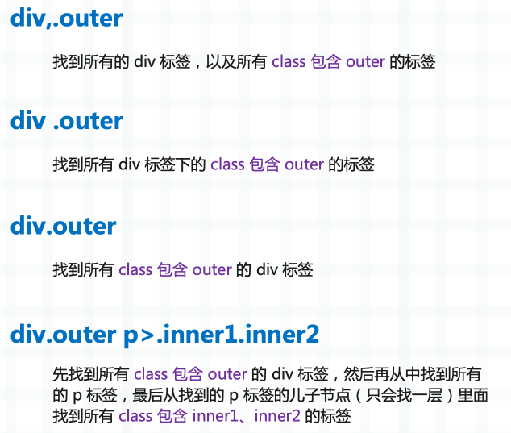

## 楔子

在工作中难免会遇到解析 HTML 的场景，比如将网页下载下来之后，要解析出里面图片的路径、指定标签里的文本等等。而 pyquery 专门负责做这件事，它是仿照 jquery 设计的，用起来非常方便。并且 pyquery 底层基于 lxml，而 lxml 是使用 Cython 实现的，所以 pyquery 的速度也有保证。

```python
from pyquery import PyQuery

html = """
<body>
    <p>
        古明地觉的编程教室
    </p>
</body>
"""
p = PyQuery(html)
print(type(p))
"""
<class 'pyquery.pyquery.PyQuery'>
"""
# 打印 PyQuery 对象会直接显示 HTML 内容
print(p)
"""
<body>
    <p>
        古明地觉的编程教室
    </p>
</body>
"""
```

我们在获取 HTML 之后，直接传递 PyQuery 中，然后通过属性选择器即可获取指定的内容。

另外除了传递 HTML 文本之外，还可以传递一个 URL，或者 HTML 文件。

```python
from pyquery import PyQuery

# 传递一个 url, 会自动调用 urlopen 下载内容
p1 = PyQuery(url="https://www.baidu.com", encoding="utf-8")
# 传递一个 html 文件, 会自动打开并读取
p2 = PyQuery(filename="1.html")
```

后两种方式其实不是很常用，我们一般还是会搭配 requests 或者 httpx，下载完页面之后直接丢给 PyQuery。

接下来我们看看如何筛选指定的标签，多说一句，我个人非常喜欢这个库，在解析 HTML 的时候首先想到的就是它。

## CSS 选择器

pyquery 是模仿 jquery 设计的，显然它也是通过类似于 CSS 选择器的方式进行筛选，下面介绍一些常用的选择器。

```Python
from pyquery import PyQuery

html = """
<body>
    <div class="div_cls1 div_cls2">
        <p>S 老师不想你们为了她两败俱伤</p>
        <p class="p_cls1">高老师总能分享出好东西</p>
        <div class="div_cls3">
            <p id="six_six_six">
                我也退了，都怪我说了不该说的
            </p>
        </div>
    </div>

    <div>
        <a href="http://www.me.org/bento/1.png"></a>
        <p>
            <a href="http://www.me.org/image/2.png"></a>
        </p>
    </div>

    <div class="div_cls1">
        <span>嘿嘿嘿</span>
    </div>
</body>
"""
p = PyQuery(html)
```

我们以上面这个 HTML 为例，来看看相关操作。

**基于标签进行选择**

```Python
# 选择所有的 p 标签
print(p("p"))
"""
<p>S 老师不想你们为了她两败俱伤</p>
        <p class="p_cls1">高老师总能分享出好东西</p>
        <p id="six_six_six">
                我也退了，都怪我说了不该说的
            </p>
        <p>
            <a href="http://www.me.org/image/2.png"/>
        </p>
    
"""
```

会选择所有指定的标签，并且包含标签里面的内容。

**同时选择多个标签**

在基于标签选择时，也可以同时选择多个标签。

```Python
# 选择所有的 p 标签和 a 标签
print(p("p,a"))
"""
<p>S 老师不想你们为了她两败俱伤</p>
        <p class="p_cls1">高老师总能分享出好东西</p>
        <p id="six_six_six">
                我也退了，都怪我说了不该说的
            </p>
        <a href="http://www.me.org/bento/1.png"/>
        <p>
            <a href="http://www.me.org/image/2.png"/>
        </p>
    <a href="http://www.me.org/image/2.png"/>
    
"""
```

多个标签之间使用逗号分隔，会将多个标签都筛选出来。

注意：筛选的标签之间是独立的，比如第二个 a 标签，它在 p 标签里面。我们筛选 p 标签的时候，已经将它内部的 a 标签筛选出来了，但在筛选 a 标签的时候又筛选出来一次，因此标签之间是独立的。

**选择指定标签下的子标签**

```Python
# 选择所有的 div 标签下的所有 a 标签
print(p("div a"))
"""
<a href="http://www.me.org/bento/1.png"/>
        <a href="http://www.me.org/image/2.png"/>
        
"""
```

多个标签使用空格分隔，表示筛选层级，比如 tag1 tag2 tag3，表示筛选所有 tag1 标签下的所有 tag2 标签下的所有 tag3 标签。

div a 表示从所有 div 的子孙节点中选择 a 标签，如果只希望从儿子节点中选择呢？

```Python
# 选择所有的 div 标签下的所有 a 标签，但只从儿子节点中选择
# 第二个 a 标签的外部套了个 p 标签，所以不符合筛选条件
print(p("div>a"))
"""
<a href="http://www.me.org/bento/1.png"/>
        
"""
```

当标签之间是空格，那么会从子孙节点当中选择；当标签之间是大于号，那么只会从儿子节点当中选择。

**按照 id 选择标签**

```Python
# 选择 id = "six_six_six" 的标签
print(p("#six_six_six"))
"""
<p id="six_six_six">
                我也退了，都怪我说了不该说的
            </p>
"""
```

id 在一个 html 中具有唯一性，所以有 id 属性的话，那么会非常好定位。

**按照 class 选择标签**

```Python
p = PyQuery(html)
# 选择 class 等于 "p_cls1" 的标签
print(p(".p_cls1"))
"""
<p class="p_cls1">高老师总能分享出好东西</p>
"""
```

选择所有 class 属性等于 p_cls1 的标签，但是注意，一个标签可以同时拥有多个 class。

```Python
print(p(".div_cls1"))
"""
<div class="div_cls1 div_cls2">
        <p>S 老师不想你们为了她两败俱伤</p>
        <p class="p_cls1">高老师总能分享出好东西</p>
        <div class="div_cls3">
            <p id="six_six_six">
                我也退了，都怪我说了不该说的
            </p>
        </div>
    </div>

    <div class="div_cls1">
        <span>嘿嘿嘿</span>
    </div>
        
"""
```

我们看到两个 div 都应用了 div_cls1 这个 class，因此它们都被筛选了出来。而第一个 div 除了 div_cls1，还应用了 div_cls2 这个 class。

那么问题来了，如果我们希望选择同时应用了 div_cls1 和 div_cls2 的标签该怎么做呢？

```Python
print(p(".div_cls1.div_cls2"))
"""
<div class="div_cls1 div_cls2">
        <p>S 老师不想你们为了她两败俱伤</p>
        <p class="p_cls1">高老师总能分享出好东西</p>
        <div class="div_cls3">
            <p id="six_six_six">
                我也退了，都怪我说了不该说的
            </p>
        </div>
    </div>
        
"""
```

我们看到此时就只获取了第一个 div，注意：.div_cls1 和 .div_cls2 之间不可以有空格，如果加上了空格，那么含义就变成了选择 .div_cls1 标签下面的 .div_cls2 标签。

所以 id、class、标签等选择器，它们可以搭配使用。比如说：



实际举例说明：

```python
# 找到所有 class 包含 div_cls1、div_cls2 的标签
# 再从其儿子节点中找到所有 class 包含 .div_cls3 的 div 标签
print(p("div.div_cls1.div_cls2>div.div_cls3"))
"""
<div class="div_cls3">
            <p id="six_six_six">
                我也退了，都怪我说了不该说的
            </p>
        </div>
        
"""
```

综上所述，pyquery 还是很强大的。

**选择是否具有指定属性的标签**

```python
# 选择具有 class 属性的 p 标签
print(p("p[class]"))
"""
<p class="p_cls1">高老师总能分享出好东西</p>
"""

# 选择具有 id 属性的 p 标签
print(p("p[id]"))
"""
<p id="six_six_six">
                我也退了，都怪我说了不该说的
            </p>
"""

# 选择 class="div_cls1" 的 div 标签
# 等号右面可以是双引号，也可以是单引号，也可以不加引号
print(p("div[class='div_cls1']"))
"""
<div class="div_cls1">
        <span>嘿嘿嘿</span>
    </div>
"""
# 注意：div[class='div_cls1'] 和 div.div_cls1 不同
# 前者要求 class 属性必须为 div_cls1
# 而后者要求 class 属性只要包含 div_cls1 即可


# 这些属性除了 id、class 之外, 也可以是其它的任意属性（随便写一个也可以）
# 下面选择所有具有 href 属性的 a 标签
print(p("a[href]"))
"""
<a href="http://www.me.org/bento/1.png"/>
        <a href="http://www.me.org/image/2.png"/>
"""

# 选择 href 等于某个 url 的 a 标签, 这里的 url 必须要使用引号包起来
print(p("a[href='http://www.me.org/bento/1.png']"))
"""
<a href="http://www.me.org/bento/1.png"/>
"""

# 还可以指定以 ... 开头
print(p("a[href^='http://www.me.org/image']"))
"""
<a href="http://www.me.org/image/2.png"/>
"""

# 指定以 ... 结尾
print(p("a[href$='2.png']"))
"""
<a href="http://www.me.org/image/2.png"/>
"""

# 包含 ...
print(p("a[href*='bento']"))
"""
<a href="http://www.me.org/bento/1.png"/>
"""
# 当然其它属性也可以，选择 class 包含 div_cls1 的 a 标签
# 此时 div[class*='div_cls1'] 和 div.div_cls1 是等价的
print(p("div[class*='div_cls1']") == p("div.div_cls1"))
"""
True
"""
```

**选择指定位置的标签**

```python
# 先选择所有 class 包含 div_cls1、div_cls2 的标签
# 然后从它的儿子节点中选择所有的 p 标签
print(p(".div_cls1.div_cls2>p"))
"""
<p>S 老师不想你们为了她两败俱伤</p>
        <p class="p_cls1">高老师总能分享出好东西</p>
"""
# 先选择所有 class 包含 div_cls1、div_cls2 的标签
# 然后从它的儿子节点中选择所有 class 等于 p_cls1 的 p 标签
print(p(".div_cls1.div_cls2>p[class='p_cls1']"))
"""
<p class="p_cls1">高老师总能分享出好东西</p>
"""

# 然后也可以按照位置进行选择，比如这里选择符合条件的第一个 p 标签
print(p(".div_cls1.div_cls2>p:nth-child(1)"))
"""
<p>S 老师不想你们为了她两败俱伤</p>
"""
# 选择符合条件的第二个 p 标签
print(p(".div_cls1.div_cls2>p:nth-child(2)"))
"""
<p class="p_cls1">高老师总能分享出好东西</p>
"""
```

**选择兄弟标签**

```python
# 选择 class 包含 p_cls1 的所有 p 标签，然后选择它的兄弟标签
print(p("p.p_cls1").siblings())
"""
<p>S 老师不想你们为了她两败俱伤</p>
        <div class="div_cls3">
            <p id="six_six_six">
                我也退了，都怪我说了不该说的
            </p>
        </div>
"""
```

以上就是一些常见的 CSS 选择器，在工作中一般是够用了。

## 获取标签属性

基于 CSS 选择器，我们可以拿到指定的标签，然后就是获取属性了，比如获取文本。

```python
print(p("p").text())
"""
S 老师不想你们为了她两败俱伤 高老师总能分享出好东西 我也退了，都怪我说了不该说的
"""
```

返回的是字符串，里面包含了所有的 p 标签里的文本。但这样我们就不知道，哪个文本是哪个 p 标签里面的了，因此我们可以进行遍历。

PyQuery 这个类继承 list，因为基于选择器筛选到的标签可能会有多个，因此提供了用于遍历的方法。但遍历得到依旧是 PyQuery 对象，只不过此时里面就只有一个标签了。

```python
# 可以对选择的标签进行遍历
for tag in p("p").items():
    print(tag.text())
"""
S 老师不想你们为了她两败俱伤
高老师总能分享出好东西
我也退了，都怪我说了不该说的
"""
```

text 方法用于获取文本，至于其它属性则通过 attr 方法获取。

```python
for tag in p("a").items():
    print(tag.attr("href"))
"""
http://www.me.org/bento/1.png
http://www.me.org/image/2.png
"""

for tag in p("div").items():
    print(tag.attr("class"))
"""
div_cls1 div_cls2
div_cls3
None
div_cls1
"""

# 遍历所有的标签，获取 id 的值
for tag in p("*").items():
    if tag.attr("id") is not None:
        print(tag.attr("id"))
"""
six_six_six
"""

# 通过 attr 可以获取所有的属性，甚至自定义的也可以
```

是不是很方便呢？基于 CSS 选择器和 attr 方法，我们就能获取所有想要的属性。

## find 和 filter

PyQuery 对象还有两个很重要的方法，分别是 find 和 filter。

先来看看 find：

```python
# p("div .div_cls3 p") 等价于 p.find("div").find(".div_cls3").find("p")
# 或者也等价于 p.find("div").find(".div_cls3 p")
# 也等价于 p.find("div .div_cls3").find("p")
print(p("div .div_cls3 p") ==
      p.find("div").find(".div_cls3").find("p") ==
      p.find("div").find(".div_cls3 p") ==
      p.find("div .div_cls3").find("p"))
"""
True
"""

# 相信你应该明白 find 方法是做什么的了，它是基于指定条件继续向内筛选
# 比如我们成功筛选了指定的标签
tag = p("div .div_cls3")
# 这时候想在 tag 的基础上继续获取它内部的 p 标签，那么可以调用 find
print(tag.find("p"))
"""
<p id="six_six_six">
                我也退了，都怪我说了不该说的
            </p>
"""
```

tag.find 是在 tag 的基础上继续向内筛选，而 tag.filter 则是对 tag 进行过滤。

```python
tag = p("div p")
# 在 tag 的基础上向内筛选，获取 class 包含 p_cls1 的标签
# 但 div p 内部没有 class 包含 p_cls1 的标签
print(tag.find(".p_cls1"))
"""
"""
# 对 tag 进行过滤，从已获取的 tag 中过滤出 class 包含 p_cls1 的标签
print(tag.filter(".p_cls1"))
"""
<p class="p_cls1">高老师总能分享出好东西</p>
"""
```

所以当你筛选了指定的 div 之后，你想从它的内部继续筛选，那么就使用 find 方法。如果你想按照指定条件对 div 进行过滤，那么就使用 filter。

另外 filter 还有一个用法，就是可以根据文本进行过滤。

```python
print(p("p"))
"""
<p>S 老师不想你们为了她两败俱伤</p>
        <p class="p_cls1">高老师总能分享出好东西</p>
        <p id="six_six_six">
                我也退了，都怪我说了不该说的
            </p>
        <p>
            <a href="http://www.me.org/image/2.png"/>
        </p>
"""
# 对筛选到 p 标签进行过滤，只保留文本包含 "老师" 的 p 标签
print(
    p("p").filter(lambda _, this: "老师" in PyQuery(this).text())
)
"""
<p>S 老师不想你们为了她两败俱伤</p>
        <p class="p_cls1">高老师总能分享出好东西</p>
"""
```

以上就是 find 和 filter 的用法，当你的解析需求不复杂时，直接调用 PyQuery 对象即可，否则可以搭配这两个方法。

## 小结

总的来说，pyquery 还是相当方便的，相比 bs4 多了更多的灵活性，而且速度也更快一些。

当然 pyquery 还有一些功能我们没有说，比如追加节点等等，但这些不常用，所以不再赘述。因为我们只是解析 HTML，能基于选择器获取想要的标签以及属性就足够了。

虽然 pyquery 是仿照 jquery 设计的，但我们不会像 jquery 操作 DOM 那样，对节点进行新增修改啥的。我们要做的只有查询，基于选择器获取指定标签，并且选择器也不止我们上面介绍的那些，不过基本上够用了。