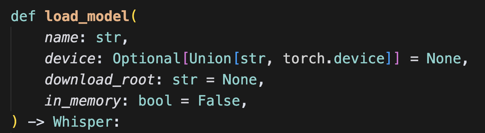
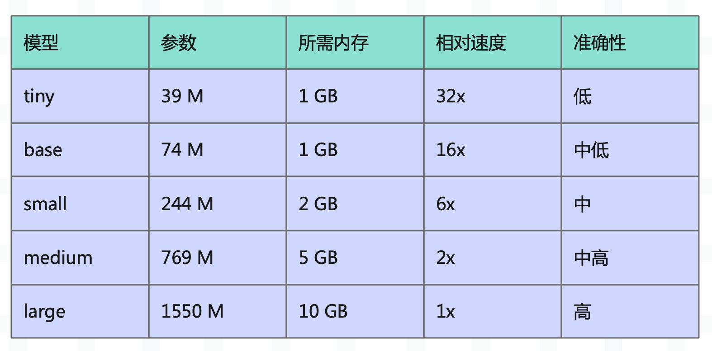

如果做过自媒体的话，那么语音转文本这个需求应该会很常见。当然说到这儿，就不得不提我大学的时光了，我在大学的时候加入了一个字幕组，专门做日语翻译。

而翻译一段视频主要有以下几个步骤：

+ 将视频完整地听一遍，将原文听写下来。
+ 将原文翻译成中文。
+ 字幕生成，将原文和中文显示在视频上。

这其中最痛苦的莫过于第三步，因为要保证人物说的话和字幕在时间上是匹配的。所以人物说的每一句话，都要手动记录起始时间和结束时间，让字幕在人物开始说话的那一刻显示，在话说完的那一刻消失。而这个过程也有一个专业名词，叫打轴，当时用的打轴工具叫 Aegisub。

如果有小伙伴用 Aegisub 打过轴，那么应该知道这个过程极其痛苦，要在人物开始说话的那一刻，立即按下暂停键，记录一下时间；当话说完时，再立即按下暂停键，记录一下时间，这两个时间就是字幕持续的起始和结束时间。对于一个长视频来说，里面出现成百上千句话都是正常的，而每句话都要重复这个过程，可想而知这个过程有多么遭罪。

> 记得当初在翻译《李狗嗨》的时候，第一次是如此地讨厌雅人叔。

但是现在不同了，我们有了 AI，可以让 AI 来帮我赋能。本次要介绍的工具是 whisper，我们来看看它的用法，不过使用之前先安装，直接 pip install openai-whisper 即可。

~~~Python
import whisper

# 加载模型
model = whisper.load_model("large")
~~~

首先是加载模型，来看一下这个函数都接收哪些参数。

**参数 name**

模型名称，可选值如下。

另外 large 还有几个不同的版本：

+ large-v1：和 large 模型等价。
+ large-v2：对 v1 的改进版本，提高了多语种的识别能力，特别是对非英语语言，对背景噪音有更好的抵抗力。
+ large-v3：最新的 Large 模型版本，进一步提高了准确性和语言覆盖范围，改进了困难场景（如嘈杂环境、口音等）的表现。

当然以上都是 OpenAI 官方提供的预训练模型，这些模型会自动下载到 `~/.cache/whisper/` 目录中。除了预训练模型，还可以加载自定义模型，稍后我们会从 huggingface 上下载。

**参数 device**

指定模型加载和运行的设备，可以传一个字符串或 torch.device 对象。

~~~Python
import torch

# 如果你的机器上有 NVIDIA 显卡，那么可以指定为 cuda
if torch.cuda.is_available():
    device = torch.device("cuda")
# 如果你用的是 macOS，那么会不支持 NVIDIA CUDA
# 但对于 macOS 而言，可以使用 mps（Metal Performance Shaders），这是针对 APPLE 的 GPU 加速技术
# 所以要是你的 Mac 有 Apple Silicon 芯片（M1/M2/M3 等），那么可以使用 mps 进行加速
elif torch.backends.mps.is_available():
    device = torch.device("mps")
# 否则使用 CPU
else:
    device = torch.device("cpu")
~~~

默认会优先选择 GPU，否则选择 CPU。

**参数 download_root**

前面说了，OpenAI 提供了一系列预训练模型，如果要使用，那么首先要下载。而该参数便负责指定模型文件的下载目录，默认是 `~/.cache/whisper`。

**参数 in_memory**

是否将整个模型加载到内存中，默认为 True，设置为 False 可以减少内存使用，但可能影响性能。

以上就是 whisper.load_model 的相关参数，我们就介绍完了，然后去 huggingface 上下载模型。

