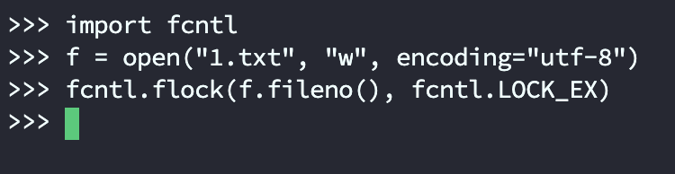
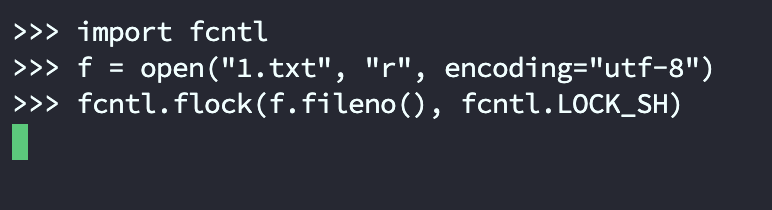
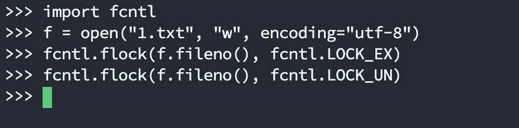
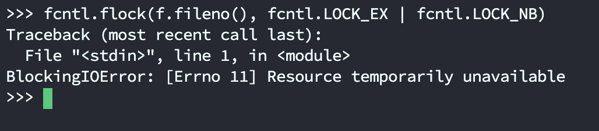

当我们在读写文件的时候，如果该文件同时还被另一个进程操作，那么很容易出现混乱。这时候就需要加锁了，正如操作数据库表的时候需要加锁一样。

而 Python 提供了一个库 fcntl，通过 fcntl.flock 函数即可实现对文件进行加锁和解锁。

> 注意：这个模块目前不支持 Windows，我们只能在类 Unix 下使用。

fcntl.flock 接收两个参数，第一个参数是文件描述符，第二个参数是 operation。常见的 operation 如下：

+ fcntl.LOCK_SH：共享锁，所有进程都可以对当前文件施加共享锁；
+ fcntl.LOCK_EX：排他锁，只能有一个进程对当前文件施加排他锁，其他进程在施加的时候会阻塞；
+ fcntl.LOCK_UN：对加锁文件进行解锁；
+ fcntl.LOCK_MAND：共享模式强制锁，可以和 LOCK_READ 或者 LOCK_WRITE 联合起来使用，从而表示是否允许并发的读操作或者并发的写操作(基本不用)；
+ fcntl.LOCK_NB：非阻塞锁，如果指定此参数，函数不能获得文件锁就立即返回；否则函数会等待获得文件锁，LOCK_NB 可以同 LOCK_SH、LOCK_EX 结合使用；

例如：如果一个文件设置了排他锁：

```python
fcntl.flock(f.fileno(), fcntl.LOCK_EX)
```

那么当其它进程在请求获取这个锁的时候就会一直阻塞在这里。

但如果和 LOCK_NB 结合起来使用：

```python
fcntl.flock(f.fileno(), fcntl.LOCK_EX | fnctl.LOCK_NB)
```

那么其它进程在获取不到锁的时候就直接返回了。

> 需要注意的是，在给文件加锁之前,一定要保证文件以相应的访问模式打开。
>
> 比如共享锁是让所有进程对文件只有读权限，那么在加共享锁的时候要保证文件以读方式打开；加上排他锁的时候，文件要以可写的形式打开。

下面举例说明，由于 fcntl 不支持 Windows，我们在 Linux 上测试。



开启一个终端，打开 1.txt 并加上排他锁，而一旦施加了排他锁，其它进程就不能再加锁了（包括共享锁）。

这里再开启一个终端，测试一下：



进程 1 已经施加了排他锁，进程 2 再加锁的话就会阻塞，不管是共享锁还是排他锁都会阻塞。


然后我们再回到进程 1，将锁释放掉。



再来看看进程 2：


此时已经不再阻塞了，因为第一个终端把锁解除了。

我们说设置了排他锁的话，其它进程在获取不到锁的时候会阻塞，但如果和 fcntl.LOCK_NB 结合使用的话，在获取不到锁的时候会直接返回。

进程 1 释放锁之后，已经被进程 2 获取，此时进程 2 给文件施加了排他锁，然后我们继续尝试在进程 1 获取。



因为此时获取不到锁，所以直接返回，告诉我们资源不可用。