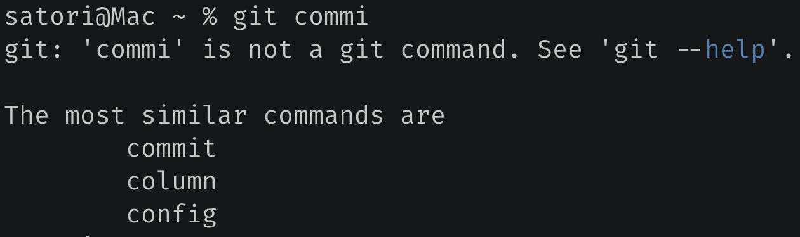

fuzzywuzzy 可以计算两个字符串之间的相似度，它依据 Levenshtein Distance 算法来进行计算，该算法又叫 Edit Distance 算法，是指两个字符串之间，由一个转成另一个所需要的最少编辑操作次数。许可的编辑操作包括将一个字符替换成另一个字符，插入一个字符，删除一个字符。一般来说，编辑距离越小，两个串的相似度越高。

我们来看一下该模块的用法，非常简单：

~~~python
from fuzzywuzzy import fuzz

# 调用 fuzz.ratio 即可计算两个字符串的相似度
print(fuzz.ratio("古明地觉", "古明地恋"))  # 75

# 我们看到 ratio 是完全匹配的，它把字符串的长度也考虑在内了
print(fuzz.ratio("古明地觉", "古明地觉aa"))  # 80

# partial_ratio 是非完全匹配
# 如果一方结束了，那么剩下的就不考虑了
print(fuzz.partial_ratio("古明地觉", "古明地觉,小五萝莉"))  # 100

# token_sort_ratio 表示忽略顺序匹配
# 但前提是多个词，以空格进行分隔
print(fuzz.ratio("古 明 地 觉", "古 明 地 觉"[:: -1]))  # 43
print(fuzz.token_sort_ratio("古 明 地 觉", "古 明 地 觉"[:: -1]))  # 100

# token_set_ratio 表示去重匹配
# 同样：前提是多个词，以空格进行分隔
print(fuzz.ratio("a a a he", "a he"))  # 67
print(fuzz.token_set_ratio("a a a he", "a he"))  # 100
~~~

当我们使用 git 的时候，如果命令输错了，那么会告诉你此命令不是一个 git 命令，这是理所应当的。然后重点来了，git 还会提示一些与你输错的命令长得非常相似的一些命令。

所以这里面也用到了字符串的相似度原理，找出 git 命令中和你输错的命令最相似的几个，然后进行提示。

如果我们也写了一个类似的程序，需要用户通过命令行参数的方式，那么当用户输入了一个不存在的命令时，也可以这么做。而实现方法也很简单，就是将所有的命令和用户输错的命令都计算一个相似度，然后返回相似度最高的 n 个即可。

使用上面的 fuzz 完全可以实现，当然 fuzzywuzzy 模块还提供了一个 extract 函数，可以让我们更加轻松地做到这一点。

~~~python
from fuzzywuzzy import process

words = ["hello python", "hello java", "hello golang", "hello php"]
# 会自动和 words 里面的每一个元素进行比较
# 然后按照相似度从高到低排列
print(process.extract("hello thon", words))
"""
[('hello python', 91), ('hello php', 74), 
 ('hello golang', 73), ('hello java', 64)]
"""

# 还可以传入一个 limit 参数
# 表示只返回前 limit 个，默认为 5
print(process.extract("hello thon", words, limit=2)) 
"""
[('hello python', 91), 
 ('hello php', 74)]
"""

# 返回分数最高的，此时返回一个元组
print(process.extractOne("hello thon", words))  
"""
('hello python', 91)
"""
~~~

这个模块使用起来还是比较简单的，当然核心是字符串相似度的计算原理，这才是重点，有兴趣可以去了解一下。

另外使用 fuzzywuzzy 这个模块的时候，会弹出一个警告：

> UserWarning: Using slow pure-python SequenceMatcher. Install python-Levenshtein to remove this warning

提示我们可以通过安装 python-Levenshtein 得到解决，这是一个用于加速字符串匹配的库，可提供 4 到 10 倍的加速。当然即使没有这个库也是可以的，没有的话 fuzzywuzzy 底层会使用标准库 difflib 进行匹配，只是会弹出警告罢了。