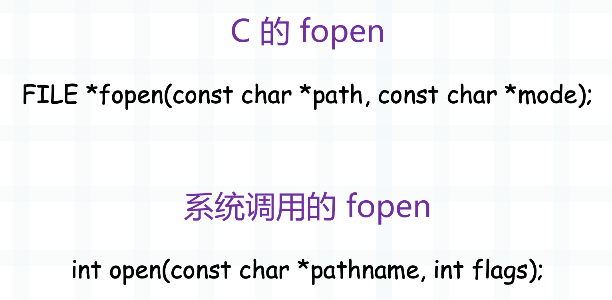
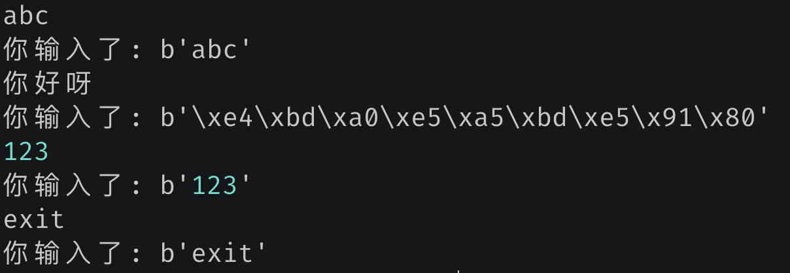

## 使用 os.open 打开文件

无论是读文件还是写文件，都要先打开文件。说到打开文件，估计首先想到的就是内置函数 open（即 io.open），那么它和 os.open 有什么关系呢？

内置函数 open 实际上是对 os.open 的封装，在 os.open 基础上增加了相关访问方法。因此为了操作方便，应该调用内置函数 open 进行文件操作，但如果对效率要求较高的话，则可以考虑使用 os.open。此外 open 函数返回的是一个文件对象，我们可以在此基础上进行任意操作；而 os.open 返回的是一个文件描述符，说白了就是一个整数，因为每一个文件对象都会对应一个文件描述符。

~~~python
import os

f1 = open("main.c", "r")
f2 = os.open("main.c", os.O_RDONLY)

print(f1.__class__)
print(f2.__class__)
"""
<class '_io.TextIOWrapper'>
<class 'int'>
"""
~~~

Python 的 open 函数实际上是封装了 C 的 fopen，C 的 fopen 又封装了系统调用提供的 open。



操作系统提供了很多的系统调用，打开文件则是 open，我们看到它返回一个整数，这个整数就是对应的文件描述符。C 的 fopen 封装了系统调用的 open，返回的是一个文件指针。

所以内置函数 open 和 os.open 的区别就更加清晰了，内置函数 open 在底层会使用 C 的 fopen，得到的是一个封装好的文件对象，在此基础上可以直接操作。至于 os.open 在底层则不走 C 的 fopen，而是直接使用系统调用提供的 open，得到的是文件描述符。

> os 模块内部的函数基本上都是直接走的系统调用，所以模块名才叫 os。

然后我们使用 os.open 一般需要传递两个参数，第一个参数是文件名，第二个参数是模式，举个栗子：

```python
import os

# 以只读方式打开，要求文件必须存在
# 打开时光标处于文件的起始位置
os.open("main.c", os.O_RDONLY)

# 以只写方式打开，要求文件必须存在
# 打开时光标处于文件的起始位置
os.open("main.c", os.O_WRONLY)

# 以可读可写方式打开，要求文件必须存在
# 打开时光标处于文件的起始位置
os.open("main.c", os.O_RDWR)

# 如果希望文件不存在时能够自动创建，那么可以使用 os.O_CREAT
os.open("main.c", os.O_RDONLY | os.O_CREAT)
os.open("main.c", os.O_WRONLY | os.O_CREAT)
os.open("main.c", os.O_RDWR | os.O_CREAT)

# 文件不存在时创建，存在时清空
# 打开时光标处于文件的起始位置
os.open("main.c", os.O_WRONLY | os.O_CREAT | os.O_TRUNC)
# 当然读取文件也是可以的
# 比如 os.O_RDONLY | os.O_CREAT | os.O_TRUNC
# 也是文件存在时清空内容，但是这没有任何意义
# 因为读取的时候将文件清空了，那还读什么？

# 文件不存在时创建，存在时追加
# 打开时光标处于文件的末尾
os.open("main.c", os.O_WRONLY | os.O_CREAT | os.O_APPEND)

# 所以
"""
open 里面的读模式等价于这里的 os.O_RDONLY
open 里面的写模式等价于这里的 os.O_WRONLY | os.O_CREATE | os.O_TRUNC
open 里面的追加模式等价于这里的 os.O_WRONLY | os.O_CREATE | os.O_APPEND
"""
```

好，打开方式介绍完了，那么怎么读取和写入呢？很简单，读取使用 os.read，写入使用 os.write。

## 使用 os.read 读取文件

先来看读取，os.read 接收两个参数，第一个参数是文件描述符，第二个参数是要读取多少个字节。

```Python
import os

fd = os.open("main.c", os.O_RDONLY)
# 使用 os.read 进行读取，这里读取 20 个字节
data = os.read(fd, 20)
print(data)
"""
b'#include <Python.h>'
"""

# 再读取 20 个字节
data = os.read(fd, 20)
print(data)
"""
b'\n#include <ctype.h>'
"""

# 继续读取
data = os.read(fd, 20)
# 由于只剩下一个字节，所以就读取了一个字节
# 显然此时文件已经读完了
print(data)
"""
b'\n'
"""

# 文件读取完毕之后
# 再读取的话会返回空字节串
print(os.read(fd, 20))  # b''
print(os.read(fd, 20))  # b''
print(os.read(fd, 20))  # b''
```

所以这就是文件的读取方式，还是很简单的。然后在读取的过程中，我们还可以移动光标，通过 os.lseek 函数。

- os.lseek(fd, m, 0)：将光标从文件的起始位置向后移动 m 个字节；
- os.lseek(fd, m, 1)：将光标从当前所在的位置向后移动 m 个字节；
- os.lseek(fd, m, 2)：将光标从文件的结束位置向后移动 m 个字节；

如果 m 大于 0，表示向后移动，m 小于 0，表示向前移动。所以当第三个参数为 2 的时候，也就是结束位置，那么 m 一般为负数。因为相对于结束位置，肯定要向前移动，当然向后移动也可以，不过没啥意义；同理当第三个参数为 0 时，m 一般为正数，相对于起始位置，肯定要向后移动。

~~~Python
import os

fd = os.open("main.c", os.O_RDONLY)
data = os.read(fd, 20)
print(data)
"""
b'#include <Python.h>'
"""

# 从文件的起始位置向后移动 0 个字节
# 相当于将光标设置在文件的起始位置
os.lseek(fd, 0, 0)
data = os.read(fd, 20)
print(data)
"""
b'#include <Python.h>'
"""

# 设置在结束位置
os.lseek(fd, 0, 2)
print(os.read(fd, 20))  # b''

# 此时就什么也读不出来了
~~~

然后我们提一下 stdin, stdout, stderr，含义应该不需要解释了，重点是它们对应的文件描述符分别为 0, 1, 2。

~~~Python
import os

# 从标准输入里面读取 10 个字节
# 没错，此时作用类似于 input
while True:
    data = os.read(0, 10).strip()
    print(f"你输入了:", data)
    if data == b"exit":
        break
~~~

我们测试一下：



os.read 可以实现 input 的效果，并且效率更高。另外当按下回车时，换行符也会被读进去，所以需要 strip 一下。然后我们这里读的是 10 个字节，如果一次读不完，那么会分多次读取。在读取文件的时候，也是同理。

~~~Python
from io import BytesIO
import os

fd = os.open("main.c", os.O_RDONLY)
buf = BytesIO()

while True:
    data = os.read(fd, 10)
    if data != b"":
        buf.write(data)
    else:
        break
print(buf.getvalue().decode("utf-8"))
"""
#include <Python.h>
#include <ctype.h>

"""
~~~

然后 os.read 还可以和内置函数 open 结合，举个栗子：

```Python
import os
import io

f = open("main.c", "r")
# 通过 f.fileno() 即可拿到对应的文件描述符
# 虽然这里是以文本模式打开的文件，但只要拿到文件描述符，都可以交给 os.read
print(os.read(f.fileno(), 10))  # b'#include <'

# 查看光标位置
print(f.tell())  # 10

# 移动光标位置，从文件开头向后移动 5 字节
f.seek(5, 0)
print(f.tell())  # 5
# os.lseek 也可以实现
os.lseek(f.fileno(), 3, 0)
print(f.tell())  # 3
# 此时会从第 4 个字节开始读取
print(f.read())
"""
clude <Python.h>
#include <ctype.h>

"""

# os.lseek 比 f.seek 要强大一些
# 移动到文件末尾，此时没问题
f.seek(0, 2)
print(f.tell())  # 41

try:
    f.seek(-1, 2)
except io.UnsupportedOperation as e:
    print(e)
"""
can't do nonzero end-relative seeks
"""
# 但如果要相对文件末尾移动具体的字节数
# 那么 f.seek 不支持，而 os.lseek 是可以的
print(f.tell())  # 41
os.lseek(f.fileno(), -1, 2)
print(f.tell())  # 40
# 最后只剩下一个换行符
print(os.read(f.fileno(), 10))  # b'\n'
```

是不是很好玩呢？

## 使用 os.write 写入文件

然后是写入文件，调用 os.write 即可写入。

```Python
import os

# 此时可读可写，文件不存在时自动创建，存在则清空
fd = os.open("1.txt", os.O_RDWR | os.O_CREAT | os.O_TRUNC)
# 写入内容，接收两个参数
# 参数一：文件描述符；参数二：bytes 对象
os.write(fd, b"hello, ")
os.write(fd, "古明地觉".encode("utf-8"))
# 读取内容
data = os.read(fd, 1024)
print(data)  # b''
# 问题来了，为啥读取不到内容呢？
# 很简单，因为光标会伴随着数据的写入而不断后移，这样的话，数据才能不断地写入
# 因此，现在的光标位于文件的结尾处，想要查看写入的内容需要移动到开头
os.lseek(fd, 0, 0)
print(os.read(fd, 1024).decode("utf-8"))
"""
hello, 古明地觉
"""
# 从后往前移动 3 字节
os.lseek(fd, -3, 2)
print(os.read(fd, 1024).decode("utf-8"))
"""
觉
"""
```

以上就是文件的写入，当然它也可以和内置函数 open 结合，通过 **os.write(f.fileno(), b"xxx")** 进行写入。但是不建议 os.open 和 open 混用，其实工作中使用 open 就足够了。

然后是 stdout 和 stderr，和 os.write 结合可以实现 print 的效果。

```Python
import os

os.write(1, "往 stdout 里面写入\n".encode("utf-8"))
os.write(2, "往 stderr 里面写入\n".encode("utf-8"))
```

以上就是 os.write 的用法。

## 使用 os.close 关闭文件

最后是关闭文件，使用 os.close 即可。

```Python
import os
import io

fd = os.open("1.txt", os.O_RDWR | os.O_CREAT | os.O_TRUNC)
# 关闭文件
os.close(fd)

# 文件对象也是可以的
f = open(r"1.txt", "r")
os.close(f.fileno())
try:
    f.read()
except OSError as e:
    print(e)
"""
[Errno 9] Bad file descriptor
"""
```

如果是调用 f.close() 关闭文件，再进行读取的话，会抛出一个 ValueError，提示 I/O operation on closed file。这个报错信息比较明显，不应该在关闭的文件上执行 IO 操作，因为文件对象知道文件已经关闭了，毕竟调用的是自己的 close 方法，所以这个报错是解释器给出的。当然啦，调用 f.close 也会触发 os.close，因为关闭文件最终还是要交给操作系统负责的。

但如果是直接关闭底层的文件描述符，文件对象是不知道的，再使用 f.read() 依旧会触发系统调用，也就是 os.read。而操作系统发现文件已经关闭了，所以会报错：文件描述符有问题，此时就是一个 OSError，报错信息是操作系统给出的。

```Python
import os

f = open(r"1.txt", "r")
# 文件是否关闭
print(f.closed)  # False
os.close(f.fileno())
print(f.closed)  # False

# 所以调用 os.close，文件对象 f 并不知道
# f.read 依旧会触发系统调用
```

如果是使用 f.close()。

```Python
f = open(r"1.txt", "r")
f.close()
print(f.closed)  # True
```

后续执行 IO 操作，就不会再走系统调用了，而是直接抛出 ValueError，原因是文件对象知道文件已经关闭了。

除了 os.close 之外，还有一个 os.closerange，可以关闭多个文件描述符对应的文件。

```Python
import os

# 关闭文件描述符为 1、2、3、4 的文件 
os.closerange(1, 5)
```

该方法不是很常用，了解一下即可。

以上就是使用 os 模块操作文件，它是直接使用操作系统提供的系统调用，所以效率上会比内置函数 open 要高一些。但是工作中还是不太建议使用 os 模块操作文件，使用内置函数 open 就好。