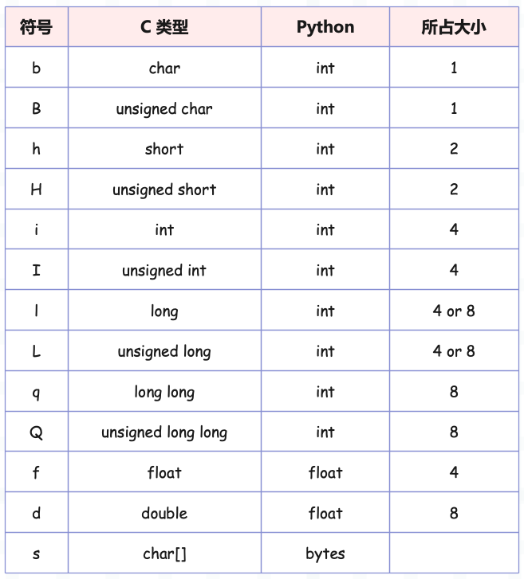

## 楔子

Python 有一个内置模块 struct，从名字上看这和 C 的结构体有着千丝万缕的联系，C 的结构体是由多个数据组合而成的一种新的数据类型。

```c
typedef struct {
    char *name;
    int age;
    char * gender;
    long salary;
} People;
```

struct 模块也是负责将多个不同类型的数据组合在一起，因为网络传输的数据都是二进制字节流。而 Python 只有字符串可以直接转成字节流，对于整数、浮点数则无能为力了。所以 Python 提供了 struct 模块来帮我们解决这一点，下面来看看它的用法。

## 打包和解包

struct 模块内部有两个函数用于打包和解包，分别是 pack 和 unpack。

- pack：将数据打包成二进制字节流；
- unpack：对二进制字节流进行解包；

~~~python
import binascii
import struct

# values 包含一个 12 字节的字节串、一个整数、以及一个浮点数。
values = ("古明地觉".encode("utf-8"), 17, 156.7)

# 第一个参数 "12s i f" 表示格式化字符串(format)，里面的符号则代表数据的类型
# 12s：12 个字节的字节串、i: 整数、f: 浮点数
# 因此 12s i f 表示打包的数据有三个，分别是：12 个字节的字节串、一个整数、以及一个浮点数
# 中间使用的空格只是用来对表示类型的符号进行分隔，在编译时会被忽略
packed_data = struct.pack("12s i f", *values)  # 这里需要使用 * 将元组打开

# 查看打印的结果
print(packed_data)
"""
b'\xe5\x8f\xa4\xe6\x98\x8e\xe5\x9c\xb0\xe8\xa7\x89\x11\x00\x00\x003\xb3\x1cC'
"""

# 还可以将打包后的结果转成十六进制, 这样传输起来更加方便
print(binascii.hexlify(packed_data))
"""
b'e58fa4e6988ee59cb0e8a7891100000033b31c43'
"""
~~~

代码中的 packed_data 就是打包之后的结果，而我们又将其转成了 16 进制表示。那么问题来了，既然能打包，那么肯定也能解包。

```python
import struct
import binascii

# 之前对打包之后的数据转成 16 进制所得到的结果
data = b'e58fa4e6988ee59cb0e8a7891100000033b31c43'

# 所以可以使用 binascii.unhexlify 将其转回来，得到 struct 打包之后的数据
packed_data = binascii.unhexlify(data)

# 然后调用 struct.unpack 进行解包，打包用的什么格式，解包也用什么格式
# 会得到一个元组，哪怕解包之后只有一个元素，得到的也是元组
values = struct.unpack("12s i f", packed_data)
print(str(values[0], encoding="utf-8"))  # 古明地觉
print(values[1])  # 17
print(values[2])  # 156.6999969482422
```

发送端将数据按照某种格式转成二进制字节流，接收端在接收到数据之后再按照相同的格式转成相应的数据就行。只不过 Python 中，只有字符串可以直接转换成二进制字节流，整数、浮点数则需要借助于 struct 模块。

但是注意：在使用 struct 打包的时候，不能直接对字符串打包，而是需要先将字符串编码成bytes对象。因为中文字符采用不同的编码所占的字节数不同，所以需要先手动编码成 bytes 对象。

整体还是比较简单的，就是将数据按照指定格式进行打包，然后再按照指定格式进行解包。而像 12s、i、f 这些都属于我们定义的格式中的类型指示符，而除了这些指示符之外，还有哪些类型指示符呢？



然后需要注意，我们在进行打包的时候，类型以及个数一定要匹配。

```python
import struct

try:
    struct.pack("iii", 1, 2, 3.14)
except Exception as e:
    print(e)  # required argument is not an integer
# 告诉我们需要的是整数, 但我们传递了浮点数

try:
    # iii 表示接收 3 个整数, 但我们只传递了两个
    struct.pack("iii", 1, 2)
except Exception as e:
    print(e)  # pack expected 3 items for packing (got 2)

try:
    # iii 表示接收 3 个整数, 但我们却传递了四个
    struct.pack("iii", 1, 2, 3, 4)
except Exception as e:
    print(e)  # pack expected 3 items for packing (got 4)
```

此外，我们之前说一个长度为 12 的字节串，可以使用 12s 来表示，那么 3s 就表示长度为 3 的字节串。问题来了，i 表示整数，那么3i 表示什么呢？

```python
import struct

try:
    struct.pack("3i", 1, 2)
except Exception as e:
    print(e)  # pack expected 3 items for packing (got 2)

# 告诉我们接收 3 个值, 但是只传递了两个
packed_data = struct.pack("3i", 1, 2, 3)
print(struct.unpack("3i", packed_data))  # (1, 2, 3)
```

我们看到 3i 在结果上等同于 iii，但对于 s 而言，3s 可不等同于 sss。3s 仍然表示接收一个元素，只不过这个元素是字节串，并且长度为 3。这些细节要注意。

当然对于字符串而言，即使长度不一样也是无所谓的，我们举个例子。

~~~python
import struct

# 第一个值是整数, 第二个值是字节串(长度应该为3, 但不是3也可以)
packed_data = struct.pack("i3s", 6, b"abcdefg")
print(packed_data)  # b'\x06\x00\x00\x00abc'
# 我们看到被截断了, 只剩下了 abc

packed_data = struct.pack("i6s", 6, b"abc")
print(packed_data)  # b'\x06\x00\x00\x00abc\x00\x00\x00'
# 6s 需要字节长度为 6, 但是我们只有三个, 所以在结尾补上了 3 个 \0
~~~

总之在使用 struct 进行打包的时候，需要记住两点：

- 元素个数和符号个数要对应, 比如 3i3s3f 表示接收 7 个元素，依次是 3 个整数、一个字节串、3 个浮点数；
- 元素类型和符号要对应，比如 i 对应整数，s 对应字节串等等；并且对于 s 而言，前面的数字表示接收的字节串的长度；

而对于解包而言，我们也需要关注，但只需要关注一点，那就是大小。怎么理解呢？来举个例子：

~~~python
import struct

packed_data = struct.pack("ii", 1, 2)
print(packed_data)  # b'\x01\x00\x00\x00\x02\x00\x00\x00'
# 因为 i 表示 C 的 int, 而 C 的一个 int 占 4 字节, 所以结果是 8 字节。
# 只不过 1 和 2 只需一字节即可存储, 因此其它的部分都是 0
# 打包之后的 packed_data 的大小, 不取决于打包的元素, 而是取决于格式化字符串中的类型符号
# 比如 struct.pack("4s", b"abc") , 尽管传递的字节串只有 3 字节
# 但指定的是 4s, 所以打包之后的 packed_data 占 4 字节

# 而我们在解包的时候, 指定的符号的字节大小 和 packed_data 要匹配
# 比如这里的 packed_data 是 8 字节, 在打包结束之后它的大小就已经固定了
try:
    print(struct.unpack("i", packed_data))
except Exception as e:
    print(e)  # unpack requires a buffer of 4 bytes
# 告诉我们需要一个 4 字节的buffer, 这是因为我们的 packed_data 是 8 字节
# 同理:
try:
    print(struct.unpack("iii", packed_data))
except Exception as e:
    print(e)  # unpack requires a buffer of 12 bytes
# 这样也是不可以的, 告诉我们需要 12 字节

# 只有字节数匹配, 才可以正常解析
print(struct.unpack("ii", packed_data))  # (1, 2)
~~~

那么问题来了，我们说一个 long long 是占 8 字节，正好对应两个 int，那么将两个 int 按照一个 long long 来解析可不可以呢？再有 8s 也是 8 字节，又可不可以进行解析呢？我们来试一下。

```python
import struct

packed_data = struct.pack("ii", 1, 2)
print(packed_data)
"""
b'\x01\x00\x00\x00\x02\x00\x00\x00'
"""

print(struct.unpack("8s", packed_data))
"""
(b'\x01\x00\x00\x00\x02\x00\x00\x00',)
"""
print(struct.unpack("q", packed_data))
"""
(8589934593,)
"""

# 答案显然是可以的, 因为字节数是相匹配的
# 对于 8s 而言, 我们看到解析出来的结果就是原始的字节流
# 对于 q, 也可以正确解析, 只不过结果不是我们想要的

# 但是我们观察一下按照 q 解析出来的结果, 结果是 8589934593, 那么它是怎么得到的呢?
# 如果将 packet_data 按照 8 字节整数解析，相当于将两个 4 字节整数合并成一个 8 字节整数
# 其中整数 2 占据前 32 个位，整数 1 占据后 32 个位
print((2 << 32) + 1)
"""
8589934593
"""
# 怎么样, 结果是不是一样呢? 至于这里为什么不是 (1 << 31) + 2, 我们后面会说
```

所以在解析的时候，格式化字符串中的类型符号对应的字节数，要和 packed_data 的字节数相匹配，这是不报错的前提。当然如果想得到正确的结果，最关键的还是解包对应的格式化字符串，要和打包对应的格式化字符串保持一致。

## struct.Struct

在 struct 模块中，我们可以直接使用 struct.pack 和 struct.unpack 这两个模块级的函数，但是 struct 模块还提供了一个 Struct 类。

```python
import struct

s = struct.Struct("ii")
# 和使用 struct.pack("ii", 1, 2) 之间是等价的
packed_data = s.pack(1, 2) 
print(packed_data)  
"""
b'\x01\x00\x00\x00\x02\x00\x00\x00'
"""
```

如果我们需要使用同一种格式化字符串来对大量数据进行打包的话，那么使用 struct.Struct 是更推荐的，可以类比正则。

re.search(pattern, string) 这个过程分为两步，会先将 pattern 进行编译转换，然后再进行匹配。如果我们需要同一个 pattern 匹配 100 个字符串的话，那么要编译转换 100 次。

而如果先对 pattern 进行编译 comp = re.compile(pattern)，那么不管调用 comp.search(string) 多少次，都只会进行一次编译转换，效率会更高。struct 也是类似的，如果要按照相同的格式进行多次打包，那么创建一个 Struct 实例并在这个实例上调用方法时（不使用模块级函数）会更高效。

当然，使用 Struct 类还有一个好处，就是可以获取一些额外信息。

~~~python
import struct

s = struct.Struct("ii4sf")
print("格式化字符串:", s.format)  # 格式化字符串: ii4sf
print("字节数:", s.size)  # 字节数: 16
~~~

我们看到打包后的数据大小是由格式化字符串中的符号所决定的。

## 字节序

说到字节序，你应该会想到大端存储、小端存储，所谓大端存储就是：数据的低位存储在内存的高地址中，高位存储在内存的低地址中。而小端存储与之相反：数据的低位存储在内存的低地址中，高位存储在内存的高地址中。

那么 Python 的 struct 默认使用什么存储呢？答案是小端存储。

```python
import struct

# i 表示 int32，那么相应的整数 1 就占 4 字节
# 其中最低位存储的是 1，剩余三个位存储的是 0
packed_data = struct.pack("i", 1)
print(packed_data)  # b'\x01\x00\x00\x00'
# 打包之后的数据是一个字节串，或者理解为 C 的字符数组
# 而数组的元素，从左往右对应的内存地址是依次增大的
# 所以结果就是低位存在了低地址中，所以这里是小端存储

# 而如果想要变成大端存储的话, 可以这么做
packed_data = struct.pack(">i", 1)
print(packed_data)  # b'\x00\x00\x00\x01'
# 我们看到此时结果就变了
```

当然我们在解析的时候也需要注意大小端的问题，如果是打包的时候使用的是大端存储，那么解包的时候也要使用大端存储。

```python
import struct

# 因为 \x01 在最后面，而后面表示内存的高地址
# 此时这个数字如果想表示 1, 那么它一定是大端存储的 1
# 也就是将低位的 \x01 放在了高地址中
packed_data = b'\x00\x00\x00\x01'

# 这里我们不指定大小端, 默认是小端
print(struct.unpack("i", packed_data))
"""
(16777216,)
"""
# 我们看到结果变了, 至于这个结果怎么来的, 很简单
# 无论打包还是解包，如果不指定字节序，那么默认都是小端，低位存在低地址中
# 所以 b'\x00\x00\x00\x01' 等价于如下
print(0b00000001_00000000_00000000_00000000) 
"""
16777216
"""

# 所以我们也要用大端存储进行解析, 表示: 我是大端存储, 存储在高地址的是数据的低位
print(struct.unpack(">i", packed_data)) 
"""
(1,)
"""
print(0b00000000_00000000_00000000_00000001)  
"""
1
"""
# 所以通过 b'\x00\x00\x00\x01' 的值是不是 1，可以判断当前采用的是大端还是小端
# 因为 \x01 在高地址，如果值为 1，说明 \x01 是低位，因此是大端，否则小端
```

然后再回顾一下之前的例子，我们用一个 long long 表示两个 int。

```python
import struct

packed_data = struct.pack("ii", 1, 2)
print(packed_data)
"""
b'\x01\x00\x00\x00\x02\x00\x00\x00'
"""

# 将两个 int 转成一个 long long，默认是小端，所以低位存在低地址中
# 因此 \x01\x00\x00\x00 表示 1，占据低 32 个位
# \x02\x00\x00\x00 表示 2，占据高 32 个位
print(struct.unpack("q", packed_data))
print((2 << 32) + 1)
"""
(8589934593,)
8589934593
"""

# 如果按照大端解析的话，低位存在高地址中，那么就是相反的
# 但此时 \x01\x00\x00\x00 表示的不再是 1
# 同理 \x02\x00\x00\x00 表示也不再是 2
print(struct.unpack(">q", packed_data))
print(
    (0b00000001_00000000_00000000_00000000 << 32) +
    0b00000010_00000000_00000000_00000000
)
"""
(72057594071482368,)
72057594071482368
"""
```

因此 struct 模块给我们提供了自定义字节序的功能，可以显式地指定是使用大端存储、还是小端存储。而方法也很简单，只需要给格式化字符串的第一个字符指定为特定的符号即可实现这一点。

+ `>` : 大端字节序（Big-endian）
+ `<` : 小端字节序（Little-endian）
+ `!` : 网络字节序（实际上就是大端字节序）
+ `=` : 本地字节序（当前系统的字节序）
+ `@` : 本地字节序（和 `=` 相同，但可能有不同的对齐方式）

## 缓冲区

pack 方法在打包的时候，会为打包数据申请一块内存空间，也就是说每一次 pack 都需要申请内存资源，显然这是一种浪费。通过避免为每个打包数据分配一个新缓冲区，在内存开销上可以得到优化。而 pack_into 和 pack_from 可以支持我们从指定的缓冲区进行读取和写入。

```python
import struct
import ctypes

# 创建一个 string 缓存, 大小为 10
buf = ctypes.create_string_buffer(10)
# raw 表示原始数据，这里都是 \0，因为 C 中是通过 \0 来标识一个字符串的结束
print(buf.raw)  # b'\x00\x00\x00\x00\x00\x00\x00\x00\x00\x00'
# value 就是 Python 中的字符串, 显然为空
print(buf.value)  # b''

# 然后我们进行打包, 第二个参数表示缓冲区
# 第三个参数表示偏移量, 0表示从头开始写入; 然后后面的参数就是打包的数据
struct.pack_into("ii2s", buf, 0, 123, 345, b"ab")

# 打包之后的数据会存在 buf 中，解包的话，使用 unpack_from
# 会从 buf 中读取数据并解析，第三个参数表示从偏移量为 0 的位置开始解析
values = struct.unpack_from("ii2s", buf, 0)
print(values)  # (123, 345, b'ab')
```

这里的 pack_into 不会产生新的内存空间，都是对 buf 进行操作。另外我们还看到了偏移量，所以可以将多个打包的数据写入到同一个 buf 中，然后也可以从同一个 buf 中进行解包，而保证数据不冲突的前提正是这里的偏移量，举个栗子：

```python
import struct
import ctypes

s1 = struct.Struct("ii6si")
s2 = struct.Struct("2s")
buf = ctypes.create_string_buffer(s1.size + s2.size)
s1.pack_into(buf, 0, 1, 2, b"abcdef", 3)
# 偏移量为 s1.size
s2.pack_into(buf, s1.size, b"gh")

# 从 si.size 开始解析
print(s2.unpack_from(buf, s1.size))  # (b'gh',)
# 从 0 开始解析，解析 s1.size 个字节
print(s1.unpack_from(buf, 0))  # (1, 2, b'abcdef', 3)
```

以上就是 struct 模块，它定义了Python中整数、浮点数和二进制流之间的通用转换逻辑。