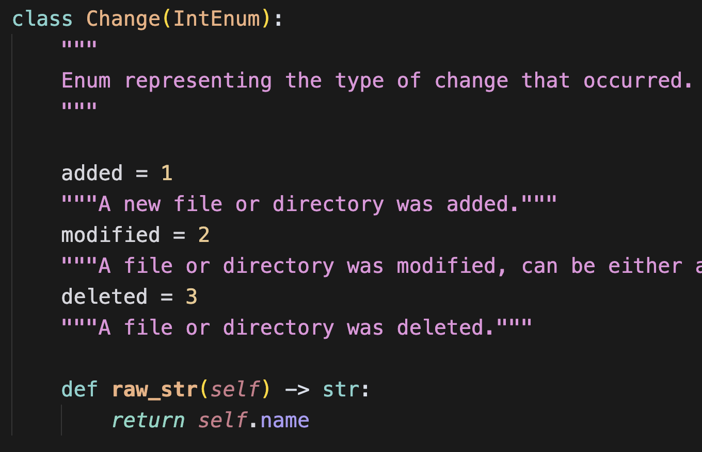
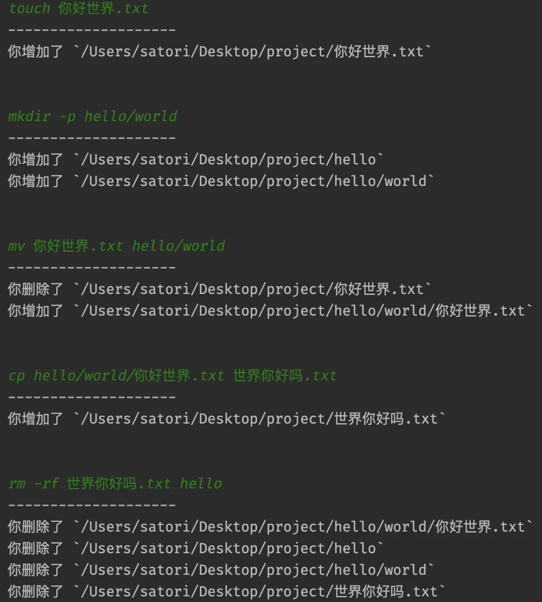
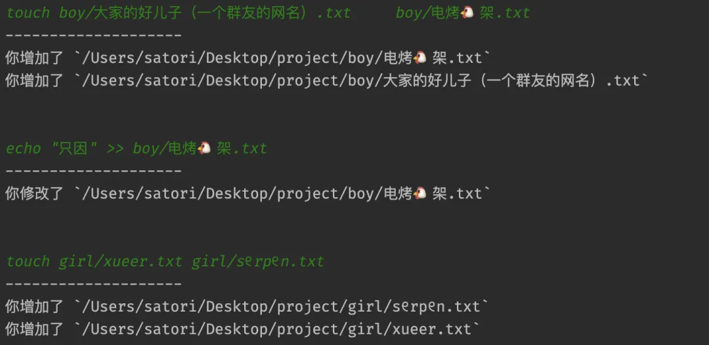
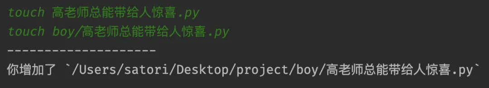
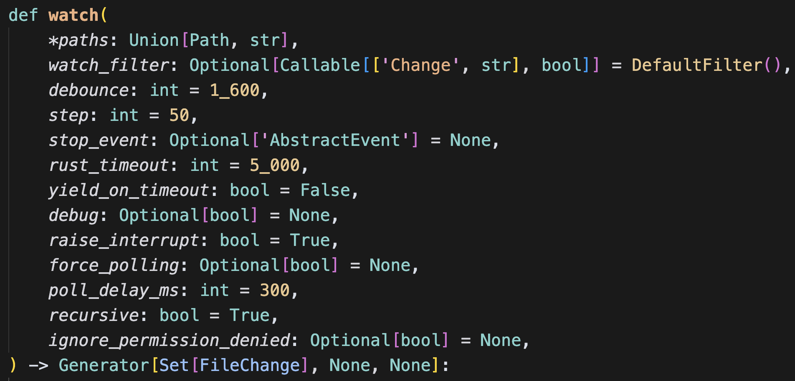
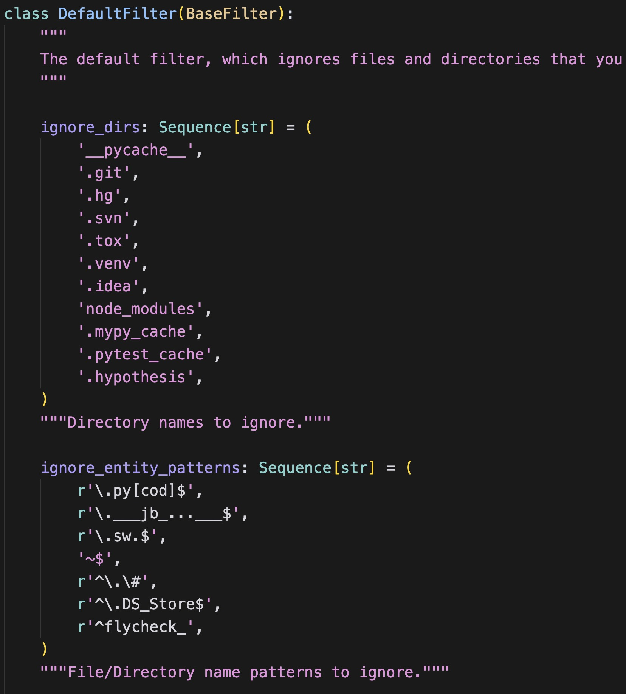

在工作中难免会碰到这样的需求，监控指定目录，如果该目录下发生文件变更，那么进行一系列的处理。而如何监视一个目录，就是我们本次探讨的主题。

监视目录可以使用 watchfiles 模块，该模块不仅简单，而且性能也不错。主要原因是，和底层文件系统交互的代码是基于 Rust 编写的，所以性能是有保证的。通过 pip install watchfiles 安装之后，我们来看看它的用法。

~~~python
from watchfiles import watch

# 当前目录为 /Users/satori/Desktop/project
for change in watch("."):
    print(change)
~~~

执行此程序，会处于阻塞状态，并持续监听指定目录的变化。然后我们在当前目录创建几个文件，看看效果。

<font color="blue">创建一个 data.txt 文本文件，程序输出如下：</font>

~~~python
{(<Change.added: 1>, '/Users/satori/Desktop/project/data.txt')}
~~~

返回的是一个集合，目前只涉及一个文件的变更，所以集合里面只有一个元素。而集合里面存储的都是元组，元组的第一个元素表示操作类型，总共有三种：分别是增加、修改和删除。



元组的第二个参数就是具体的文件路径，因此程序的输出就告诉我们，当前目录新增了一个 data.txt。

<font color="blue">再创建一个 txt_files 目录，程序输出如下：</font>

~~~python
{(<Change.added: 1>, '/Users/satori/Desktop/project/txt_files')}
~~~

不管是目录文件还是文本文件，都属于文件，所以输出是一样的。如果想知道新增的到底是目录还是普通文件，那么还需要通过 os 模块检测一下。

<font color="blue">然后在 txt_files 目录中创建一个 data.txt，程序输出如下：</font>

~~~python
{(<Change.added: 1>, '/Users/satori/Desktop/project/txt_files/data.txt')}
~~~

所以 watch 函数监听的不仅是指定目录，其内部的递归子目录也会一并监听。

问题来了，当前目录下存在一个 data.txt 文件和一个 txt_files 目录，而 txt_files 目录也存在一个 data.txt。那么如果将当前目录的 data.txt 移动到 txt_files 中，并同意覆盖，那么程序会输出什么呢？

```python
{(<Change.deleted: 3>, '/Users/satori/Desktop/project/txt_files/data.txt'), 
 (<Change.added: 1>, '/Users/satori/Desktop/project/txt_files/data.txt'), 
 (<Change.deleted: 3>, '/Users/satori/Desktop/project/data.txt')}
```

此时输出的集合包含三个元组，因此该过程涉及到三次文件的变更。因为 txt_files 里面的文件被替换掉了，所以相当于先被删除、然后重新创建。而当前目录中的 data.txt 被移走了，因此相当于被删除了。

<font color="blue">然后我们再通过 mkdir -p a/b/c 同时创建多级目录，程序输出如下：</font>

~~~python
{(<Change.added: 1>, '/Users/satori/Desktop/project/a/b/c'), 
 (<Change.added: 1>, '/Users/satori/Desktop/project/a/b'), 
 (<Change.added: 1>, '/Users/satori/Desktop/project/a')}
~~~

整个过程还是比较简单的，然后除了 watch 函数之外，还有一个 awatch。这两者的作用是一样的，参数也全部一样，只不过 awatch 需要和协程搭配，我们举个例子。

```python
import sys
import asyncio
from asyncio import StreamReader
from watchfiles import awatch, Change

# 监视指定目录
async def watch_files(path):
    # awatch(...) 返回的是异步生成器，需要通过 async for 遍历
    async for change in awatch(path):
        print("-" * 20)
        # change 是一个集合，里面可能会涉及到多个文件的变更
        for item in change:
            if item[0] == Change.added:
                operation = "你增加了"
            elif item[0] == Change.modified:
                operation = "你修改了"
            else:
                operation = "你删除了"
            print(f"{operation} `{item[1]}`")
        print("\n")

# 读取命令行输入，但是注意：不可以使用 input 函数，因为它是同步阻塞调用
# 这种调用在协程当中是大忌，会阻塞整个线程，我们需要改造成异步模式
async def read_from_stdin():
    reader = asyncio.StreamReader()
    protocol = asyncio.StreamReaderProtocol(reader)
    loop = asyncio.get_running_loop()
    await loop.connect_read_pipe(lambda: protocol, sys.stdin)
    return reader

# read_from_stdin 函数的具体细节暂时不用太关注，只需要知道它能异步读取命令行即可
# 然后定义主协程
async def main():
    # 监视当前目录
    asyncio.create_task(watch_files("."))
    # 创建读取器
    stdin_reader = await read_from_stdin()
    while True:
        # 从命令行读取输入
        command = await stdin_reader.readline()
        # 执行命令
        procs = await asyncio.create_subprocess_shell(command)
        await procs.wait()

loop = asyncio.get_event_loop()
try:
    loop.run_until_complete(main())
finally:
    loop.close()
```

来看一下效果：



结果没有问题，文件的变化都检测出来了。然后补充一点：watch 和 awatch 可以同时监听多个目录，因为第一个参数是 \*paths。

我们同时监听多个目录来测试一下，先在当前目录创建两个子目录：boy 和 girl，然后分别监视它们。



输出正常，因此这两个函数可以监听任意多个目录。另外，由于目前监听的是当前目录的两个子目录，所以当前目录的文件变更就看不到了，因为它没有被监视。



以上就是这两个函数的基本用法，当然这两个函数还有其它参数：



这里简单介绍几个。

**<font color="darkblue">过滤器（watch_filter）</font>**

watchfiles 会监视目录的文件变化，但不是所有的文件都会记录。



watchfiles 有一个内置的过滤器，会将和业务无关的文件过滤掉，如果你还希望将其它格式的文件过滤掉，那么修改过滤器即可。

**<font color="darkblue">停止事件（stop_event）</font>**

监视文件的时候，迭代器是不会停止的，如果想自由控制它的结束，可以传递一个事件。

~~~python
import asyncio
from watchfiles import awatch

async def watch_files(*paths, stop_event):
    async for _ in awatch(*paths, stop_event=stop_event):
        pass
    print("停止监视")

async def main():
    event = asyncio.Event()
    # 传递一个事件，准确的说，只要有 is_set 方法，任何对象都行
    asyncio.create_task(watch_files(".", stop_event=event))
    # 当 event.is_set() 为 True 的时候，停止监视
    print("is_set: ", event.is_set())
    await asyncio.sleep(3)  # sleep 3
    event.set()
    print("三秒后, is_set: ", event.is_set())
    # 等待子协程打印完毕
    await asyncio.sleep(0.1)

asyncio.run(main())
"""
is_set:  False
三秒后, is_set:  True
停止监视
"""
~~~

**<font color="darkblue">是否递归监视（recursive）</font>**

如果该参数为 True，那么会递归监视子目录，否则只监视顶层目录。

其它参数基本很少用，就不再赘述了，有兴趣可以自己了解一下。