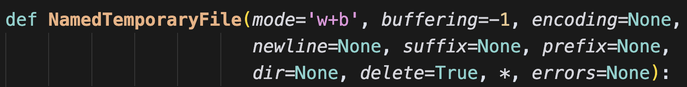

假设有一个 WebSocket 接口，会源源不断地产生数据，我们需要将其保存下来，然后进行处理。但由于数据量比较大，无法一次性加载到内存，最好的办法就是保存到文件里。如果数据处理完毕，不再需要相关文件的话，那么我们可以使用临时文件。临时文件的最大好处就是，不用命名、并且关闭时会自动删除，而无需我们手动删。

下面我们来看看如何使用临时文件。

```python
import tempfile

# 第一个参数是 mode，表示打开模式
# 默认是 "wb+"，二进制可读可写
f = tempfile.NamedTemporaryFile()
# 假设我们写 1G 的数据
f.write(b"+" * 1024 * 1024 * 1024)
# 此时文件指针会移动到末尾
# 想要读取的话，需要移动到开头
f.seek(0, 0)
print(len(f.read()))
"""
1073741824
"""
print(1073741824 == 1024 * 1024 * 1024)
"""
True
"""
```

临时文件和真实文件的操作方法是一样的，因为临时文件本质上也属于文件，它的数据也存储在系统上，只不过我们不知道罢了。当调用 f.close()，临时文件就会被自动删除，占用的磁盘空间也会被释放。我们来验证一下：

```Python
import psutil
import tempfile

GB_UNIT = 1024 * 1024 * 1024

# 临时文件默认存储在 C 盘，我们查看已经使用的空间
print(
    psutil.disk_usage("C:\\").used / GB_UNIT
)  # 89.93075561523438

f = tempfile.NamedTemporaryFile()
# 写 1G 的数据
f.write(b"+" * 1024 * 1024 * 1024)

# 不出意外的话，应该增加 1G
print(
    psutil.disk_usage("C:\\").used / GB_UNIT
)  # 90.93075561523438

# 关闭临时文件，然后释放磁盘空间
f.close()
# 所以又会减少 1G
print(
    psutil.disk_usage("C:\\").used / GB_UNIT
)  # 89.93075561523438
```

输出一切正常，所以结论如下：

- 临时文件本质上也是文件，它在存储数据的时候，也是存储在磁盘上，和真实文件并无二致；
- 临时文件的调用属于操作系统级别的，所以它的创建、读写数据，最终都会走操作系统提供的系统调用；
- 临时文件在被关闭时，操作系统会自动删除；

然后我们还可以指定临时文件的存储位置，虽然临时文件关闭时会自动删除，但我们还是希望它能存储在指定的位置上。

~~~Python
import tempfile
import time

# 让临时文件保存在当前目录
f = tempfile.NamedTemporaryFile(dir=r".")
time.sleep(30)
~~~

为了观察到现象，这里 sleep 了 30 秒。执行时，打开目录，会发现文件创建了，并且操作系统帮我们起了个随机的名字。


等 30 秒过后，文件又被自动删除了。

然后 NamedTemporaryFile 里面还接收其它参数，我们来看一下：



大部分参数和内置函数 open 类似，需要注意里面的 delete 参数，它表示当临时文件关闭时是否自动删除，默认为 True。然后还有一个 prefix 和 suffix 参数，因为临时文件也是文件，也要存储在磁盘上，只不过关闭之后会自动删除。所以它也要有一个名字，默认名字的前缀是 "tmp"，没有后缀，而我们可以指定前缀和后缀。

~~~python
import tempfile
import time

f = tempfile.NamedTemporaryFile(dir=r".", prefix="你好呀", suffix="我不好")
time.sleep(30)
~~~

执行一下看看：


此时文件的前缀和后缀就被我们改掉了，不过说实话这个前缀和后缀没太大卵用，既然是临时文件，用完就删除了，名字没太大关注的必要。

那么问题来了，如果不指定 dir 参数，我们就不知道文件存在哪了吗？显然不是的，默认存在什么地方，tempfile 已经提前告诉我们了。

~~~Python
# Linux 系统是 /tmp
# MacOS 系统是 /var/folders/bl/vlsr5c_95z33j3_wdqvdm8800000gn/T
print(
    tempfile.gettempdir()
)  # C:\Users\satori\AppData\Local\Temp

# 返回二进制结果
print(
    tempfile.gettempdirb()
)  # b'C:\\Users\\satori\\AppData\\Local\\Temp'

# 获取前缀
print(tempfile.gettempprefix())  # tmp
print(tempfile.gettempprefixb())  # b'tmp'
~~~

最后想说的是，临时文件也可以使用 mmap 进行映射。

~~~Python
import tempfile
import mmap

f = tempfile.NamedTemporaryFile()
f.write(b"hello, world")
# 映射之前需要移动一下光标
f.seek(0, 0)
# mmap 映射，这里就映射 5 字节
m = mmap.mmap(f.fileno(), 5)
m[:] = b"HELLO"

# 再次打印
print(f.read())
"""
b'HELLO, world'
"""
~~~

以上就是临时文件的用法，当然 tempfile 还提供了其它的操作，有兴趣可以了解一下，但使用最普遍的还是 NamedTemporaryFile。