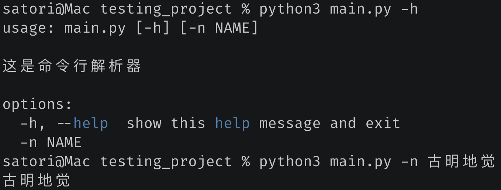
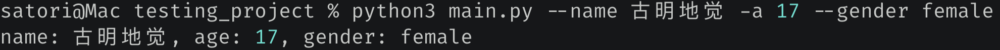
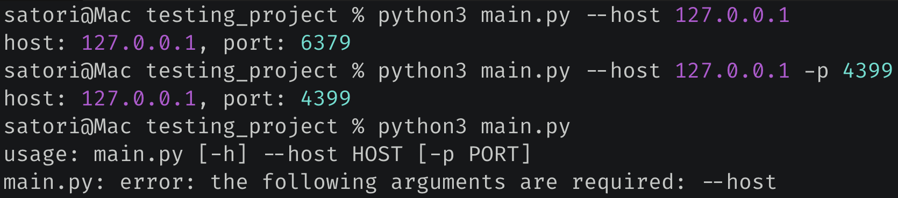
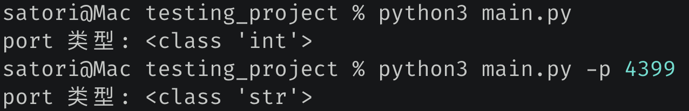
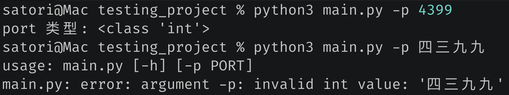
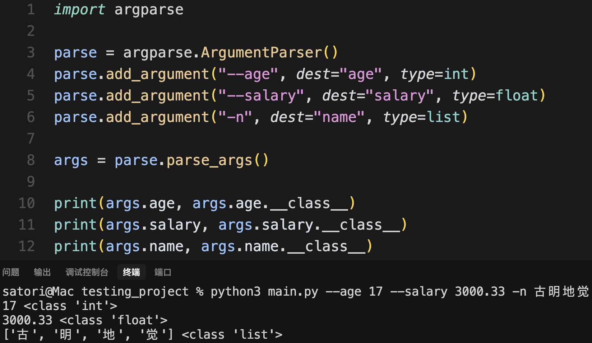
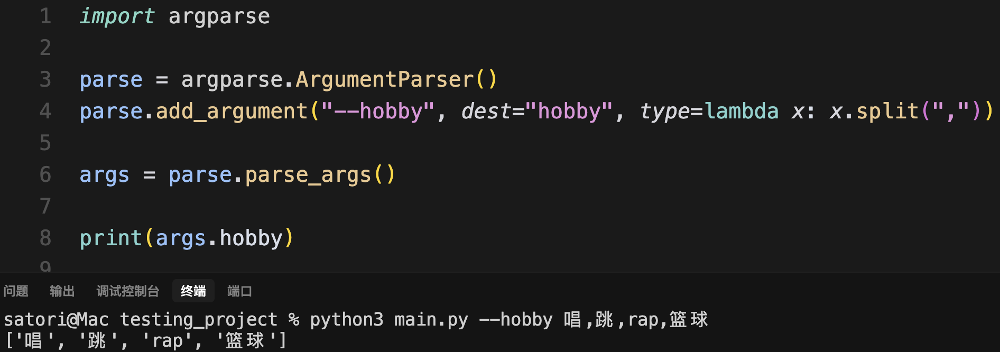

在工作中，我们经常需要从命令行当中解析出指定的参数，而 Python 也提供了相应的标准库来做这件事情，比如 sys, optparse, getopt, argparse。这里面功能最强大的莫过于 argparse，下面就来看看它用法。

~~~python
import argparse

# 使用 argparse 分为以下几步
# 1. 创建命令行解析器对象
parse = argparse.ArgumentParser(
    description="这是命令行解析器"
)

# 2.给解析器添加命令行参数，可以添加任意个
parse.add_argument("-n", dest="name")

# 3. 从命令中将参数解析出来
args = parse.parse_args()

# 然后通过 args 便可以拿到相应的参数值
print(args.name)
~~~

我们执行一下看看，当前文件叫做 main.py。

怎么样，是不是很简单呢？所以我们的重点就在 add_argument 方法上面，来看看它都支持哪些参数。

~~~python
import argparse

parse = argparse.ArgumentParser()

# 这里出现了 "-n" 和 "--name"
# 在命令行中可以通过 '-n 古明地觉' 或者 '--name 古明地觉' 进行指定
# 两者的含义是一样的，但 - 后面一般跟短参数，-- 后面跟长参数
# 然后是 dest，它表示获取相关参数值时，使用的名称
parse.add_argument("-n", "--name", dest="name")
# 这里只有一个短参数，那么在命令行中需要通过 -a 来指定
parse.add_argument("-a", dest="age")
# 这里只有一个长参数，那么在命令行中需要通过 --gender 来指定
parse.add_argument("--gender", dest="gender")

args = parse.parse_args()

print(f"name: {args.name}, age: {args.age}, gender: {args.gender}")
~~~

我们来试一下：

还是很简单的，一个 - 后面跟的是短参数，两个 - 后面跟的是长参数。在命令行中通过 - 或者 -- 进行指定，解析完毕之后再通过 dest 参数指定的名字进行获取。

另外，虽然 - 后面跟短参数，-- 后面跟长参数，但我们这样写也是可以的。

~~~python
parse.add_argument("-name", "--n", dest="name")
~~~

只不过这种写法比较怪异，应该写成 --name 和 -n，一个横杠后面是短参数，两个是长参数。

然后这些参数都是可以不指定的，会使用默认值 None。

如果我希望它是必传参数，该怎么办呢？

~~~python
import argparse

parse = argparse.ArgumentParser()

parse.add_argument("--host", dest="host", required=True)
parse.add_argument("-p", dest="port", default=6379)

args = parse.parse_args()

print(f"host: {args.host}, port: {args.port}")
~~~

我们看到当 host 不指定的时候，就会报错。并且我们还通过 default 参数指定了默认值。然后是参数值的类型，不管什么参数，只要在命令行当中传递了，那么解析出来的默认都是字符串类型。

~~~python
import argparse

parse = argparse.ArgumentParser()

parse.add_argument("-p", dest="port", default=6379)

args = parse.parse_args()

print(f"port 类型: {args.port.__class__}")
~~~

不指定参数会使用默认值，而默认值是整型，但如果指定了，那么会按照字符串格式来解析。我们可不可以规定参数的类型呢？答案是可以的。

~~~python
import argparse

parse = argparse.ArgumentParser()
parse.add_argument("-p", dest="port", type=int)
args = parse.parse_args()

print(f"port 类型: {args.port.__class__}")
~~~

通过指定 type 为 int，那么在将参数值解析出来之后就会调用 int 进行转化，转化失败则报错。

同理，我们也可以换成其它类型，举个例子。

还是很简单的，甚至换成我们自定义的类，或者一个函数也是可以的，

此时我们就实现了给一个参数传递多个值，不过这种做法属于是曲线救国，我们应该通过另一个参数实现。

nargs 指定为 *，那么表示 --hobby 可以接收任意个值，并且值之间使用空格进行分隔，最终会得到一个列表。如果指定 --hobby，但是不传值，那么会得到空列表。

> 注：如果希望接收多个值，并且至少接收一个，那么可以将 nargs 指定为 "+"。

以上就是 argparse 的基本用法，更多内容可以参考官方文档。