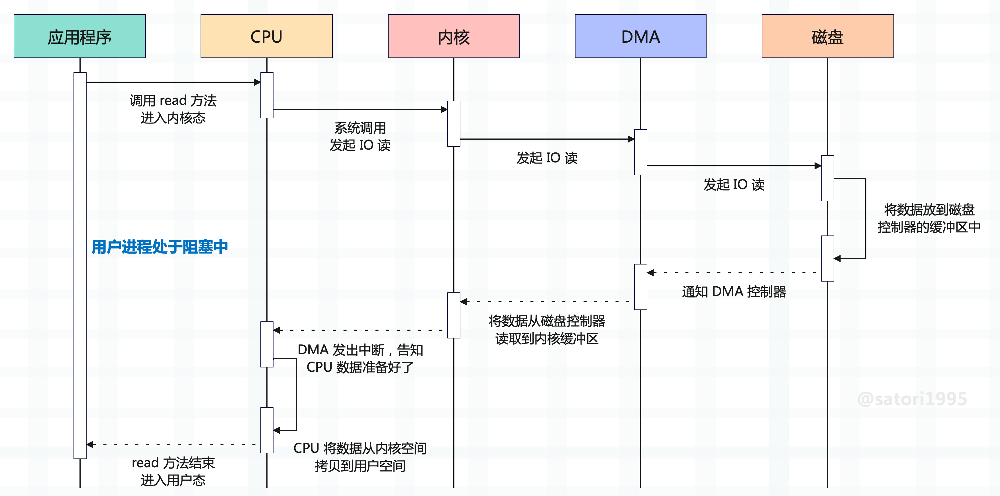

为了安全，操作系统将虚拟内存划分为用户态和内核态，两者是相互隔离的，即使用户的应用程序崩溃了，也不会影响系统的运行。


而磁盘、网卡等硬件设备，只有内核才有权限操作，如果应用程序想读取文件，那么必然涉及用户态和内核态之间的切换。假设应用程序想要读取数据，那么会经历以下过程：

+ 1）调用 read 方法，然后触发系统调用，向内核发送 IO 请求，此时程序进入阻塞状态；
+ 2）内核收到 IO 请求后，进一步将请求发送给 DMA，这里解释一下什么是 DMA。早期搬运数据都是由 CPU 来做的，但 CPU 是非常宝贵的，让它搬运数据简直是一种浪费，于是便有了 Direct Memory Access（直接内存访问）技术，简称  DMA。和磁盘等设备之间进行数据交互的时候，数据搬运的工作全部交给 DMA 控制器，让 CPU 去做别的事情；
+ 3）DMA 将 IO 请求进一步发送给磁盘，表示：磁盘兄弟，你快给我准备数据；
+ 4）磁盘收到 DMA 的 IO 请求，会把数据从磁盘读取到磁盘控制器的缓冲区中，当磁盘控制器的缓冲区被读满后，向 DMA 发起中断信号，告知自己缓冲区已满；
+ 5）DMA 收到磁盘的中断信号，会将磁盘控制器缓冲区中的数据拷贝到内核缓冲区中，此时仍然不占用 CPU，CPU 可以执行其他任务；
+ 6）当 DMA 将数据准备好后，就会向 CPU 发送中断信号，表示你可以将数据搬到用户空间了；
+ 7）CPU 收到 DMA 的信号，知道数据已经准备好，于是将数据从内核拷贝到用户空间、或者说用户缓冲区，然后系统调用返回，read 方法结束；

以上就是读取文件的整个过程，这里再解释一下 DMA。在早期搬运数据都是由 CPU 来做的，磁盘控制器的缓冲区满了之后， 由 CPU 搬到内核缓冲区。但搬数据这种简单的工作让 CPU 去做太大材小用了，如果数据量非常大的话，那 CPU 还怎么做其它事情？

于是有了 DMA，因为磁盘（硬件）存储的数据肯定要先到内核缓冲区，然后才能到用户空间。同理，用户空间想要往磁盘存储数据，也要先将数据拷贝到内核缓冲区，然后才能落盘。而为了保证 CPU 效率，内核缓冲区和磁盘之间的数据交互就可以交给 DMA 来做，CPU 不用亲自参与了。CPU 只需要告诉 DMA 传输的数据内容、以及将数据传输到哪里即可，剩下的交给 DMA 去做，DMA 做完了再告知 CPU。

早期的 DMA 只存在于主板上，而现在 IO 设备越来越多，不同的 IO 设备对数据传输的要求也不相同，所以每个设备都有自己的 DMA 控制器。总之 DMA 的作用非常单纯，就是为了减少 CPU 的工作量，帮助 CPU 完成内核缓冲区和磁盘等硬件之间的数据搬运。

但是 DMA 只负责内核缓冲区和磁盘之间的数据搬运，而内核空间和用户空间之间的数据搬运，必须由 CPU 来做。因为 DMA 位于硬件设备之上，只有内核才能操作硬件设备，所以 DMA 只能把数据搬到内核空间，不可能把内核空间的数据再搬到用户空间。换句话说，只要涉及到用户态，那么数据搬运只能由 CPU 来做。

整个过程示意图如下：



好了，说了这么多，接下来就要进入主题了。

以上过程发生了两次数据拷贝，第一次拷贝是 DMA 做的，将数据从磁盘搬到内核缓冲区；但第二次拷贝是 CPU 做的，将数据从内核缓冲区搬到用户缓冲区，因为用户进程只能操作用户空间里的数据。

但显然数据的拷贝是比较耗时的，于是 Linux 提供了一个系统调用函数 mmap，可以直接将文件映射到指定的用户进程（对应的虚拟内存）。进程通过对内存的读取和修改，实现对文件的读取和修改，从而避免了内核空间和用户空间的数据拷贝。

另外，如果多个进程映射同一个文件，还可以实现进程通信的目的。因为映射的是同一个文件，一个进程修改了，另一个进程也能看到。

前置知识介绍完了，而我们的主题是和 Python 相关的，那么接下来就要通过 Python 实现 mmap。而实现方式也很简单，Python 有一个内置库叫 mmap，调用它的 mmap 类即可实现。函数的原型如下：

~~~Python
# Windows
mmap(fileno, length[, tagname[, access[, offset]]])
# UNIX
mmap(fileno, length[, flags[, prot[, access[, offset]]]])
~~~

解释一下里面的参数，这里只看 UNIX：

- fileno：文件描述符，通过 os.open 获取即可。或者使用内置函数 open 打开，然后通过文件对象的 fileno 方法获取；
- length：映射的长度，比如文件有 1G，但我们可能只映射 1024 字节。如果指定为 0，则全部映射；
- offset：映射默认是从头开始的，如果不想从头开始，还可以指定偏移量。但这个偏移量必须是页对齐的，一个页大小默认是 4096，可以通过 mmap.PAGESIZE 查看。换句话说，offset 必须是 mmap.PAGESIZE 的整数倍；
- prot：映射之后的内存段权限，有以下几种：
  - mmap.PROT_READ：内存段可读；
  - mmap.PROT_WRITE：内存段可写；
  - mmap.PROT_EXEC：内存段可执行；
  - mmap.PROT_NONE：内存段不能被访问；
- flags：进程修改内存段之后，文件的表现，有以下几种：
  - mmap.MAP_SHARED：对内存的修改，会体现在文件中；
  - mmap.MAP_PRIVATE：对内存的修改，不会体现在文件中；
  - mmap.ANNOYMOUS：如果内存不是基于映射文件得到的，那么内容全部被初始化为 0；

prot 和 flags 参数我们一般不需要太关注，默认值就是我们想要的，多个进程可以共享文件，并且对内存的修改也会体现在文件中。所以我们只需要关注 fileno, length, offset 这三个参数即可，下面来测试一下，看看 mmap 的用法。

~~~Python
import mmap
import os

# 1.txt 里面的内容是 a-z 总共 26 个小写的英文字母
m = mmap.mmap(os.open("1.txt", os.O_RDWR), 0)
# 打印的结果是一个 mmap 对象
print(m)
"""
<mmap.mmap object at 0x0000011D7FD5A930>
"""

# 查看长度
print(len(m))
print(m.size())
"""
26
26
"""

# 获取元素，支持索引和切片
print(m[0], chr(m[0]))
"""
97 a
"""
print(m[-1], chr(m[-1]))
"""
122 z
"""

print(m[1: 3])
print(m[-3:])
print(m[:])
"""
b'bc'
b'xyz'
b'abcdefghijklmnopqrstuvwxyz'
"""

# 还提供了 find 和 rfind 方法
print(m.find(b"bcd"))  # 1
print(m.find(b"z"))  # 25
print(m.rfind(b"z"))  # 25
~~~

是不是很方便呢？就跟操作数组一样。当然啦，mmap 还支持文件操作。

~~~python
import mmap
import os

m = mmap.mmap(os.open("1.txt", os.O_RDWR), 0)

# 返回文件光标
print(m.tell())
"""
0
"""
# 读取文件内容，可以指定读取多少字节
# 不指定，则从当前光标位置读到结尾
print(m.read())
"""
b'abcdefghijklmnopqrstuvwxyz'
"""
# 此时光标处于文件结尾
print(m.tell())
"""
26
"""
# 移动光标
# 从结尾向前移动 5 字节
m.seek(-5, 2)
print(m.tell())
"""
21
"""
# 读取内容
print(m.read())
"""
b'vwxyz'
"""
# 继续读取的话，会读到空字节串
print(m.read(3), m.read())
"""
b'' b''
"""

# 无论光标在什么位置
# 都不影响索引或切片访问
print(m[10: 20])
"""
b'klmnopqrst'
"""
~~~

除此之外，mmap 还支持 for 循环：

~~~python
import mmap
import os

m = mmap.mmap(os.open("1.txt", os.O_RDWR), 0)

# 既然支持索引访问，证明实现了 __getitem__
# 那么支持 for 循环也是意料之中的
for index, char in enumerate(m):
    if index == 5:
        break
    print(char)
"""
b'a'
b'b'
b'c'
b'd'
b'e'
"""
# 注意：for 循环这种方式，不会影响光标

# 所以 mmap 对象还提供了一个 read_byte 方法
# read_byte 也是每次读取一个字节，但是会影响光标
print(m.read_byte())  # 97
print(m.read_byte())  # 98
print(m.read_byte())  # 99
# 返回的是整数，read_byte() 就相当于 read(1)[0]

# 最后 mmap 还提供了 readline 方法，一次读取一行
print(m.tell())  # 3
print(m.readline())
"""
b'defghijklmnopqrstuvwxyz'
"""
m.seek(0, 0)
print(m.readline())
"""
b'abcdefghijklmnopqrstuvwxyz'
"""
# 当前文件只有一行
# 所以再读的话就没有内容了
print(m.readline())  # b''
~~~

以上都是读取数据，然后我们来写入数据。

~~~Python
import mmap
import os

m = mmap.mmap(os.open("1.txt", os.O_RDWR), 0)

# 通过索引赋值，赋的值必须是整数
m[0] = ord("A")
# 注意长度要匹配
m[1: 3] = b"BC"
# 查看文件的话，会发现文件也被修改了
print(m[:])
"""
ABCdefghijklmnopqrstuvwxyz
"""
m[-2:] = b"YZ"
print(m[:])
"""
ABCdefghijklmnopqrstuvwxYZ
"""

# 注意：在通过索引或切片操作的时候，不要越界
# 文件总共 26 个字符，都是 ASCII
# 因此最大索引是 25
try:
    m[26] = 33
except IndexError as e:
    print(e)
"""
mmap index out of range
"""

try:
    # 依旧越界    
    m[26: 27] = b"~"
except IndexError as e:
    print(e)
"""
mmap slice assignment is wrong size
"""

# 最大索引是 25，所以 m[24:] 等价于 m[24: 26]
# 此时只剩下两个字节，而我们赋的值是 3 个字节
try:
    m[24:] = b"~~~"
except IndexError as e:
    print(e)
"""
mmap slice assignment is wrong size
"""
# 此时是没问题的
m[23:] = b"~~~"
print(m[:])
"""
b'ABCdefghijklmnopqrstuvw~~~'
"""
~~~

像这种通过索引或切片赋值的方式，不仅修改内存中的数据，还会将修改后的数据映射到磁盘文件里面。如果你在 Windows 上操作之后，发现文件内容没有变化，那么不妨先关闭，然后再用 notepad++ 打开。Linux 的话，直接 cat 命令即可。

注意：此时进程对内存的操作会直接体现在文件里，而不需要经过内核空间的 read、write 等系统调用。换句话说，此时操作内存等价于操作文件，因为两者已经建立好了映射关系，因此这种做法非常高效。

> 通常在加载共享库的时候，也是通过 mmap 的方式加载的。另外，在映射的时候，不能映射一个空文件，里面必须有内容。

mmap 也提供了类似文件的写入方法，我们来看一看，不过在这之前我先把文件恢复原样。

~~~Python
import mmap
import os

m = mmap.mmap(os.open("1.txt", os.O_RDWR), 0)
print(m[:])
"""
b'abcdefghijklmnopqrstuvwxyz'
"""

# 会伴随光标移动
m.write(b"ABC")
print(m[:])
"""
b'ABCdefghijklmnopqrstuvwxyz'
"""

m.write(b"DEF")
print(m[:])
"""
b'ABCDEFghijklmnopqrstuvwxyz'
"""

# 移动到文件末尾的前 1 个字节
m.seek(-1, 2)
print(m.tell())  # 25
# 此时最多写入一个字节
try:
    m.write(b"ZZ")
except ValueError as e:
    print(e)
"""
data out of range
"""
m.write(b"Z")
print(m[:])
"""
b'ABCDEFghijklmnopqrstuvwxyZ'
"""
# 除了 write 方法之外，还有一个 write_byte
# 但 write_byte 每次只能写入一个字节，并且接收的必须是 0 ~ 255 之间的整数
~~~

用记事本打开 1.txt 文件，如果已经打开，那么就先关闭再打开，会发现内容被修改。

然后 mmap 还有一个 resize 方法，它可以改变内存段的大小。

```Python
import mmap
import os

m = mmap.mmap(os.open("1.txt", os.O_RDWR), 0)
print(m[:])
"""
b'ABCDEFghijklmnopqrstuvwxyZ'
"""
# 打开文件会发现结尾的 yZ 已经没了
m.resize(24)
print(m[:])
"""
b'ABCDEFghijklmnopqrstuvwx'
"""
# 如果扩大 size 的话，会用 \x00 填充
m.resize(26)
print(m[:])
"""
b'ABCDEFghijklmnopqrstuvwx\x00\x00'
"""
```

打开文件，查看内容：


\\x00 显示的就是这种乱七八糟的样子，总之 resize 的话，如果 size 减少，相当于删除；size 增加，用 \\x00 填充。

以上就是通过 mmap 来读写文件，它的效率很高，并且还支持通过索引和切片的方式读写，建议使用此方式。对了，还有关闭，如果不需要使用了，可以调用 m.close() 关闭 mmap 对象（但是文件不会关闭）。

最后，再来聊一聊 offset，它表示偏移量，这个偏移量必须是页对齐的。

~~~Python
import mmap
import os

with open("1.txt", "w", encoding="utf-8") as f:
    f.write("a" * 4096 + "abc")

m = mmap.mmap(os.open("1.txt", os.O_RDWR), 0)
print(len(m))  # 4099

try:
    m = mmap.mmap(os.open("1.txt", os.O_RDWR), 0, offset=100)
except OSError as e:
    print(e)
"""
[WinError 1132] 指定的基址或文件偏移量没有适当对齐。
"""

# 偏移量必须是 mmap.PAGESIZE 的整数倍
# 一个页的大小一般是 4096
m = mmap.mmap(os.open("1.txt", os.O_RDWR), 0, offset=mmap.PAGESIZE)
# 显然此时只能读出 b"abc"
print(m[:])
"""
b'abc'
"""
# 补充一下，即便 offset 是 PAGESIZE 的整数倍
# 在 Windows 上依然会报出上面的错误，但在 Linux 上面是没有问题的
~~~

以上就是 offset 的作用，它表示偏移量，但是这个偏移量必须是页对齐的。并且，offset 不可以超过文件的长度，否则会报错：ValueError: mmap offset is greater than file size。

关于 mmap 的部分我们就说到这里。