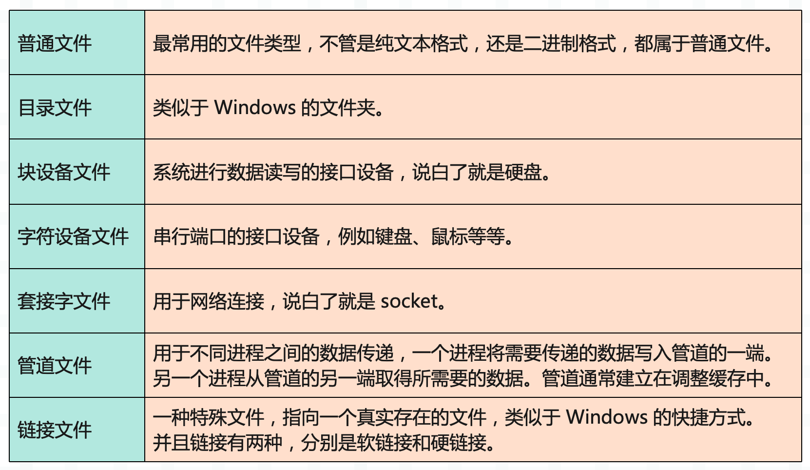
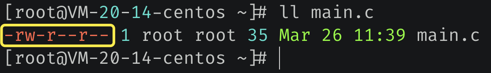
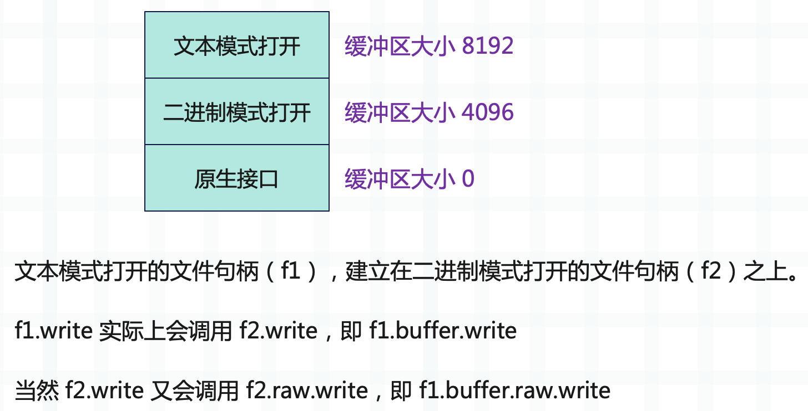
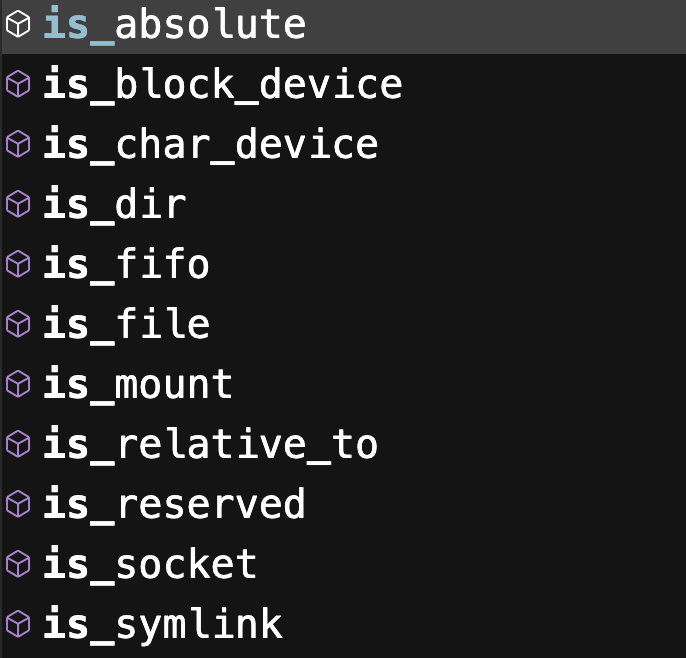

## 楔子

文件处理是程序开发中经常会遇到的一个问题，比如文件是否存在，是否可读、可写、可执行，查看文件的状态，文件的读写操作等等。

本篇文章将会介绍一些最佳实践，让你在处理文件的时候更加得心应手。另外我们知道 Linux 一切皆文件，大致有以下七种。



而本篇文章所说的文件并不单单指普通文件，而是指所有类型的文件。

## 文件是否存在、是否可读可写可执行

针对这个需求，我推荐使用 os.access 函数。使用该函数一般传递两个参数即可，参数一是文件路径，参数二是模式，而模式有以下四种：

- os.F_OK：判断文件是否存在；
- os.R_OK：判断文件是否可读；
- os.W_OK：判断文件是否可写；
- os.X_OK：判断文件是否可执行；

我们测试一下：

```python
import os

# 文件是否存在
os.access("main.c", os.F_OK)
# 文件是否可读
os.access("main.c", os.R_OK)
# 文件是否可写
os.access("main.c", os.W_OK)
# 文件是否可执行
os.access("main.c", os.X_OK)

# 返回的都是布尔值
```

可读、可写、可执行在工作中遇到的不是很多，更多的还是判断是否存在。

## 文件的状态

文件的状态一般包含以下几种：

- 文件的类型，比如普通文件、目录文件等等；
- 文件的访问权限；
- 文件的最后访问时间、修改时间等等；
- 文件的大小（普通文件）；

在 Python 里面要如何获取文件状态呢？实际上获取文件状态都是通过系统调用来完成的，而 os.stat 函数可以帮我们实现这一点。

```Python
import os

# 接收一个路径，或者文件描述符
stat = os.stat("main.c")
# 返回一个 os.stat_result 对象
print(stat)
"""
os.stat_result(
st_mode=33206, st_ino=37999121855938744, 
st_dev=2993193685, st_nlink=1, st_uid=0, 
st_gid=0, st_size=3375, st_atime=1652539604, 
st_mtime=1652539604, st_ctime=1652537628)
"""
print(stat.st_mode)
print(stat.st_ino)
print(stat.st_dev)
print(stat.st_nlink)
print(stat.st_uid)
print(stat.st_gid)
print(stat.st_size)
print(stat.st_atime)
print(stat.st_mtime)
print(stat.st_ctime)
```

里面的字段包含了文件的全部信息，我们来介绍常用的。

### st_mode

我们先在 CentOS 上使用 ll 命令查看某个文件，观察它的输出信息：



注意红色框框里面的部分，总共十个字符，首先是第一个字符，表示文件类型。**-** 代表普通文件，**d** 代表目录文件，**b** 代表块设备文件，**c** 代表字符设备文件，**p** 代表管道文件，**l** 代表链接文件。显然这里是普通文件。

然后是剩余的九个字符，分为三组，分别代表 文件所有者、文件所属组、其它用户 的操作权限，顺序都是 rwx，即是否可读、可写、可执行。如果显示的是 **-**，那么代表不具备相应的权限；如果显示的是具体的字符，那么代表具备相应的权限。

比如 main.c 的文件所有者具备对 main.c 的可读可写权限，而其它用户则只有可读权限。好了，前置知识介绍完毕，下面看 st_mode。

~~~Python
import os

stat = os.stat("main.c")
print(
    bin(stat.st_mode)
)  # 0b1000000110100100
~~~

需要转成二进制观察，我们先看后九位，110_100_100，分别对应 文件所有者、文件所属组、其它用户 的操作权限。每三位对应的都是 rwx，为 1 表示具有相关权限，为 0 表示不具有，所以它们都具有可读权限，没有可执行权限。

- 100：具备可读权限，转成十进制（八进制）结果为 4；
- 010：具备可写权限，转成十进制（八进制）结果为 2；
- 001：具备可执行权限，转成十进制（八进制）结果为 1；
- 110：具备可读可写权限，转成十进制（八进制）结果为 6；
- 011：具备可写可执行权限，转成十进制（八进制）结果为 3；
- 101：具备可读可执行权限，转成十进制（八进制）结果为 5；
- 111：具备可读可写可执行权限，转成十进制（八进制）结果为 7；

~~~python
import os

stat = os.stat("main.c")
# 右移 6 位，然后和 0b111 做按位与
# 可以计算出文件所有者的权限
print(stat.st_mode >> 6 & 0b111)  # 6
# 右移 3 位，然后和 0b111 做按位与
# 可以计算出文件所属组的权限
print(stat.st_mode >> 3 & 0b111)  # 4
# 计算其它用户的权限
print(stat.st_mode & 0b111)  # 4
~~~

当然了，这种情况更建议使用 os.access 进行判断，会更方便一些。

好，后九位我们看完了，它代表的是三个权限。而前面的位，也就是 st_mode 右移 9 位之后的结果，则代表文件的类型。

~~~Python
import os
import stat

st_mode = os.stat("main.c").st_mode
# 是否是普通文件
# 如果是返回非 0，否则返回 0
print(st_mode & stat.S_IFREG)  # 32768
# 不过上面的方式比较麻烦
# stat 模块已经帮我们封装好了相应的函数
print(stat.S_ISREG(st_mode))  # True
# 是否是目录文件
print(stat.S_ISDIR(st_mode))  # False
# 是否是块设备
print(stat.S_ISBLK(st_mode))  # False
# 是否是字符设备文件
print(stat.S_ISCHR(st_mode))  # False
# 是否是套接字文件
print(stat.S_ISSOCK(st_mode))  # False
# 是否是管道文件
print(stat.S_ISFIFO(st_mode))  # False
# 是否是链接文件
print(stat.S_ISLNK(st_mode))  # False
~~~

### st_uid 和 st_gid

文件所有者和所属组的 id，这个在 Windows 上一般都是 0，无需太关注。

### st_size

文件的大小，这个也是比较常用的。每个文件有多大，操作系统帮我们记录好了，直接获取即可。

```Python
import os

stat = os.stat(r"main.c")
print(stat.st_size)  # 35
```

### st_atime、st_mtime、st_ctime

分别表示访问时间、修改时间、创建时间，都是时间戳。

## 如何设置文件的缓冲区

像磁盘、网卡之类的硬件设备只有操作系统的内核才有权限操作，我们开发的应用程序是没有权限的。于是操作系统把对磁盘、网卡之类的硬件相关的操作封装成了一个个的系统调用，应用程序通过这些系统调用便可借助内核来操作硬件设备。

而将内存中的数据写入到磁盘也不例外，它也会触发相应的系统调用，而系统调用的 I/O 是比较耗时的。还有磁盘，磁盘属于块设备，它写入数据时，不是以字节为单位、而是以块为单位写入的。假设一个块是 4096 个字节，那么写 1 个字节和写 4096 个字节耗时是一样的。

所以在写入数据的时候，不能来一个字节就触发一次系统调用，而是应该有一个缓冲区，这个缓冲区和块大小是一致的。当缓冲区满了，那么再一次性写入，这样能够提高效率。

在 Python 里面，缓冲区的大小是多大呢？又要如何设置呢？

~~~Python
# 以二进制模式打开
f = open("main.c", "wb")
~~~

首先解释器会从内核中读取磁盘的块大小，然后让缓冲区大小和磁盘的块大小保持一致。要是找不到磁盘的块大小（基本都能找到），则使用 io.DEFAULT_BUFFER_SIZE，这个值等于 8192。

一般来说，磁盘的块大小都是可以读出来的，大小为 4096。假设已经写了 4096 个字节，此时缓冲区已满，那么当写入第 4097 个字节时，缓冲区的 4096 个字节就会刷到磁盘上。然后写入的第 4097 个字节，就会成为缓冲区里面的第一个字节，这种模式也被称为**全缓冲**。

如果以二进制模式打开，缓冲区就是当前描述的这样，但如果是以文本模式打开呢？

```Python
binary_write = open("main.c", "wb")
print(binary_write)
"""
<_io.BufferedWriter name='main.c'>
"""

text_write = open("main.c", "w")
print(text_write)
print(text_write.buffer)
"""
<_io.TextIOWrapper name='main.c' mode='w' encoding='cp936'>
<_io.BufferedWriter name='main.c'>
"""

binary_read = open("main.c", "rb")
print(binary_read)
"""
<_io.BufferedReader name='main.c'>
"""

text_read = open("main.c", "r")
print(text_read)
print(text_read.buffer)
"""
<_io.TextIOWrapper name='main.c' mode='r' encoding='cp936'>
<_io.BufferedReader name='main.c'>
"""
```

- 如果以二进制模式写入（wb），那么文件句柄的类型为 BufferedWriter；以文本模式写入（w），那么文件句柄的类型为 TextIOWrapper；
- 如果以二进制模式读取（rb），那么文件句柄的类型为 BufferedReader；以文本模式读取（r），那么文件句柄的类型仍为 TextIOWrapper；

但是需要注意 TextIOWrapper 有一个属性叫 buffer，对应的正是以二进制模式打开时的文件句柄。所以文本模式打开（包含读取和写入），实际上还是基于二进制打开进行的一层封装。

~~~Python
f = open("main.c", "w")
# 可以通过如下方式写入
f.write("abc")
# 也可以使用如下方式写入
f.buffer.write(b"abc")
~~~

而 TextIOWrapper 这一层也是有缓冲区的，它的大小一般是 8192 个字节。如果缓冲区满了，再写入 BufferedWriter 的缓冲区，BufferWriter 的缓冲区满了，再写入到磁盘。所以从这个角度看，二进制模式打开比文本模式打开要更快一些，因为计算机存储的数据就是二进制格式的。

另外我们说 TextIOWrapper 是基于 BufferedWriter（读取的话是 BufferedReader，这里以写入为例）进行的封装，但其实 BufferedWriter 下面还有一层，叫 raw，而 raw 这一层是无缓冲的。

~~~Python
# 以二进制模式打开，缓冲区为 4096
f = open("main.c", "wb")
# 会立即写入磁盘，因为这一层没有缓冲区
# 它可以看做是调用操作系统提供的原生接口
f.raw.write(b"abc")

# 缓冲区大小为 4096，刚好满
f.write(b"a" * 4096)
# 但是到这里为止，缓冲区的数据还没有进入磁盘
# 如果你在此处 sleep 一会，然后查看文件
# 你会发现文件里面只有 abc 这三个字符

# 好，此时又来一个字符，缓冲区容不下了
# 必须先将已有的 4096 个字节写入磁盘
# 而写入是通过调用 f.raw 写入的
f.write(b"b")
~~~

文本模式也是同理，它是在二进制模式的基础之上又构建了一层。

~~~python
# 以文本模式打开，缓冲区为 8192
f = open("main.c", "w")
# TextIOWrapper -> BufferedWriter -> raw
# 此时缓冲区刚好满
f.write("a" * 8192)
# 再写入一个字符
f.write("b")

# 缓冲区容不下了，于是会将已有的 8192 字节写入 f.buffer 的缓冲区
# f.buffer 是以二进制模式打开的文件句柄
# 因为文本模式打开是构建在二进制模式打开的基础之上的
# 然后再通过 f.buffer.raw 将数据写入磁盘
~~~

因此，如果你希望写入的内容立刻刷到磁盘上，除了使用 flush 之外，还可以这么做。

~~~Python
# 以文本模式打开
f = open("main.c", "w")

# TextIOWrapper 没有 raw，只有 buffer，因为它是构建在 BufferedWriter 之上的
# raw 这一层没有缓冲区，调用它的 write，会直接写入文件
f.buffer.raw.write(b"abc")

# 或者还可以调用 flush 方法
f.write("abc")
# 该方法的本质也是强制调用 raw 的 write 操作，将内容写入磁盘
f.flush()
~~~

因此这三层的关系如下：



所以这就是三者之间的关系，最终实际负责写入数据的肯定还是 raw 这一层，只不过它没有缓冲区，只要有数据，就立刻写入。所以为了保证效率，在 raw 这一层之上又构建了带缓冲区的两层。

那么如何指定缓冲区的大小呢？

~~~python
f = open("main.c", "wb", buffering=1024)
~~~

通过 buffering 参数即可设置缓冲区大小，注意：不管是文本模式打开、还是二进制模式打开，这里的 buffering 参数设置的都是二进制这一层的缓冲区。在设置的时候 buffering 必须大于 1，如果等于 1，那么就不再是全缓冲了，而是行缓冲，意思就是遇到换行会立即写入磁盘。不过问题来了， 要是一直都没有写入换行呢？如果一直没有换行，那么缓冲区满了会写入磁盘，所以此时相当于全缓冲。

另外，行缓冲只支持文本模式。

~~~python
import time

f = open("main.c", "w")
f.write("abc\n")
time.sleep(30)
~~~

执行，然后查看文件，会发现里面啥也没有，因为数据都在缓冲区里面。默认是全缓冲，第一层的缓冲区大小是 8192，第二层的缓冲区大小是 4096，只有缓冲区满了，才会写入磁盘。

~~~Python
import time

f = open("main.c", "w", buffering=1)
f.write("abc\n")
time.sleep(30)
~~~

如果指定 buffering=1，那么就变成了行缓冲，在遇到换行的时候会直接写入磁盘，而不管缓冲区有没有满。如果一直没有换行，那么等价于全缓冲。

最后，还有一个无缓冲，也就是指定 buffering 为 0，但只支持二进制模式。

```Python
f = open("main.c", "wb", buffering=0)
# 立即写入缓冲区
f.write(b"abc")
```

实际上，如果指定 buffering=0，那么会直接得到 raw 这一层的文件句柄。

~~~Python
import time

f = open("main.c", "wb", buffering=1024)
print(f)
print(f.raw)
"""
<_io.BufferedWriter name='main.c'>
<_io.FileIO name='main.c' mode='wb' closefd=True>
"""
# raw 这一层对应的文件句柄类型是 FileIO
# 它可以看做是调用操作系统的原生接口，这一层没有缓冲区

# 如果指定 buffering=0
f = open("main.c", "wb", buffering=0)
# 我们看到直接返回第三层
print(f)
"""
<_io.FileIO name='main.c' mode='wb' closefd=True>
"""
# 所以 buffering=0 表示无缓冲
# 因为它返回的不是 BufferedWriter，而是 raw 这一层的句柄
~~~

我们总结一下，缓冲模式分为全缓冲、行缓冲、无缓冲。

- buffering 大于 1：全缓冲；
- buffering 等于 1：行缓冲，只适用于文本模式；
- buffering 等于 0：无缓冲，只适用于二进制模式，并且返回的句柄类型是 FileIO；

## 优雅地遍历一个目录

在工作中，有时我们需要读取一个目录，然后遍历里面所有的文件。我们可以使用 os.listdir 来实现，但是 Python 从 3.4 开始引入了一个 pathlib 模块，更加的方便。

~~~python
from pathlib import Path

p = Path(r"C:\python38\Lib\asyncio")

for file in p.glob("b*.py"):
    print(file)
"""
C:\python38\Lib\asyncio\base_events.py
C:\python38\Lib\asyncio\base_futures.py
C:\python38\Lib\asyncio\base_subprocess.py
C:\python38\Lib\asyncio\base_tasks.py
"""
~~~

Path 接收一个文件路径，然后调用它的 glob 方法，即可遍历内部所有的文件。并且 glob 方法接收一个模式，在遍历的时候会选择名称和模式匹配的文件。

- ?：匹配一个任意字符；
- *：匹配任意个任意字符；
- [sequence]：匹配出现在 sequence 里面的一个字符；
- [!sequence]：匹配没有出现在 sequence 里面的一个字符；
- [a-z]：匹配出现在 abcdef...z 中的一个字符；
- [A-Z]：匹配出现在 ABCDEF...Z 中的一个字符；
- [0-9]：匹配出现在 0123...9 中的一个字符；

如果想匹配所有文件，那么直接 **.glob("\*")** 即可，并且遍历得到的仍是一个 Path 对象。当然啦，如果只是 glob，那么可以用 os.listdir 代替。Path 对象还有一个方法叫 rglob，用法和 glob 一样，但是它可以递归遍历子目录，而 glob 只能遍历一层。

~~~Python
from pathlib import Path

p = Path(r"C:\python38\Lib\site-packages\numpy")

# 只能遍历一层
for file in p.glob("*.py"):
    # 拿到文件名
    # 直接 p.glob("__init__.py") 也是可以的
    if file.name == "__init__.py":
        print(file)
"""
C:\python38\Lib\site-packages\pnumpy\__init__.py
"""

# 递归遍历
for file in p.rglob("*.py"):
    if file.name == "__init__.py":
        print(file)
"""
C:\python38\Lib\site-packages\numpy\__init__.py
C:\python38\Lib\site-packages\numpy\compat\__init__.py
C:\python38\Lib\site-packages\numpy\compat\tests\__init__.py
C:\python38\Lib\site-packages\numpy\core\__init__.py
C:\python38\Lib\site-packages\numpy\core\tests\__init__.py
C:\python38\Lib\site-packages\numpy\distutils\__init__.py
......
......
"""
~~~

因此在遍历目录的时候，强烈推荐使用 pathlib 模块，非常的方便。其实不光是遍历目录，pathlib 还有其它的功能，这里也补充一下。

~~~Python
from pathlib import Path

p = Path(__file__)
print(p)
"""
D:\satori\main.py
"""

# 如果想拿到它的上一级目录，该怎么做呢？
# 是不是比 os.path.dirname 要方便呢？
print(p.parent)  # D:\satori
# 上一级目录的上一级目录
print(p.parent.parent)  # D:\

# 目录的拼接，直接使用 / 即可
# 或者调用 joinpath
print(p.parent / "koishi" / "main.py")
print(p.parent.joinpath("koishi", "main.py"))
"""
D:\satori\koishi\main.py
D:\satori\koishi\main.py
"""

# 所以 Path 在路径拼接上面也是一把好手
# 另外以上返回的都是 Path 对象
# 如果想当成字符串来用，需要调用 str 转化一下

# Path 还有一些其它方法
# 返回文件名，字符串格式
print(p.name)  # main.py

# 返回不带后缀的文件名
print(p.stem)  # main

# 文件重命名
p.rename("main2.py")
~~~

此外 Path 还有一些方法可以用来判断文件类型，比如是普通文件、目录文件等等。



这些方法内部在判断的时候也是基于 os 和 stat 模块实现的，我们上面已经介绍过了，先通过 os.stat 函数获取 st_mode，再使用 stat 模块里面函数判断类型。

总之在拼接路径和遍历目录的时候，首推 pathlib。