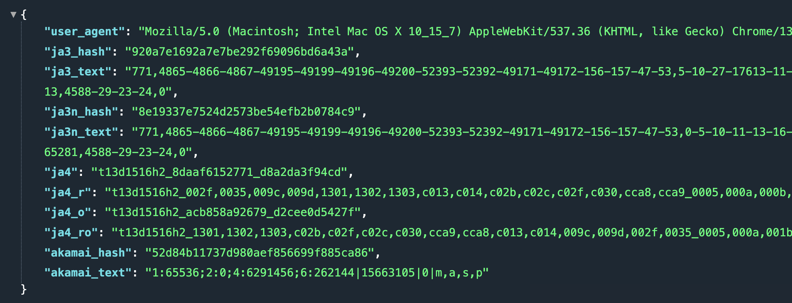
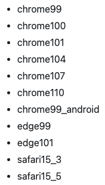

相信大家在做爬虫的时候，都有过被反爬的经历，一旦网站识别是爬虫，就会拒绝请求。反爬机制有很多，最常见的便是通过请求头里的 User-Agent，举个例子。

```python
import requests
import httpx

response = requests.get("http://www.baidu.com")
print(response.request.headers["User-Agent"])
"""
python-requests/2.28.0
"""

response = httpx.get("http://www.baidu.com")
print(response.request.headers["User-Agent"])
"""
python-httpx/0.23.3
"""
```

如果 User-Agent 不符合浏览器的格式，那么一定不是浏览器发出的，于是网站便可认定这属于爬虫。当然通过 User-Agent 识别属于最低级的方式，因为爬虫可以伪造自己的 User-Agent。

~~~python
import requests
import httpx

response = requests.get("http://www.baidu.com",
                        headers={"User-Agent": "Chrome User-Agent"})
print(response.request.headers["User-Agent"])
"""
Chrome User-Agent
"""

response = httpx.get("http://www.baidu.com",
                     headers={"User-Agent": "IE User-Agent"})
print(response.request.headers["User-Agent"])
"""
IE User-Agent
"""
~~~

除了 User-Agent 之外，还可以通过请求头中的 Refer 字段判断是否为爬虫。比如你在 A 页面点击某个标签跳转到 B 页面，那么 Refer 就是 A 页面的地址。如果你直接访问的 B 页面，那么 Refer 就是空。如果 B 页面必须通过点击 A 页面的标签才能跳转，那么网站便可以通过 Refer 来判断是否为爬虫。

当然啦，反爬机制还有很多，不同网站使用的策略不一样。但现在大部分的网站都使用了 HTTPS，在建立 HTTPS 连接的时候要先进行 TLS 握手，在握手的过程中会协商加密算法、交换密钥和验证双方的身份。而将 TLS 握手产生的信息收集起来，并使用 JA3 算法生成一个哈希值，便得到了 TLS 指纹，基于该指纹可以标识、分类和跟踪使用特定 TLS 配置的客户端。

因此通过 JA3 哈希生成指纹便可以确定哪些是恶意流量，从而将其拒绝掉。换句话说，通过 TLS 指纹可以识别哪些是浏览器发出的正常请求，哪些是爬虫。

那么 TLS 指纹如何查看呢？可以通过以下几个网站。

> https://tls.browserleaks.com/json 
>
> https://tls.peet.ws/ 
>
> https://kawayiyi.com/tls



这是我基于浏览器访问的，它的字段都不是空。但如果使用爬虫，那么多次请求时的 ja3_hash 是不变的，并且 akamai_hash 和 akamai_text 均是空，基于该特征很容易识别是不是爬虫。即使我们更换代理，设置请求头，也无法改变这一点。

于是为了完美模拟浏览器，国外大佬开发出了 curl-impersonate，将 curl 底层依赖的库全部换成了浏览器使用的库，并且版本也是一致的，这样生成的指纹就和浏览器完全一样了。而 curl_cffi 正是 curl-impersonate 的 Python binding，我们直接使用 pip 安装即可。

~~~python
# 和 requests 接口是一致的
from curl_cffi import requests

# 但是多了一个 impersonate 参数，用于指定模拟哪个浏览器
response = requests.get("https://tls.browserleaks.com/json",
                        impersonate="chrome101")

print(response.json())
"""
{'user_agent': 'Mozilla/5.0 (Windows NT 10.0; Win64; x64) AppleWebKit/537.36...', 
 'ja3_hash': 'cd08e31494f9531f560d64c695473da9', 
 'ja3_text': '771,4865-4866-4867-49195-49199-49196-49200-52393-52392-49171-491...', 
 'ja3n_hash': 'aa56c057ad164ec4fdcb7a5a283be9fc', 
 'ja3n_text': '771,4865-4866-4867-49195-49199-49196-49200-52393-52392-49171-491...', 
 'ja4': 't13d1516h2_8daaf6152771_e5627efa2ab1', 
 'ja4_r': 't13d1516h2_002f,0035,009c,009d,1301,1302,1303,c013,c014,c02b,c02c,c02f...', 
 'ja4_o': 't13d1516h2_acb858a92679_2d79a7d73c2f', 
 'ja4_ro': 't13d1516h2_1301,1302,1303,c02b,c02f,c02c,c030,cca9,cca8,c013,c014,009c...', 
 'akamai_hash': '4f04edce68a7ecbe689edce7bf5f23f3', 
 'akamai_text': '1:65536;3:1000;4:6291456;6:262144|15663105|0|m,a,s,p'}
"""

# 当然也可以先创建 session
session = requests.Session()
# 然后基于 session 发请求
~~~

总共支持如下版本的浏览器：



我们选择 chrome110 即可，然后 curl_cffi 还支持异步发请求，可以和 asyncio 轻松集成。

~~~python
import asyncio
from curl_cffi import requests

async def send_req():
    async with requests.AsyncSession() as session:
        response = await session.get(
            "https://tls.browserleaks.com/json",
            impersonate="chrome101"
        )
    print(response.json())
    
asyncio.run(send_req())
~~~

由于指纹特征很难更改，因此通过指纹可以防御一大批爬虫，而通过 curl_cffi 模拟指纹则可以绕过这道防线。