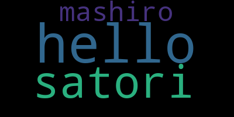
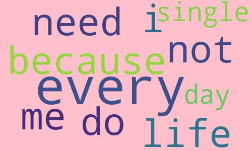
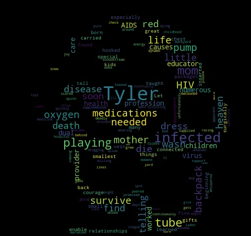
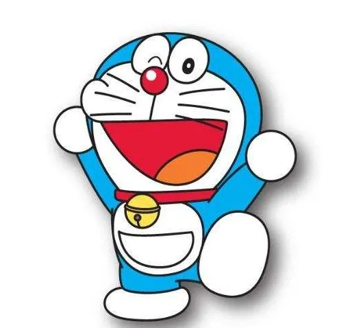
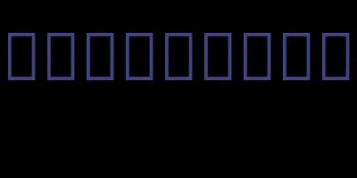
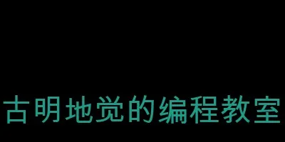
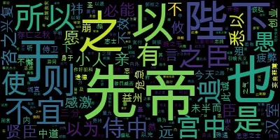

什么是词云？在网络上我们经常可以看到一张图片，上面有一大堆大小不一的文字，这便是词云。词云一般是根据输入的大量词语生成的，如果某个词语出现的次数越多，那么相应的大小就会越大。

Python 中有一个专门用来生成词云的模块：wordcloud，直接 pip 安装即可，然后我们来看看它的用法。

~~~python
# 导入模块
from wordcloud import WordCloud
# 准备文本数据，是一个字符串，单词之间用空格分隔
sentence = "hello satori hello mashiro hello satori"
# 创建词云对象
wc = WordCloud()
# 根据文本生成词云
wc.generate(sentence)
# 保存为图片
wc.to_file("word.png")
~~~

打开图片看看效果：



我们看到单词就显示在了图片上，如果单词一多就像天空的云彩一样漂浮着，并且单词出现的频率越高，那么该单词在图片上大小就越大。

虽然词云生成了，但是风格是固定的，我们可不可以调整呢，显然是可以的。WordCloud 里面支持很多参数用来调整风格，我们看一下这些参数。

- width：词云的宽，默认是400像素；
- height：词云的高，默认是200像素；
- background_color：词云的背景颜色，默认是黑色；
- font_path：生成的词云所使用的字体，传入一个字体名称；
- mask：词云背景图片，接收一个 Numpy 数组。可以使用 PIL 或者 cv2 读取图片，然后生成数组；
- stopwords：要屏蔽的词语，接收一个集合，生成词云的时候会忽略掉屏蔽的词语；
- max_font_size：字体的最大大小，默认为 None；
- min_font_size：字体的最小大小，默认为 None；
- max_words：最多显示多少个单词，默认为200。比如文本数据有 10000 个不重复单词，肯定不可能全部显示，而是按照出现的频率高低排序，选择出现频率最高的 N 个单词，默认是 200 个；
- contour_width：轮廓粗细；
- contour_color：轮廓颜色；
- scale：用来控制生成的图片大小，默认为 1。如果我们改成了 10，那么生成的图片大小会扩大 10 倍。这个参数不用管，没太大用，默认为 1 即可；

我们举例说明：

~~~python
from wordcloud import WordCloud
sentence = "i do not need sex, because life fucks me every every single day"
wc = WordCloud(
    width=500,  # 设置宽度为500px
    height=300,  # 设置高度为300px
    background_color='pink',  # 设置背景为粉色
    stopwords={"sex", "fucks"},  # 设置禁用词
    max_font_size=100,  # 设置最大的字体大小，所有词都不会超过 100px
    min_font_size=10,  # 设置最小的字体大小，所有词都会超过 10px
    max_words=10  # 最多生成 10 个词，当然这里单词比较少，看不出来什么
)

wc.generate(sentence)
wc.to_file("word.png")
~~~

看看生成的图片：



可以看到图片变宽了、变高了，背景变成粉色了，并且也没有出现禁用词。但这个图片是正方形的，而我们平常见到的词云是有形状的，比如一个圆形、或者一个人的形状等等。显然这是根据图片生成的，而 wordcloud 也支持这么做，下面来演示一下。

~~~python
from wordcloud import WordCloud
from PIL import Image
import numpy as np

# 一篇英文文章
with open("article.txt") as f:
    sentence = f.read()
# 加载一张图片，转化成numpy中的数组
mask = np.array(Image.open("哆啦A梦.png"))
# 传入mask
wc = WordCloud(mask=mask)
wc.generate(sentence)
wc.to_file("word.png")
~~~

看一下生成的结果：



下面是原始的图片，"多啦A梦.png"



会自动将周围的白色区域给忽略掉，因此选择的图片建议最好是白底的。

然后目前生成词云所使用的单词都是英文的，那中文可不可以呢？我们来看一下。

```python
from wordcloud import WordCloud

wc = WordCloud()
wc.generate("古明地觉的编程教室")
wc.to_file("word.png")
```

生成的结果如下：



显然默认是不支持中文的，此时我们需要指定一个中文字体。

```python
from wordcloud import WordCloud

# 传入本机支持中文的字体名称
wc = WordCloud(font_path="Arial Unicode.ttf")
wc.generate("古明地觉的编程教室")
wc.to_file("word.png")
```

看看效果：



中文正常显示了，但显示的是一整句话。因为 wordcloud 默认是以空格分隔单词的，所以对于英文我们不需要做什么处理，因为英文单词之间就是以空格分隔的。但中文则是所有的汉字都连在一起，因此整体被当成了一个词。

这个时候推荐使用 jieba 分词，将单词进行分隔。

~~~python
from wordcloud import WordCloud
import jieba

with open("出师表.txt") as f:
    sentence = f.read()
# 分词得到列表，手动使用空格拼接
sentence = " ".join(jieba.cut(sentence))
wc = WordCloud(font_path="Arial Unicode.ttf")
wc.generate(sentence)
wc.to_file("word.png")
~~~

我们基于出师表的内容生成词云：



结果没有问题，当然这里图片有点小了，你也可以调整它的宽高。

另外我们一直都是将词云保存成图片，除了图片，还可以保存成其它格式。

~~~python
from io import BytesIO
from wordcloud import WordCloud
import jieba

with open("出师表.txt") as f:
    sentence = f.read()

sentence = " ".join(jieba.cut(sentence))
wc = WordCloud(font_path="Arial Unicode.ttf")
wc.generate(sentence)

# 将词云保存为 PIL 的 Image 对象
im = wc.to_image()
buf = BytesIO()
# 将词云的字节流保存在 buf 中，这样可以直接交给客户端进行渲染
im.save(buf, "png")
print(buf.getvalue())

# 当然也可以保存为文件，im.save(filename)
# wc.to_file() 底层也是先转成 Image 对象、然后调用 im.save() 实现的

# 或者还可以保存为 SVG 格式
svg = wc.to_svg()
# 将 svg 的内容保存成文件，就得到 SVG 图片了
print(svg)
~~~

以上就是 Python 中词云生成相关的内容，快来试试吧。