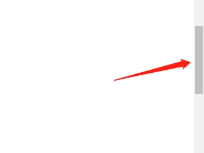
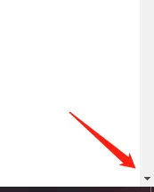

## 楔子

Python 有很多的库可以实现各种各样的功能，比如使用 pynput 操作你的鼠标和键盘。如果你写过游戏，那么用 pygame 和 pyglet 也可以，只不过它们毕竟是开发游戏的，要只是为了操作鼠标和键盘，用它们就有点小题大做了。

下面来看看 pynput 这个库的用法。

## 操作鼠标

鼠标的操作无非就这几种：点击按住不放、松开、双击，滑动滚轮，移动鼠标等等。

```python
from pynput.mouse import Button, Controller

# 实例化 Controller 得到一个可以操作鼠标的对象
mouse = Controller()
# mouse.position: 获取当前鼠标位置。
# 屏幕左上角坐标为 (0, 0)，右下角为 (屏幕宽度, 屏幕高度)
print(f"当前鼠标位置: {mouse.position}")
"""
当前鼠标位置: (881, 467)
"""

# 给 mouse.position 赋值等于移动鼠标，这里相当于移动到 (100, 100) 的位置
# 如果坐标小于 0，那么等于 0。如果超出屏幕范围，那么等于最大范围
mouse.position = (100, 100)  # 此方法等价于 mouse.move(100, 100)
print(f"当前鼠标位置: {mouse.position}")
"""
当前鼠标位置: (100, 100)
"""


# 按下左键, 同理 Button.right 是右键
mouse.press(Button.left)
# 松开左键
mouse.release(Button.left)
# 上面两行连在一起等于一次单击
# 如果这两行紧接着再重复一次，那么整体会实现双击的效果
# 因为两次单击是连续执行的，没有等待时间。
# 如果中间来一个 time.sleep，那么就变成两次单击了


# 当然鼠标点击我们有更合适的办法，使用 click 函数
# 该函数接收两个参数：点击鼠标的哪个键、以及点击次数
# 这里连续点击两次，等于双击
mouse.click(Button.right, 2)
```

然后是滑动滚轮，这个需要找张图片来演示。



这种情况我们如果想知道更多内容，需要向下滑动，也就是沿着 y 轴滑动。

```python
from pynput.mouse import Controller

mouse = Controller()

# 垂直方向、沿着 y 轴向下滑动 2 个 step
# 第一个参数针对水平方向，第二个参数针对垂直方向
# 具体的值表示移动的 step 数
mouse.scroll(0, 2)
```

那么问题来了，什么是 step 呢？



点击一次就会移动一个 step。


同理这个就是在水平方向上移动。

```python
from pynput.mouse import Controller

mouse = Controller()
# 水平方向：大于 0 向右，小于 0 向左
# 垂直方向：大于 0 向下，小于 0 向上
mouse.scroll(3, 0)
```

可能有人好奇，可不可以水平、垂直两个方向同时移动呢？答案是不可以，因为是模拟人来点击，无非就是效率的问题，所以也要符合常理，而我们平时用鼠标显然不可能两个方向同时移动。

## 监控鼠标

除了操作鼠标之外，pynput 也支持监控，记录我们做了哪些操作。

```python
from pynput.mouse import Listener, Button

def on_move(x, y):
    print(f"鼠标移动到: ({x}, {y})")

def on_click(x, y, button, is_press):
    if button == Button.left:
        button = "左键"
    else:
        button = "右键"
    if is_press:
        operator = "按下"
    else:
        operator = "松开"

    print(f"鼠标{button}在 ({x}, {y}) 处{operator}")

def on_scroll(x, y, dx, dy):
    if dx:
        print(f"滑轮在 ({x}, {y}) 处向{'右' if dx > 0 else '左'}滑")
    else:
        print(f"滑轮在 ({x}, {y}) 处向{'下' if dy > 0 else '上'}滑")

with Listener(
    on_move=on_move,
    on_click=on_click,
    on_scroll=on_scroll
) as listener:
    listener.join()
"""
鼠标移动到: (783.17578125, 302.7890625)
鼠标移动到: (777.2734375, 302.7890625)
鼠标移动到: (769.5703125, 302.7890625)
鼠标移动到: (758.74609375, 302.7890625)
滑轮在 (111.03515625, 609.31640625) 处向上滑
滑轮在 (111.03515625, 609.31640625) 处向上滑
滑轮在 (111.03515625, 609.31640625) 处向上滑
滑轮在 (111.03515625, 609.31640625) 处向左滑
滑轮在 (111.03515625, 609.31640625) 处向左滑
鼠标左键在 (649.44140625, 448.4765625) 处按下
鼠标左键在 (649.44140625, 448.4765625) 处松开
"""
```

上面实例化 Listener 时，相当于开启了一个线程，因为 Listener 这个类继承自 Thread。所以我们调用 listener.join() 就相当于阻塞在这里了，会一直监控鼠标事件。

如果回调函数里面返回了 False，那么监听会自动停止。

```python
from pynput.mouse import Listener, Button

def on_click(x, y, button, is_press):
    if button == Button.right:
        print("点击鼠标右键，监听结束")
        returnFalse
    if is_press:
        operator = "按下"
    else:
        operator = "松开"

    print(f"鼠标左键在 ({x}, {y}) 处{operator}")


with Listener(
    on_click=on_click,
) as listener:
    listener.join()
"""
鼠标左键在 (28.453125, 610.71484375) 处按下
鼠标左键在 (28.453125, 610.71484375) 处松开
点击鼠标右键，监听结束
"""
```

当然啦，程序在创建 Listener 的时候，使用的是 with 语句，会一直阻塞在这里。如果不希望它阻塞，还可以这么做。

```python
listener = Listener(
    on_move=on_move,
    on_click=on_click,
    on_scroll=on_scroll)

# 启动子线程开启监听，主线程会继续向下执行
listener.start()
# 如果不想监听了，可以调用 stop 方法结束
listener.stop()
```

## 操作键盘

操作键盘也比较简单，无非也是按下某个键、松开某个键，在按下某个键（或者多个）不松开的前提下按下另一个键。

下面来操作一下，方法和操作鼠标比较类似。

```python
from pynput.keyboard import Key, Controller

# 实例化一个可以操作键盘的对象
keyboard = Controller()

# 按下 a 键，小写
keyboard.press("a")
# 松开 a 键
keyboard.release("a")

# 按下 A 键，大写
keyboard.press("A")
# 松开 A 键
keyboard.release("A")
"""
像英文字符、数字等等直接输入相应的字符即可
但如果是 shift、ctrl 等键，那么需要调用 Key 里面属性
"""
# 按下大写键
keyboard.press(Key.caps_lock)
# 松开大写键
keyboard.release(Key.caps_lock)
```

然后是按住某个键不放的前提下，按下另外的键。

```python
from pynput.keyboard import Key, Controller

keyboard = Controller()

# shift 有两个键，一个是左边的、一个是右边的，此时相当于输入感叹号
with keyboard.pressed(Key.shift_l):
    keyboard.press("1")
    keyboard.release("1")

# 如果要同时按下多个键，那就输入多个键即可
with keyboard.pressed(Key.shift_l, Key.ctrl_l):
    keyboard.press(Key.f10)
```

## 监控键盘

监控键盘使用的方法和监控鼠标非常类似，依旧是实例化一个类Listener。

```python
from pynput.keyboard import Key, Listener

def on_press(key):
    # 当按下esc，结束监听
    if key == Key.esc:
        print(f"你按下了 esc，监听结束")
        returnFalse
    print(f"你按下了 {key} 键")

def on_release(key):
    print(f"你松开了 {key} 键")


with Listener(
    on_press=on_press, 
    on_release=on_release
) as listener:
    listener.join()
"""
你按下了 'a' 键
你松开了 'a' 键
你按下了 Key.backspace 键
你松开了 Key.backspace 键
你按下了 Key.shift 键
你松开了 Key.shift 键
你按下了 'c' 键
你松开了 'c' 键
你按下了 Key.enter 键
你松开了 Key.enter 键
你按下了 esc，监听结束
"""
```

以上就是这个模块的基本内容，具体怎么使用由你自己决定。另外这个模块在 Linux 上也是可以运行的，但前提是必须有显示器。