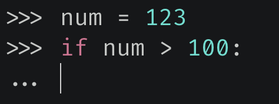

Python 里面可以通过换行来标识一行语句的结束，当你在一行的末尾敲击 Enter 键时，便可开始新的一行语句。

~~~python
name = "高老师"
print(name)  # 高老师
~~~

这段代码很简单，因为 `name = "高老师"` 后面已经没有内容了，是一个换行，那么就代表这个语句结束了。但是在 Python 中我们还可以指定分号，表示该语句结束了。

~~~python
name = "高老师"; print(name); age = 18; print(age)
"""
高老师
18
"""
~~~

可以看到当我们在 `name = "高老师"` 后面指定了分号之后，就代表该语句结束了。但是 Python 的语法解析并不会直接跳到下一行，而是继续向后寻找，即便当中出现了空格。由于都在一行，所以解释器会找到 print(name)，然后继续向后寻找。尽管这么做是可以的，但不推荐这种写法，这种写法纯属在恶作剧，当然我们这里演示就不算了。

再比如 if 语句，有时候会出现写在一行的情况。

```python
a = 123
if a > 100: print("a > 100"); print("两个 print 具有相同的缩进")
"""
a > 100
两个 print 具有相同的缩进
"""
```

如果 if 语句写在了一行，那么语句块的代码就应该只有一句，像我们这里的两个 print 就不应该写在同一行。并且这两个 print 的缩进层级是一样的，即：

```python
a = 123

if a > 100: print("a > 100"); print("两个 print 具有相同的缩进")
# 等价于
if a > 100:
    print("a > 100")
    print("两个 print 具有相同的缩进")
```

关于 Python 中的语句，根据交互式界面的表现形式我们可以分为两种：



我们看到当输入 num = 123 按下回车的时候，下一行的开始出现的是 >>>，这表示上一行语句已经结束了。但是当输入 `if num > 100:` 按下回车的时候，下一行出现的是 ...，这表示这行语句还没有结束。

像 `if xx:`，`for xx:`，`while xx:`，`def xx():`，`class xx:` 等等这样带有 **:** 的语句，一般是需要多行来表达的，一旦按下回车，就意味着下面肯定还有内容，而且还会带有缩进，在交互式界面中就会出现 **...**。而这样的语句我们在一行中只能出现一次，比如：


这样写是无法通过语法检测的，因为当中出现了两个 **:**，我们说这样的语句一行只能出现一次。当然肯定也不会有人这么做，所以这些知道就好。

**说完了换行，我们再来聊一聊反斜杠。**

如果一行代码比较长，我们需要分开多行来写该怎么办呢？答案是使用反斜杠 \，反斜杠在 Python 中表示转义。

```python
a = \
    123456
# \ 表示转义，意思就是使后面的换行符失去效果
# 这样 Python 就不会认为这条语句结束了
# 因为 123456 前面还有一些空格，因此等价于 a =     123456

a = \
123456
# 这行代码就等价于 a = 123456 了
```

再比如字符串：

```python
s = "这是一段很"   "长的字符串"  "具体有多长我也不知道"
print(s)  # 这是一段很长的字符串具体有多长我也不知道
```

Python 的字符串比较特别的是，不需要显式的使用加号。如果使用了加号，像这段代码就会先创建 3 个字符串，然后再拼接在一起。如果不使用加号，那么 Python 在语法解析的时候就会知道这是一个字符串，只不过分开写了。

```python
s = "这是一段很" \
    "长的字符串" \
    "具体有多长我也不知道"
```

当然我们也可以分开写，但是要使用 \ 将换行符转义掉，而下面的做法则不行。


如果把 **\\** 改成 **+** 就不行了，这个在 Go 里面可以，但是不同语言的语法检测不一样。因为 **+** 后面没有内容了，直接换行语句结束，那么这是无法通过语法检测的，所以 **+** 后面出现了红色波浪线。而且我们看到第三行字符串也出现了红色波浪线，这是缩进不对造成的，因为上面的语句已经结束，所以这是一条单独的语句，应该靠左对齐。这里显然没有对齐，而是出现了缩进。


这样写是可以的，此时就等价于`"这是一段很长的字符串" + "具体有多长我也不知道"`。

然后还有一个特殊情况，那就是出现了括号。


这样写也是没有问题的，因为 Python 在检测代码的时候发现了小括号的左半部分，那么即便出现了换行，Python 也不会认为语句结束了。只有当再找到小括号的右半部分，Python 才会认为语句结束，所以此时是不需要 **\\** 的。

再来看几个需要动点脑筋的：

~~~python
s = "这是一段很"
"长的字符串"
"具体有多长我也不知道"
print(s)
# 会打印什么呢？
~~~

只会打印`这是一段很`，因为遇到换行符语句结束了，下面两行只是创建两个字符串对象，而且还没有赋值，因此创建完之后就被销毁了。

```python
s = "这是一段很" \
    "长的字符串"; \
    "具体有多长我也不知道"
print(s)
# 会打印什么呢？注意第二行出现了;
```

会打印`这是一段很长的字符串`，因为我们手动指定了 `;`，表示结束这段语句。后面出现的`"具体有多长我也不知道"`只是创建了一个字符串对象，没有赋值，创建完毕直接销毁。

因此上面的代码就等价于：

```python
s = "这是一段很长的字符串"; "具体有多长我也不知道"

# 或者等价于

s = "这是一段很长的字符串"
"具体有多长我也不知道"
```

要是我们将第二行结尾的 **\\** 给去掉，会怎么样？


可以看到如果把第二行的 **\\** 去掉了，这里又出现了红色波浪线，这个问题我们上面说过了。因为第二行出现了 **;**，那么第三行就是单独的语句，所以应该要靠在左边。


这样写是没问题的，但第三行还是如我们之前所说，只是创建了一个字符串对象。

----

再来说说 Python 的转义，这也是一个老生常谈的问题了，它是通过反斜杠来实现的。但 **\\** 有两个作用：

- 和一些特定的字符组合，从而具备特殊意义（\\n, \\t, \\r 等等）
- 使 Python 的一些本来就具有特殊意义的字符失去其意义。

```python
s = "my name is \nVan"
print(s)
"""
my name is 
Van
"""

s = "my name is \"Van"
print(s)
"""
my name is "Van
"""
```

我们看到 `\` 和字符 `n` 组合，整体形成了换行。而 `\` 和 `"` 组合则并不是变成新的什么东西，而是使 `"` 失去其本来的意义。因为遇到 `"` 表示字符串结束了，但是前面出现了 `\`，使得 `"` 失去了其具有的意义，遇到下一个 `"` 才表示字符串结束。而中间那个 `"` 则是正常输出了出来，但是 `\` 却不见了，因为 `\` 和 `"` 组合就等于 `"`。

说到这儿，再补充一下 Python 字符串的几种表示方式：

```python
print(hex(97), hex(98), hex(99))
"""
0x61 0x62 0x63
"""
# 在字符串中，每个字符还可以使用 \x 加两个 16 进制数字表示
print("\x61\x62\x63")
"""
abc
"""
# 或者使用 \ 加上三个 8 进制数字表示
print(oct(97), oct(98), oct(99))
"""
0o141 0o142 0o143
"""
print("\141\142\143")
"""
abc
"""

# 不过上面只能表示 ASCII 字符串，因为一个汉字占三个字节
# 所以当包含一个字节无法表示的字符时，解析就会出现乱码
print("\xe9\xab\x98\xe8\x80\x81\xe5\xb8\x88")
"""
高老师
"""
print(b"\xe9\xab\x98\xe8\x80\x81\xe5\xb8\x88".decode("utf-8"))
"""
高老师
"""
```

当然，在 Python 里面每个字符还可以使用 \\u 或者 \\U 来表示。

```python
# \u 表示 unicode，后面跟 4 个十六进制数表示的 unicode 码点
print(hex(97), hex(98), hex(99))
"""
0x61 0x62 0x63
"""
print("\u0061 \u0062 \u0063")
"""
a b c
"""

print(ord("高"), ord("老"), ord("师"))
"""
39640 32769 24072
"""
print(hex(39640), hex(32769), hex(24072))
"""
0x9ad8 0x8001 0x5e08
"""
print("\u9ad8 \u8001 \u5e08")
"""
高 老 师
"""

# 如果是 emoji，它的码点超出了 FFFF
# 此时 4 个 16 进制数无法表示，因此需要 8 个十六进制数
print(hex(ord("🤣")), hex(ord("🤡")))
"""
0x1f923 0x1f921
"""
# 如果是 4 个十六进制数，那么可以使用 \u 或者 \U
# 如果是 8 个十六进制数，那么只能使用 \U
print(f"\U0001f923 -> \U0001f921")
"""
🤣 -> 🤡
"""
```

还是蛮有趣的，Python 字符串的表示方式还挺丰富。

----

最后是 Python 的 r 前缀，如果字符串的开头出现了 r，会是什么情况呢？

```python
s1 = "my name is \nVan"
s2 = r"my name is \nVan"
print(s1)
"""
my name is 
Van
"""
print(s2)
"""
my name is \nVan
"""
```

如果是 **r""** 这种形式，表示这个字符串是原生的，这里的 r 表示 raw。里面出现的任何东西都当成普通字符串，什么 \\n 啊，\\t 啊，就是普通的字符串。但是我们说过，**\\** 具有两个作用：

- 和某些特殊字符组合，从而具备一些特殊意义
- 使得某些本来就具有特殊意义的字符，失去其意义

而 **r""** 这种形式，只会限制 **\\** 的第一个作用，却不会限制其第二个作用。


我们看到即使加上了前缀 r，第一行语句依旧是不合法的，因为 **"** 表示字符串的边界，即使加上了 r，对于 **"** 依旧是无能为力的，这时候还是需要 **\\** 进行转义。

~~~python
s1 = "my name is \"Van"
s2 = r"my name is \"Van"
print(s1)
print(s2)
"""
my name is "Van
my name is \"Van
"""
~~~

然后我们又观察到了一个奇特的现象，当不加 r 的时候，**\\"** 会表示 **"**，而加上了 r，**\\"** 则表示 **\\"**，因为 r 表示原生的，**\\** 会原原本本的输出出来。但我们说了，r 不会限制 **\\** 的第二个作用，所以 **\\** 不仅输出了出来，还使得 **"** 失去了其原本的意义。

最后引出 Python 中一个比较让人费解的问题，估计已经有人猜到了，那就是字符串结尾出现了 **\\**。


两行代码都是不合法的。

第一行代码不合法是因为右边的 **"** 表示字符串的结尾，现在我们使用 **\\** 让其失去了本来的意义，而后面又是空行导致相当于写了一半的语句结束了，所以不合法能够理解。第二行同样不合法，因为 r 限制不了 **\\** 的第二个作用，也就是第二行的 **\\** 依旧会使得 **"** 失去其意义，导致同样是写了一半的语句强行结束了。因此解决办法就是再来一个 **\\**，形成 **\\\\**。

~~~python
s1 = "my name is Van\\"
s2 = r"my name is Van\\"
print(s1)
print(s2)
"""
my name is Van\
my name is Van\\
"""
~~~

第二行代码的输出多了一个 **\\**，因为不加 r 的话，**\\\\** 等价于 **\\**，因为第一个 **\\** 在使第二个 **\\** 失去意义的时候，其使命也就结束了，因此只会输出一个 **\\**。

但是对于有 r 前缀的字符串来说，**\\** 就表示普通的字符，所以是什么就输出什么，只不过即便它是普通字符，依旧具备第二个功能。因此对于第二行有前缀 r 的字符串来说，第一个 **\\** 不仅让第二个 **\\** 失去了意义，使得它不能再干扰结尾的 **"**，而且两个 **\\** 都会原本的输出出来。

如果 \\ 出现在其他位置呢？

```python
s1 = "my nam\e is Van"
s2 = r"my nam\e is Van"
print(s1)
print(s2)
"""
my nam\e is Van
my nam\e is Van
"""
```

输出是一样的，因为 **\\** 和字符 **e** 无法形成具有特殊意义的字符，而且 **e** 也是一个普通的字符，不具备什么特殊意义。所以对于 s1 来说，就直接把 **\\** 完整的输出了，但是不推荐这种写法。

对于 s1 来说，应该指定两个 **\\**。如果就只想写一个 **\\** 的话，那么应该指定前缀 r，所以 s2 是没问题的。