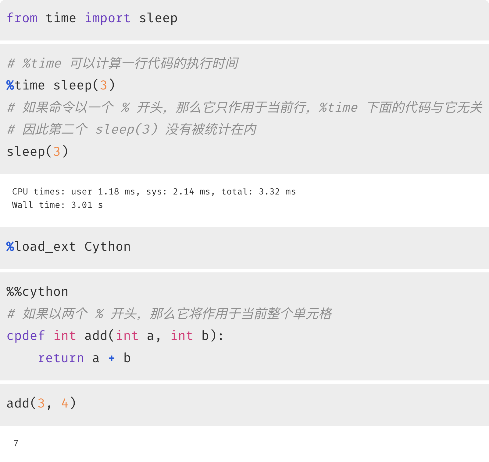
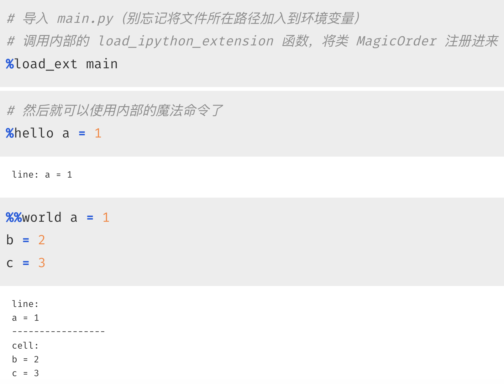
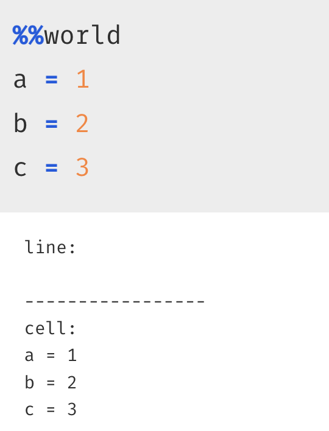
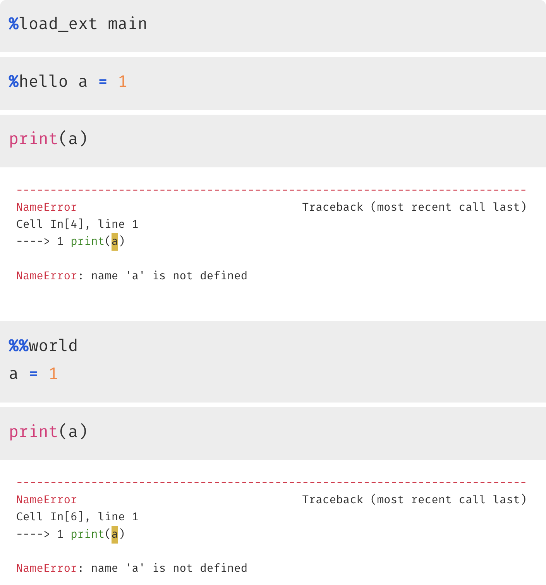
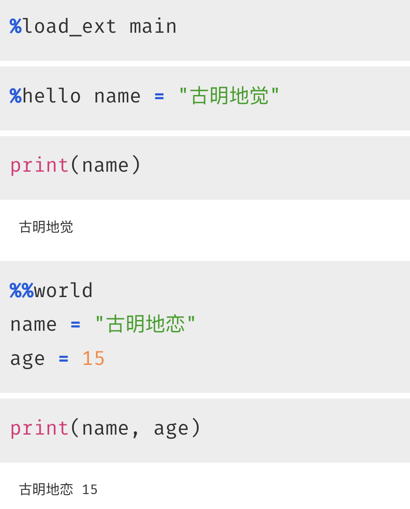
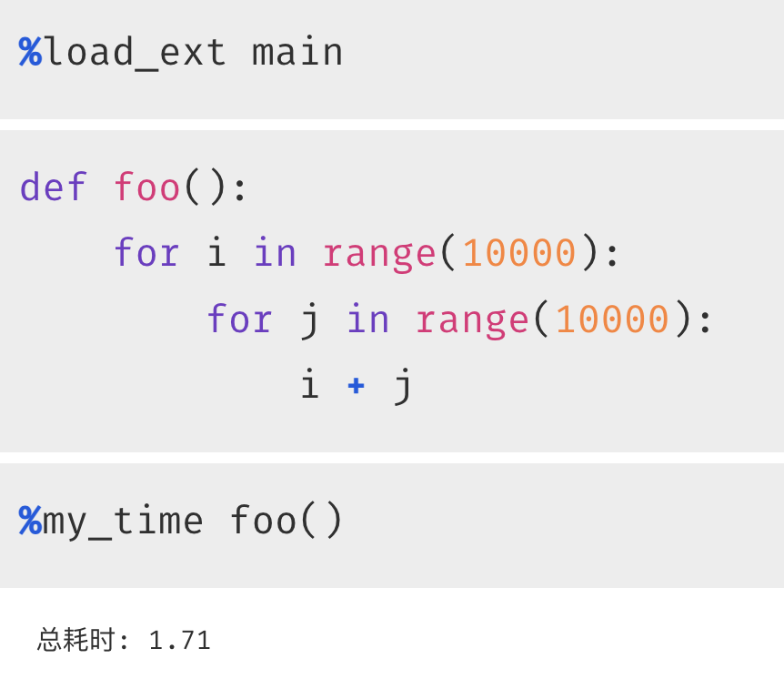
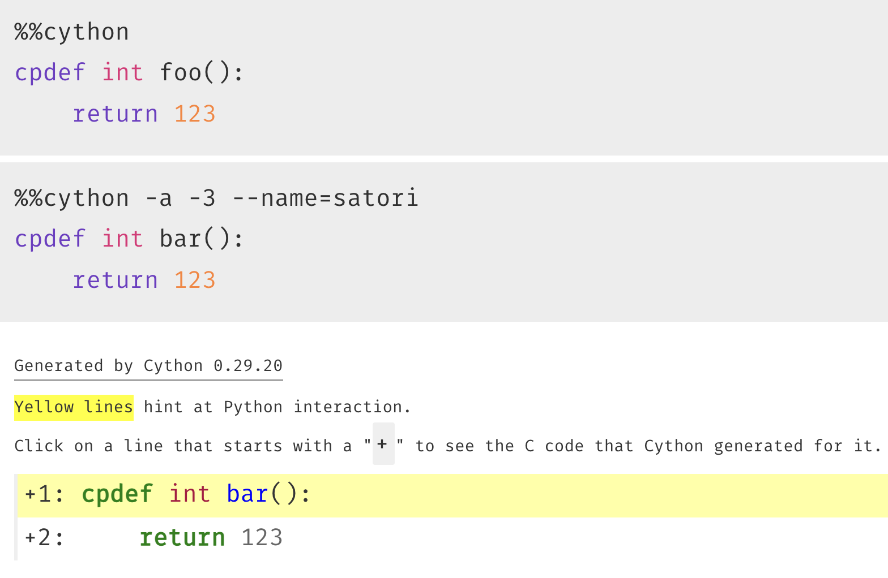
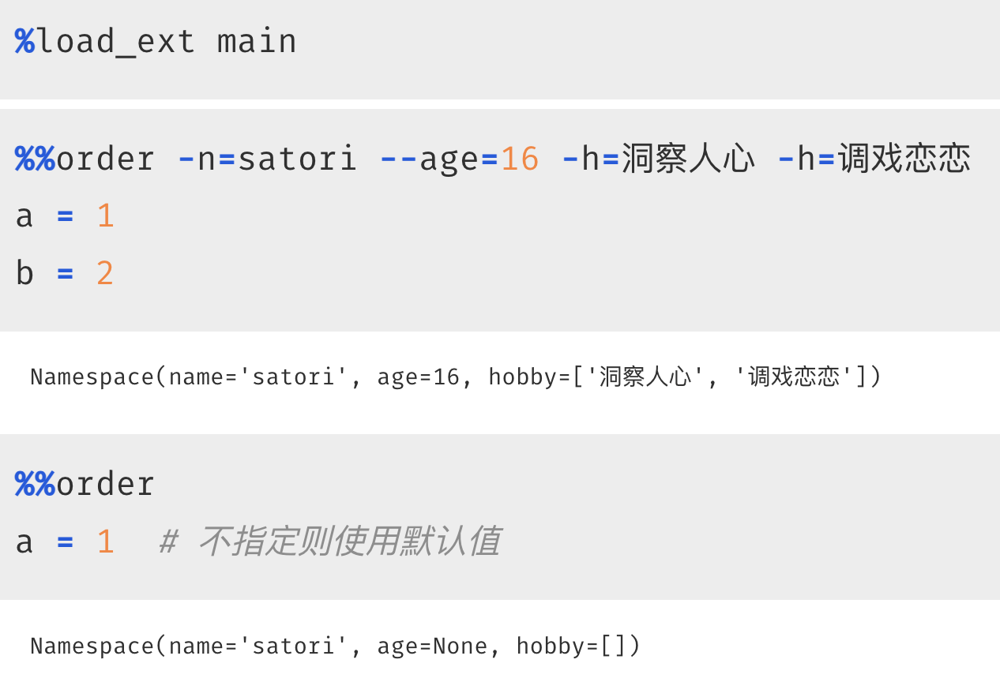

相信大家都用过 jupyter，也用过里面的魔法命令，这些魔法命令都以 % 或者 %% 开头，我们举个例子。



用法还是比较简单的，但是我们能不能自定义魔法命令呢？毫无疑问是可以的，因为上面的 %%cython 就是 Cython 模块自定义的。

所以命令可以是 jupyter 内置的，比如 %time，直接拿来就能用；还可以是第三方模块里面的，在 jupyter 通过 %load_ext 加载之后，再嵌入进来。下面就来看看如何自定义魔法命令。

~~~python
from IPython.core.magic import (
    magics_class,
    Magics,
    line_magic,
    cell_magic
)


@magics_class
class MagicOrder(Magics):
    """
    自定义一个类，类名叫什么无所谓
    但要继承 Magics，并且要被 magics_class 装饰
    """

    @line_magic
    def hello(self, line):
        """
        在 jupyter 中就可以使用如下命令，比如：
        %hello <Your Code>，然后就会调用这个 hello 方法
        参数 line 就是 %hello 后面的代码
        """
        print(f"line: {line}")

    @cell_magic
    def world(self, line, cell):
        """
        在 jupyter 中就可以使用如下命令，比如：
        %%world
        <Your Code>
        <Your Code>
        ...

        然后就会调用这个 world 方法
        参数 cell 就是 %%world 下面整个单元格的代码

        然后还有一个参数 line，它表示 %%world 所在行后面的代码
        但对于 %% 开头的命令来说，我们一般都会新起一行，然后写代码
        所以 line 这个参数暂时用不到
        """
        print(f"line: \n{line}")
        print("-----------------")
        print(f"cell: \n{cell}")


# 必须定义 load_ipython_extension 函数
# %load_ext 本质上也是加载一个模块，但它会自动调用该函数
def load_ipython_extension(ip):
    # 在函数内部，我们将类 MagicOrder 注册进去
    # 然后就可以使用它内部的魔法命令了
    ip.register_magics(MagicOrder)

# 如果不定义此函数，那么使用 %load_ext 加载时会报错
# The xxx module is not an IPython extension.
~~~

当前模块叫 main.py，我们来测试一下：



结果没有问题，但说实话对于 %% 开头的命令来说，我们很少会在它后面写代码，基本都是新起一行，就像下面这个样子。



自定义命令我们已经实现了，并且也知道怎么获取输入的代码了，下面要做的就是执行它。而将字符串当成代码执行，我们可以使用内置函数 exec。

~~~python
@magics_class
class MagicOrder(Magics):

    @line_magic
    def hello(self, line):
        exec(line)

    @cell_magic
    def world(self, line, cell):
        exec(cell)
~~~

代码的其它部分不变，然后你觉得接下来调用魔法命令会执行成功吗？我们测试一下。注意：要重启内核。



神奇的地方出现了，虽然命令执行成功了，但执行完之后，告诉我们变量未定义。其实原因很好想，我们调用 exec 的时候没有指定名字空间，那么默认会影响 exec 函数所在的名字空间，即 hello 和 world 函数的名字空间。

当打开一个 jupyter 的时候，内部相当于启动了一个 shell，所以在调用 exec 的时候，应该将整个 shell 的名字空间传进去。

```python
from IPython.core.magic import (
    magics_class,
    Magics,
    line_magic,
    cell_magic,
    needs_local_scope
)


@magics_class
class MagicOrder(Magics):

    @line_magic
    def hello(self, line):
        # 通过 self.shell.user_ns，可以拿到当前 shell 的名字空间
        # 注意：包含所有的单元格
        local_ns = self.shell.user_ns
        # 在 local_ns 当中执行代码
        exec(line, local_ns, local_ns)

    @needs_local_scope
    @cell_magic
    def world(self, line, cell, local_ns):
        # 或者通过 needs_local_scope 装饰器
        # 这样在调用函数的时候，会额外传递一个 local_ns 参数
        # 该参数和 self.shell.user_ns 等价
        exec(cell, local_ns, local_ns)

def load_ipython_extension(ip):
    ip.register_magics(MagicOrder)
```

然后再来测试一下：



此时就没有任何问题了。

下面我们模仿 jupyter 的 %time 命令，实现一个 %my_time，来加深一遍印象。

~~~python
@magics_class
class MagicOrder(Magics):

    @needs_local_scope
    @line_magic
    def my_time(self, line, local_ns):
        start = time.perf_counter()
        exec(line, local_ns, local_ns)
        end = time.perf_counter()
        print(f"总耗时: {round(end - start, 3)}")
~~~

测试一下：



结果没有问题，是我们想要的结果。

最后再来看看如何设置可选参数，举一个 Cython 的例子：



我们说对于以 %% 开头的命令，应该新起一行，在它的下面写代码。而之所以新起一行，是因为命令所在的行，要用于设置可选参数。那么问题来了，如何设置指定的可选参数呢？

```python
from IPython.core.magic import (
    magics_class,
    Magics,
    cell_magic,
    needs_local_scope
)
from IPython.core import magic_arguments


@magics_class
class MagicOrder(Magics):
    @magic_arguments.magic_arguments()
    # 在 jupyter 中可以通过 -n=xxx 或者 --name=xxx
    # 然后是 dest="name"，用于指定参数的名字
    # 后续便可以通过 name 字段来获取该参数的值
    @magic_arguments.argument(
        "-n", "--name", dest="name", default="satori"
    )
    # "-" 和 "--" 可以只出现一个，并且默认解析得到的是字符串
    # 而 age 我们希望是整数，所以指定 type 为 int
    # 解析完参数之后，会自动调用 int 进行转化
    # 如果不指定该参数，则使用 default
    # 而这里没有 default，那么结果就是 None
    @magic_arguments.argument(
        "--age", dest="age", type=int
    )
    @magic_arguments.argument(
        "-h", "--hobby", dest="hobby", default=[],
        action="append"
    )
    @needs_local_scope
    @cell_magic
    def order(self, line, cell, local_ns):
        # 显然 line 就是可选参数，cell 就是代码块
        exec(cell, local_ns, local_ns)
        # 解析参数
        args = magic_arguments.parse_argstring(self.order, line)
        # 打印
        print(args)


def load_ipython_extension(ip):
    ip.register_magics(MagicOrder)
```

我们测试一下：



还是很简单的，而且这里的参数解析和 argparse 模块非常类似，可以自己看一下。


