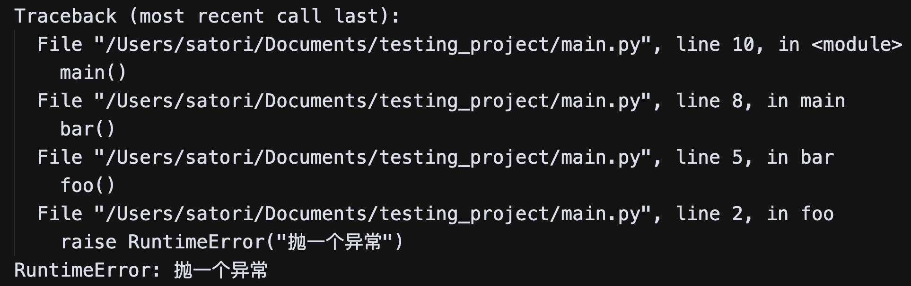
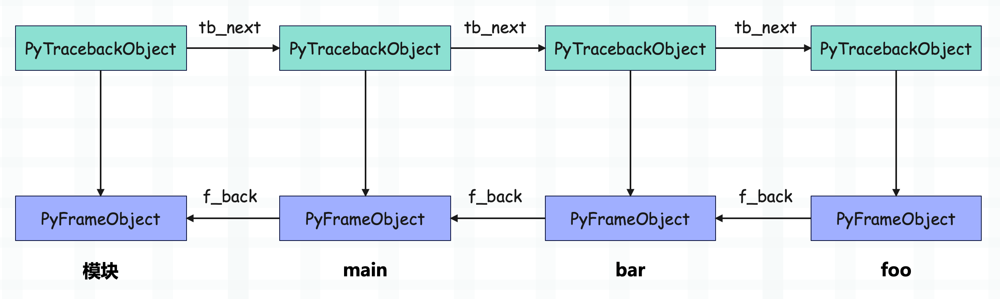
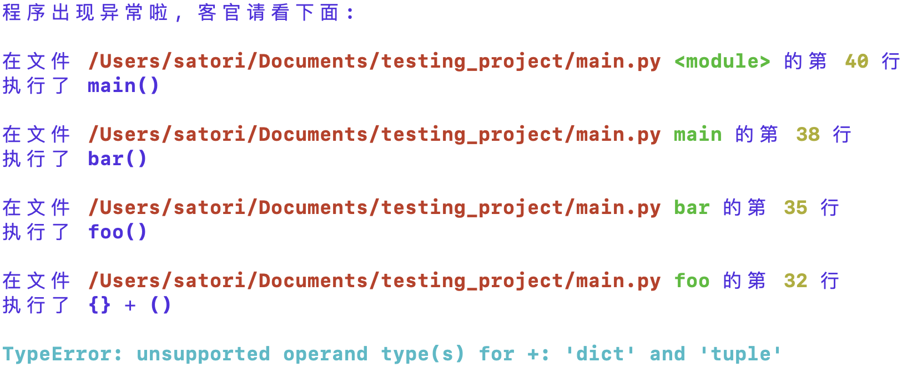

当我们的程序报错时，解释器会将整个异常的堆栈信息全部输出出来，举个例子：

~~~python
def foo():
    raise RuntimeError("抛一个异常")

def bar():
    foo()

def main():
    bar()

main()
~~~

如果执行这段代码，会得到以下报错信息：

解释器会将异常产生的整个调用链都给打印出来，那么问题来了，我们能不能自定义这些报错信息呢？答案是可以的，我们只要拿到这些报错信息，然后再进行修改即可。那么如何才能拿到呢？显然需要借助于 traceback 对象。

~~~python
import sys

def foo():
    raise RuntimeError("抛一个异常")

def bar():
    foo()

def main():
    bar()

try:
    main()
except Exception:
    # sys.exc_info() 返回一个元组，里面有三个元素
    # 分别是：异常类型、异常值、异常的堆栈信息
    exc_type, exc_val, exc_tb = sys.exc_info()

    print(exc_type)
    print(exc_val, type(exc_val))
    print(exc_tb)
    """
    <class 'RuntimeError'>
    抛一个异常 <class 'RuntimeError'>
    <traceback object at 0x7fe35811de40>
    """
~~~

每一个函数在运行时都会创建一个栈帧，栈帧在 CPython 里面由 PyFrameObject 结构体表示。同时每个栈帧都会对应一个 PyTracebackObject，也就是异常堆栈，即代码中的 exc_tb。

上面的代码在执行函数 foo 的时候出现了异常，那么解释器会创建对应的 traceback 对象，由于 foo 内部没有异常捕获，因此会回退到上一级栈帧，继续寻找异常捕获逻辑。而 foo 的上一级栈帧是 bar 的栈帧，因此解释器同样会基于 bar 的栈帧创建 traceback 对象，并且 bar 的 traceback 对象的 tb_next 指向 foo 的 traceback 对象。

就这样栈帧一层层的回退，整个过程我们称之为栈帧展开。在栈帧展开的过程中，解释器不断地创建与各个栈帧对应的 traceback，并将其链接成链表。如果回退到最外层（模块）也没有找到异常捕获逻辑，那么解释器就要输出异常信息了，从模块对应的 traceback 开始不断遍历，将每一层信息都输出出来，就是我们看到的样子。

而我们也可以在拿到 traceback 之后，手动输出出来。

~~~python
import sys
import traceback

def foo():
    raise RuntimeError("抛一个异常")

def bar():
    foo()

def main():
    bar()

try:
    main()
except Exception:
    exc_type, exc_val, exc_tb = sys.exc_info()
    error_msg = "".join(
        traceback.format_exception(exc_type, exc_val, exc_tb)
    )
    print(error_msg)
"""
Traceback (most recent call last):
  File "/Users/satori/Documents/testing_project/main.py", line 14, in <module>
    main()
  File "/Users/satori/Documents/testing_project/main.py", line 11, in main
    bar()
  File "/Users/satori/Documents/testing_project/main.py", line 8, in bar
    foo()
  File "/Users/satori/Documents/testing_project/main.py", line 5, in foo
    raise RuntimeError("抛一个异常")
RuntimeError: 抛一个异常
"""    
~~~

Python 有一个标准模块也叫 traceback，使用它的 format_exception 函数，我们可以拿到格式化后的异常堆栈信息，而该函数接收的参数正是 exc_type, exc_val, exc_tb。

虽然目前拿到了异常的堆栈信息，但是还不够，因为这里是通过手动捕获异常的方式。而在生产上，很多时候我们并不知道哪里会抛出异常，所以我们需要在不使用异常捕获逻辑的前提下，自动捕获异常。是不是有点绕了呢？我们举个例子。

~~~python
import sys

def catch(exc_type, exc_val, exc_tb):
    """
    光看名字，就应该知道这三个参数的含义了
    """
    print("报错啦")
    print(exc_val)

# 之后当出现异常的时候，如果没有异常捕获逻辑
# 就会执行 catch 函数
sys.excepthook = catch

raise ZeroDivisionError("除零错误")
"""
报错啦
除零错误
"""
~~~

代码中 raise 了一个异常，默认情况下解释器应该将异常输出到 stderr 当中，然后中止运行。但是我们替换了 sys.excepthook，那么在出现异常的时候，解释器会去执行我们这里替换之后的 catch 函数，并自动将 exc_type, exc_val, exc_tb 作为参数传进去。而一旦 cache 函数执行完毕，程序就结束了。

那么接下来我们就可以对异常输出进行改造了，至于怎么改，完全由你来决定，这里给个示例。

~~~python
import sys
from io import StringIO
import re
import traceback
from rich import print

def catch(exc_type, exc_val, exc_tb):
    buf = StringIO()
    # 得到一个列表
    errors = traceback.format_exception(exc_type, exc_val, exc_tb)
    buf.write(f"[blue]程序出现异常啦, 客官请看下面:\n\n")
    # 遍历
    i = 1
    while i < len(errors):
        match = re.search(r'File "(.+?)", line (\d+), in (.+)\s*(.*)', errors[i].strip())
        if match is not None:
            file_path, lineno, where, reason = match.groups()
            buf.write(
                f"在文件 [red bold]{file_path}[/red bold] "
                f"[green bold]{where}[/green bold] 的"
                f"第 [yellow bold]{lineno}[/yellow bold] 行\n"
            )
            buf.write(f"执行了 {reason.strip()}\n\n")
        i += 1
    buf.write(f"[cyan bold]{errors[-1].strip()}")
    print(buf.getvalue())

sys.excepthook = catch

def foo():
    # raise a exception
    {} + ()

def bar():
    foo()

def main():
    bar()

main()
~~~

我们执行这段代码，看看它的错误输出是什么样子。

怎么样，是不是很好玩呢？只要把 sys.excepthook = cache 这段逻辑加载到程序中，我们就可以自定义异常显示信息了。

当然啦，根据异常的不同，解释器可能输出更复杂的信息，所以我们上面的代码并不完善，但你可以根据实际情况进行修改。只要知道如何获取解释器输出的异常信息，以及 sys.excepthook 的用法就足够了。

最后再强调一下，解释器在发现异常的时候，会立即调用 sys.excepthook。而一旦调用结束，整个程序就结束了。