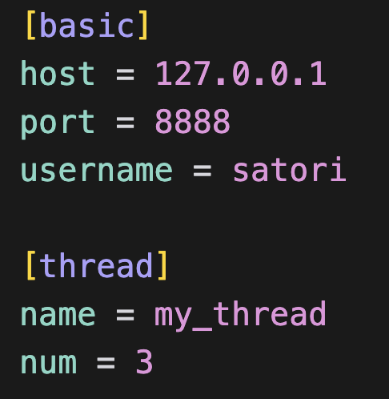
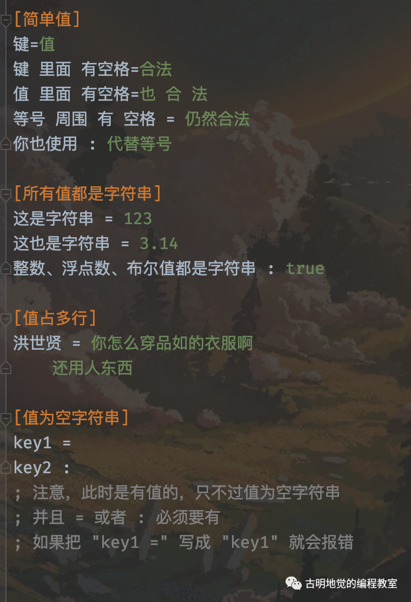
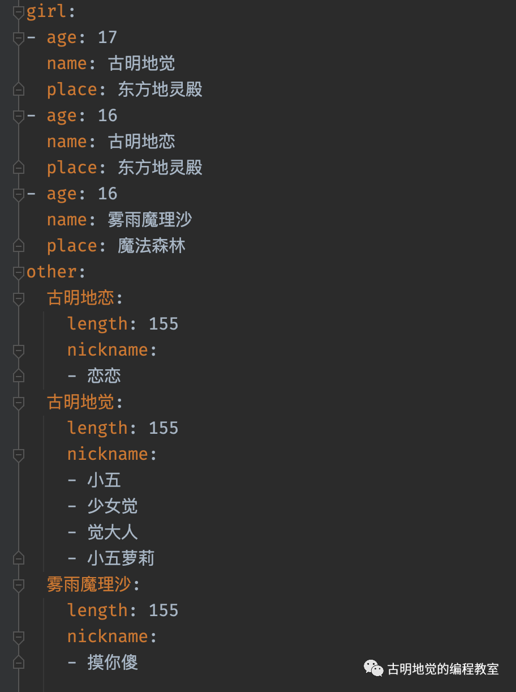
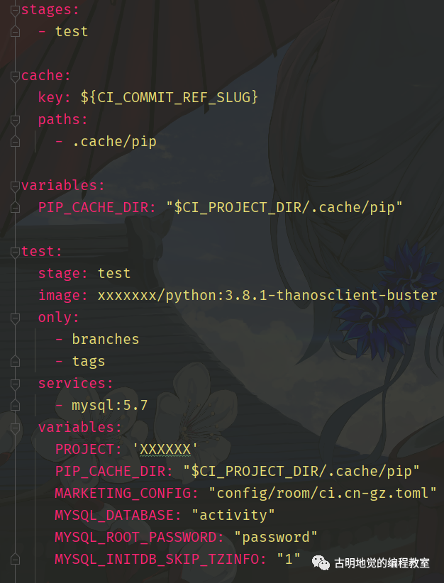

## 楔子

在开发过程中，配置文件是少不了的，只不过我们有时会将 py 文件作为配置文件（config.py），然后在其它的模块中直接导入。这样做是一个好主意，不过配置文件是有专门的格式的，比如：ini, yaml, toml 等等。

而对于 Python 而言，也都有相应的库来解析相应格式的文件，下面来看一看。

## ini 文件

先来了解一下 ini 文件的格式：

~~~ini
[satori]
name = 古明地觉
age = 16
where = 东方地灵殿

[koishi]
name = 古明地恋
age = 15
where = 东方地灵殿

[marisa]
name = 雾雨魔理沙
age = 17
where = 魔法森林

; 以分号或井号开头表示注释，不影响
~~~

ini 文件总分可以分为三块，分别是：

- section：就是写在 [] 里面的内容，可以把它理解为一个段；
- parameter：以 key = value 的形式出现，比如 age = 16，那么 age 就是 key、16 就是 value，注意：每个 section 都有自己的 parameter；
- 注释：以分号开头，无影响，会被忽略掉。

可以看到结构还是比较清晰的，那么 Python 要如何解析呢？Python 解析 ini 文件需要使用一个名叫 configparser 的库，这个库是自带的，我们可以直接用。

~~~python
import configparser

# 实例化一个 ConfigParser 实例
config = configparser.ConfigParser()
# 打开 ini 文件
config.read("cfg.ini", encoding="utf-8")

# 获取所有的 section
print(config.sections())
"""
['satori', 'koishi', 'marisa']
"""

# 获取某一个 section 的所有 parameter
print(config["satori"])
"""
<Section: satori>
"""

# 我们可以像操作字典一样操作 parameter
print(list(config["satori"]))
"""
['name', 'age', 'where']
"""
print(list(config["satori"].values()))
"""
['古明地觉', '16', '东方地灵殿']
"""
print(list(config["satori"].items()))
"""
[('name', '古明地觉'), ('age', '16'), ('where', '东方地灵殿')]
"""
# 获取某个 key 对应的 value
# 如果 key 不存在则抛出 KeyError
print(config["marisa"]["where"])
"""
魔法森林
"""
# 也可以调用 get 方法
# 在 key 不存在时，指定一个默认值
print(config["marisa"].get("age"))
"""
17
"""
# 我们发现 age 居然是一个字符串
# 因为默认解析得到的都是字符串
print(config["marisa"]["age"].__class__)
"""
<class 'str'>
"""

# 可以通过 getint 获取
# 会将 value 转成整型，但转化失败的话会报错
# 除了 getint 之外，还有 getfloat、getboolean
print(config["marisa"].getint("age") == 17)
"""
True
"""

# 最后也可以直接转成字典
print(dict(config["koishi"]))
"""
{'name': '古明地恋', 'age': '15', 'where': '东方地灵殿'}
"""
print(dict(config))
"""
{'DEFAULT': <Section: DEFAULT>, 
 'satori': <Section: satori>, 
 'koishi': <Section: koishi>, 
 'marisa': <Section: marisa>}
"""
print({k: dict(v) for k, v in config.items()})
"""
{'DEFAULT': {}, 
 'satori': {'name': '古明地觉', 
            'age': '16', 
            'where': '东方地灵殿'}, 
 'koishi': {'name': '古明地恋', 
            'age': '15', 
            'where': '东方地灵殿'}, 
 'marisa': {'name': '雾雨魔理沙', 
            'age': '17', 
            'where': '魔法森林'}}
"""
~~~

可以看到还是比较容易的，因为 ini 这种文件格式本身就很简单。除了读取文件，我们还可以进行写入。

~~~python
import configparser

# 实例化一个 ConfigParser 类的实例
config = configparser.ConfigParser()
config["basic"] = {"Host": "127.0.0.1",
                   "Port": "8888",
                   "Username": "satori"}

config["thread"] = {}
config["thread"]["name"] = "my_thread"
config["thread"]["num"] = "3"

with open("cfg.ini", "w", encoding="utf-8") as f:
    config.write(f)
~~~



虽然成功写入了，但是我们看到结果变成了小写。是的，对于 parameter 来说，无论是大写还是小写，写入文件的时候都会变成小写。然后读取也是，无论 ini 文件中是大写还是小写，读取之后都会变成小写。

> 注意：大小写不敏感只是针对于 parameter，对于 section 来说还是区分大小写的。

### 特殊格式

我们上面配置的 parameter 中的 key, value 都是一个普通的单词，但其实还可以配置的更加复杂一些。



我们操作一波，看看能否正常解析。

~~~python
import configparser

# 实例化一个 ConfigParser 实例
config = configparser.ConfigParser()
# 打开 ini 文件
config.read("cfg.ini", encoding="utf-8")

print(dict(config["简单值"]))
"""
{'键': '值', 
 '键 里面 有空格': '合法', 
 '值 里面 有空格': '也 合 法', 
 '等号 周围 有 空格': '仍然合法', 
 '你也使用': '代替等号'}
"""

print(dict(config["所有值都是字符串"]))
"""
{'这是字符串': '123', 
 '这也是字符串': '3.14', 
 '整数、浮点数、布尔值都是字符串': 'true'}
"""
# true True yes 都可以转成布尔值 True
# false False no 都可以转成布尔值 False
print(config["所有值都是字符串"].getboolean(
    '整数、浮点数、布尔值都是字符串'))
"""
True
"""

print(dict(config["值占多行"]))
"""
{'洪世贤': '你怎么穿品如的衣服啊\n还用人东西'}
"""

print(dict(config["值为空字符串"]))
"""
{'key1': '', 'key2': ''}
"""
~~~

结果是正常的，但是很明显上面这种做法有点闲的没事了，以后就统一写成 key = value 的形式即可。另外如果 ini 文件中只有 key 没有 value 的话，默认是报错的，但可以通过一个参数改变这一点：

```python
import configparser

# "key =" 这种形式不叫没有值，它是有值的，值为空字符串
# "key" 这种形式才是没有值，解析的时候默认会报错
# 可以通过一个参数改变这一点
config = configparser.ConfigParser(allow_no_value=True)
config.read_string(
    """
[mysqld]
user = mysql
skip-bdb
""")
print(dict(config["mysqld"]))
"""
{'user': 'mysql', 'skip-bdb': None}
"""
```

除此之外，key 之间还可以发生引用。

```python
import configparser

config = configparser.ConfigParser()

# 可以通过 %(key)s 的方式对同一个 section 中的其它 key 进行引用
# 所以如果想表示一个 % 的话，需要写两个 %，因为涉及到转义
config.read_string("""
[section1]
user = 古明地觉
age = 16
info = %(user)s--%(age)s 
percent = 80%% 
""")

print(dict(config["section1"]))
"""
{'user': '古明地觉', 'age': '16', 
 'info': '古明地觉--16', 'percent': '80%'}
"""
```

还是很简单的，如果想引用其它的 section 中的 key 要怎么做呢？

~~~python
import configparser

# 指定该参数之后，我们就不能通过 %(age)s 的方式引用了
# 需要使用 ${age} 这种格式，显然更方便了
config = configparser.ConfigParser(
    interpolation=configparser.ExtendedInterpolation()
)

config.read_string("""
[DEFAULT]
默认的 = 自动加入到每一个 section 中

[section1]
user = 古明地觉
age = 16
info = ${user} -- ${age} 

[section2]
info = ${section1:user}, ${section1:age}
""")

print(dict(config["section1"]))
"""
{'user': '古明地觉', 
 'age': '16', 
 'info': '古明地觉 -- 16', 
 '默认的': '自动加入到每一个 section 中'}
"""
print(dict(config["section2"]))
"""
{'info': '古明地觉, 16', 
 '默认的': '自动加入到每一个 section 中'}
"""
~~~

以上就是 ini 文件的一些简单用法，以后我们在写配置的时候，不妨使用一些专门用来表示配置的文件格式，不一定非要写在 py 文件里面。

而且使用 ini 等配置文件的一个好处就是，即便不懂 Python 的人也能看懂；或者这个配置文件不一定是要由你来写，可能是别人写，而那个人不用 Python，但是通过 ini 文件的话就省去了沟通的成本。

## yaml 文件

yaml 的表达能力比 ini 更加强大，该文件以 .yml 结尾，在介绍它的语法结构之前我们先来看看 yaml 的一些基本规则。

- 大小写敏感；
- 使用缩进表示层级关系，并且缩进只能用空格、不可以使用 tab 键。缩进的空格数目不重要，只要相同层级的元素左侧对齐即可；
- \# 表示注释，# 到行尾的所有字符都会被忽略；

yaml 支持的数据结构有以下三种：

- 字典：键值对的集合；
- 数组：多个元素组成的集合；
- 标量：单个、不可分割的值；

Python 解析 yaml 则是通过一个名为 pyyaml 的库，直接 pip install pyyaml 即可。

下面我们来介绍一下 yaml 的数据结构。

### 字典

类似于 Python 的字典，使用键值对表示：

```yaml
name: satori
# 或者写成下面的形式
{name: satori}
```

Python 解析之后会是什么结果呢？

~~~python
import yaml

config = """
name: satori
"""

# yaml.safe_load：只解析自己信任的输入
# yaml.unsafe_load：不检测输入的安全性
print(yaml.safe_load(config))
"""
{'name': 'satori'}
"""

config = """
{name: satori}
"""
print(yaml.safe_load(config))
"""
{'name': 'satori'}
"""
~~~

在 yaml 里面，字典的 value 也可以是一个字典：

```yaml
info: {name: satori, address: 东方地灵殿}
```

Python 解析的结果如下：

```python
import yaml

config = """
info: {name: satori, address: 东方地灵殿}
"""

print(yaml.safe_load(config))
"""
{
  'info': {'name': 'satori', 'address': '东方地灵殿'}
}
"""
```

还是很简单的。

### 数组

一组连字符开头的行，构成一个数组。

```yaml
- 古明地觉
- 古明地恋
- 雾雨魔理沙
# - 后面要有空格，或者写成下面的形式
[古明地觉, 古明地恋, 雾雨魔理沙]
```

Python 解析的结果如下：

~~~python
import yaml

config = """
- 古明地觉
- 古明地恋
- 雾雨魔理沙
"""

print(yaml.safe_load(config))
"""
['古明地觉', '古明地恋', '雾雨魔理沙']
"""

config = """
[古明地觉, 古明地恋, 雾雨魔理沙]
"""

print(yaml.safe_load(config))
"""
['古明地觉', '古明地恋', '雾雨魔理沙']
"""
~~~

并且数组的子成员也可以是一个数组：

```yaml
-
 - 古明地觉
 - 古明地恋
 - 雾雨魔理沙
```

Python 解析的结果如下：

~~~python
import yaml

config = """
-
  - 古明地觉
  - 古明地恋
  - 雾雨魔理沙
"""

print(yaml.safe_load(config))
"""
[['古明地觉', '古明地恋', '雾雨魔理沙']]
"""

# 更简洁的写法
config = """
- [古明地觉, 古明地恋, 雾雨魔理沙]
"""

print(yaml.safe_load(config))
"""
[['古明地觉', '古明地恋', '雾雨魔理沙']]
"""
~~~

显然数组也可以放在字典中：

```yaml
# 缩进对应的空格数没有要求，但是必须一样
# 对于当前这个键值对而言也可以没有缩进
girl:
    -古明地觉
    -古明地恋
    -雾雨魔理沙
# 或者下面这种形式
girl:[古明地觉,古明地恋,雾雨魔理沙]
# 或者下面这种形式
{girl:[古明地觉,古明地恋, 雾雨魔理沙]}
```

Python 解析的结果如下：

```python
import yaml

config = """
girl:
  - 古明地觉
  - 古明地恋
  - 雾雨魔理沙
"""

print(yaml.safe_load(config))
"""
{'girl': ['古明地觉', '古明地恋', '雾雨魔理沙']}
"""

# 注意：上面的 girl 对应的是数组，因为每个元素前面都有 -
# 但如果没有的话会发生什么？
config = """
girl:
    古明地觉
    古明地恋
    雾雨魔理沙
"""

print(yaml.safe_load(config))
"""
{'girl': '古明地觉 古明地恋 雾雨魔理沙'}
"""
# 我们看到整体相当于是一个字符串，类似于 html，之间用一个空格代替
# 因此如果内容比较长，我们可以写成多行，但是注意：每一行前面必须有空格
```

然后是一个稍微复杂的例子：

```python
import yaml

config = """
girl:
    # 会对应一个数组
    - 古明地觉
    - 古明地恋
    - 雾雨魔理沙
    
place1:
    # 虽然不是数组，但是内部是字典的形式
    # 所以会对应一个含有三个键值对的字典
    古明地觉: 东方地灵殿
    古明地恋: 东方地灵殿
    雾雨魔理沙: 魔法森林

place2:
  # 是数组，数组里面每个元素是一个字典
  - 古明地觉: 东方地灵殿
  - 古明地恋: 东方地灵殿
  - 雾雨魔理沙: 魔法森林
"""

print(yaml.safe_load(config))
"""
{
    'girl': ['古明地觉', '古明地恋', '雾雨魔理沙'],
    'place1': {'古明地觉': '东方地灵殿', 
               '古明地恋': '东方地灵殿', 
               '雾雨魔理沙': '魔法森林'},
    'place2': [{'古明地觉': '东方地灵殿'}, 
               {'古明地恋': '东方地灵殿'}, 
               {'雾雨魔理沙': '魔法森林'}]
}
"""
```

place1 对应的是一个字典，place2 对应的是一个数组。

### 标量

标量属于最基本的、不可再分的值，比较简单，我们就全部都说了吧。

```python
import yaml

config = """
int: 123
float: 3.14
bool:
    - true 
    - false
# 波浪号表示空    
NoneType: ~  
datetime: 2020-11-11 12:12:13

# 使用两个 ! 可以进行类型强转
# 不过几乎用不到 
cast:
    - !!str 123
    - !!str true  
"""

print(yaml.safe_load(config))
"""
{
    'int': 123, 'float': 3.14,
    'bool': [True, False], 'NoneType': None,
    'datetime': datetime.datetime(2020, 11, 11, 12, 12, 13), 
    'cast': ['123', 'true']
}
"""
```

这里可能有人已经发现了，就是字符串不需要加引号，但如果里面有特殊字符怎么办？所以 yaml 是支持使用引号括起来的。

```python
import yaml

config = """
name1: 古明地觉      a x   $ #  !!        
name2: "古明地觉      a x   $ #  !!"        
name3: '古明地觉      a x   $ #  !!'   
"""

print(yaml.safe_load(config))
"""
{'name1': '古明地觉      a x   $', 
 'name2': '古明地觉      a x   $ #  !!', 
 'name3': '古明地觉      a x   $ #  !!'}
"""
```

对于 yaml 而言，字符串默认是从第一个不是空格的字符、匹配到最后一个不是空格的字符（如果遇到 # 直接停止）。因此如果 value 的前面或后面有空格的话，那么这些空格是不会显示的，或者当中有 #，那么 # 后面的内容也不会显示。

解决办法是使用单引号或双引号括起来，如果内部还有引号，那么需要输入两遍进行转义（如果内部的引号和外面括起来的引号相同的话）。

### 引用

对于 yaml 而言，还支持我们采用 & 和 \* 进行引用，举个例子：

~~~python
import yaml

config = """
# 多了一个 &db_info_ref
# 相当于起了个名字，叫 db_info_ref
db_info: &db_info_ref  
    host: 127.0.0.1
    port: 5432
    user: postgres
    password: 123456

deploy:
    os: Linux
    # 将内容直接扔到里面来  
    <<: *db_info_ref  
"""

print(yaml.safe_load(config))
"""
{
    'db_info': {'host': '127.0.0.1',
                'port': 5432,
                'user': 'postgres',
                'password': 123456},
    'deploy': {'host': '127.0.0.1',
               'port': 5432,
               'user': 'postgres',
               'password': 123456,
               'os': 'Linux'}
}
"""
~~~

& 用来建立锚点，<< 表示合并当前数据，\* 表示用来引用锚点。还可以作用在数组中：

```python
import yaml

config = """
- &name 古明地觉 
- 古明地恋
- 雾雨魔理沙
- *name
"""

print(yaml.safe_load(config))
"""
['古明地觉', '古明地恋', 
 '雾雨魔理沙', '古明地觉']
"""
```

### 生成 yaml 文件

既然能够读取 yaml 文件，那么自然也能生成 yaml 文件。

```python
import yaml

data = {
    "girl": [
        {"name": "古明地觉", "age": 17, "place": "东方地灵殿"},
        {"name": "古明地恋", "age": 16, "place": "东方地灵殿"},
        {"name": "雾雨魔理沙", "age": 16, "place": "魔法森林"}
    ],
    "other": {
        "古明地觉": {"nickname": ["小五", "少女觉", "觉大人", "小五萝莉"], "length": 155},
        "古明地恋": {"nickname": ["恋恋"], "length": 155},
        "雾雨魔理沙": {"nickname": ["摸你傻"], "length": 155}
    }
}

with open("cfg.yml", "w", encoding="utf-8") as f:
    yaml.dump(data, f, allow_unicode=True, indent=2)
```

然后我们看看生成的 yml 文件长什么样子。



我们来看 yml 文件，然后反推出相应的数据结构。首先整体是一个字典，里面有 girl 和 other 两个 key。其中 girl 对应一个数组，数组里面每个元素都是字典，这是符合预期的。

然后 other 对应一个字典，而且这个字典内部有三个键值对，key 分别是：古明地觉、古明地恋、雾雨魔理沙，各自对应的 value 又是一个字典（内部有 length、nickname 两个 key，其中 length 对应整型、nickname 对应列表）。

最后再看一个本人之前项目中的 yml 文件，可以猜猜看解析出来长什么样子。



解析一下看看和你想的是不是一样的。

```python
import yaml

with open(".gitlab-ci.yml", "r", encoding="utf-8") as f:
    data = f.read()

data = yaml.safe_load(data)
print(data)
"""
{
    'stages': ['test'], 
    'cache': {'key': '${CI_COMMIT_REF_SLUG}', 
              'paths': ['.cache/pip']},
    'variables': {'PIP_CACHE_DIR': '$CI_PROJECT_DIR/.cache/pip'},
    'test': {'stage': 'test', 
             'image': 'xxxxxxx/python:3.8.1-thanosclient-buster', 
             'only': ['branches', 'tags'],
             'services': ['mysql:5.7'],
             'variables': {'PROJECT': 'XXXXXX', 
                           'PIP_CACHE_DIR': '$CI_PROJECT_DIR/.cache/pip',
                           'MARKETING_CONFIG': 'config/room/ci.cn-gz.toml',
                           'MYSQL_DATABASE': 'activity', 
                           'MYSQL_ROOT_PASSWORD': 'password',
                           'MYSQL_INITDB_SKIP_TZINFO': '1'}
             }
}
"""
```

结果应该不难想，毕竟 yaml 文件不是很复杂。

## toml 文件

虽然 yaml 的表达能力已经很丰富了，但 GitHub 觉得还是不够优雅，所以鼓捣出了一个 toml。toml 有着比 yaml 更简洁的语法，它的目标就是成为一个最简单的配置文件格式。然后 Python 解析 toml 文件需要使用一个名字也叫 toml 的库，直接 pip install toml 即可。

有了 ini 和 yaml，相信 toml 学习来也很简单，先直接看一个例子吧。

~~~python
import toml

config = """
title = "toml 小栗子"

[owner]
name = "古明地觉"
age = 17
place = "东方地灵殿"
nickname = ["小五", "少女觉", "觉大人"]

[database]
host = "127.0.0.1"
port = 5432
username = "satori"
password = "123456"
echo = true

[server]
    [server.v1]
    api = "1.1"
    enable = false
    
    [server.v2]
    api = "1.2"
    enable = true

[client]
client = [
    ["socket", "webservice"], 
    [5555]
]
address = [
    "xxxx",
    "yyyy"
]
"""

# loads：从字符串加载
# load：从文件加载
# dumps：生成 toml 格式字符串
# dump：生成 toml 格式字符串并写入文件中
data = toml.loads(config)
print(data)
"""
{
    'title': 'toml 小栗子', 
    'owner': {'name': '古明地觉', 
              'age': 17, 
              'place': '东方地灵殿', 
              'nickname': ['小五', '少女觉', '觉大人']},
    'database': {'host': '127.0.0.1', 
                 'port': 5432,
                 'username': 'satori', 
                 'password': '123456', 
                 'echo': True},
    'server': {'v1': {'api': '1.1', 'enable': False}, 
               'v2': {'api': '1.2', 'enable': True}},
    'client': {'client': [['socket', 'webservice'], [5555]], 
               'address': ['xxxx', 'yyyy']}
}
"""
~~~

toml 是采用 `var = value` 的形式进行配置，然后也有类似于 ini 里面的 section，每个 section 都是字典中的一个 key，然后该 key 也对应一个字典。但是我们注意看最开始的 title，由于它上面没有 section，所以它是一个单独的 key。

而且还有一点就是 toml 支持嵌套，我们看到 server.v1，表示 v1 是 server 对应的字典里面的一个 key，然后 v1 对应的值还是一个字典。

toml 变得更加简单了，而且写来也非常像 Python，它有如下特点：

- toml 文件是大小写敏感的；
- toml 文件必须是有效的 UTF-8 编码的 Unicode 文档；
- toml 文件的空白符应该是 Tab 或者空格；
- toml 文件的换行是 LF 或者 CRLF；

然后我们来介绍一下 toml 的数据结构。

### 注释

toml 采用 # 表示注释，举个例子：

```toml
# 这是注释
key = "value"  # 也是注释
```

可以解析一下看看会得到什么，剧透：会得到只包含一个键值对的字典。

### 键值对

TOML 文档最基本的构成区块是键值对，键名在等号的左边、值在右边，并且键名和键值周围的空白会被忽略。此外键、等号和值必须在同一行（不过有些值可以跨多行）。

```toml
key = "value"
```

键名可以是裸露的（裸键），引号引起来的（引号键），或点分隔的（点分隔键）。裸键只能包含：ascii 字符、ascii 数字、下划线、短横线。

```python
import toml

config = """
key = "value"
bare_key = "value"
bare-key = "value"
# 1234 会被当成字符串
1234 = "value"  
"""

data = toml.loads(config)
print(data)
"""
{'key': 'value', 
 'bare_key': 'value', 
 'bare-key': 'value', 
 '1234': 'value'}
"""
```

如果不是裸键，那么就必须使用引号括起来，但是此时也支持我们使用更加广泛的键名，但除了特殊场景，否则使用裸键是最佳实践。

~~~python
import toml

config = """
"127.0.0.1" = "value"
"character encoding" = "value"
"ʎǝʞ" = "value"
'key2' = "value"
'quoted "value"' = "value" 
"""

data = toml.loads(config)
print(data)
"""
{'127.0.0.1': 'value', 
 'character encoding': 'value', 
 'ʎǝʞ': 'value', 
 'key2': 'value', 
 'quoted "value"': 'value'}
"""
~~~

注意：裸键不能为空，但空引号键是允许的（虽然不建议如此）。

```toml
= "没有键名"  # 错误
"" = "空"     # 正确但不鼓励
'' = '空'     # 正确但不鼓励
```

然后是点分隔键，它是一系列通过点相连的裸键或引号键，这允许我们将相近属性放在一起：

~~~python
import toml

config = """
name = "橙子"
physical.color = "橙色"
physical.shape = "圆形"
site."google.com" = true
site.google.com = true
a.b.c.d = 123
"""

data = toml.loads(config)
print(data)
"""
{
    'name': '橙子',
    'physical': {'color': '橙色',
                 'shape': '圆形'},
    'site': {'google.com': True,
             'google': {'com': True}},
    'a': {'b': {'c': {'d': 123}}}
}
"""
~~~

我们看到这个点分隔符不错哟，自动实现了嵌套结构，并且点分隔符周围的空白会被忽略。

```toml
fruit.name = "香蕉"     # 这是最佳实践
fruit. color = "黄色"    # 等同于 fruit.color
fruit . flavor = "香蕉"   # 等同于 fruit.flavor
```

注意：多次定义同一个键是不行的。

```python
import toml

config = """
# name 和 "name" 是等价的
name = "古明地觉"
"name" = "古明地恋"  
"""

try:
    data = toml.loads(config)
except toml.decoder.TomlDecodeError as e:
    print(e)
"""
Duplicate keys! (line 4 column 1 char 36)
"""
```

对于点分隔键也是如此，只要一个键还没有被直接定义过，我们就仍可以对它和它下属的键名赋值。

```python
import toml

config = """
fruit.apple.smooth = true# 此时可以继续操作 fruit、fruit.apple，它们都是字典
# 给 fruit 这个字典加一个 key  
fruit.orange = 2  
# 给 fruit.apple 加一个 key
fruit.apple.color = "red"   
"""

data = toml.loads(config)
print(data)
"""
{
    'fruit': {'apple': {'smooth': True, 
                        'color': 'red'}, 
              'orange': 2}
}
"""
```

但下面这个操作是不行的：

```toml
# 将 fruit.apple 的值定义为一个整数
fruit.apple = 1
# 但接下来就不合法了，因为整数不能变成字典
fruit.apple.smooth = true

# 如果我们设置 fruit.apple = {}，那么第二个赋值是可以的
# 没错，我们可以通过 {} 直接创建一个字典
```

可以看到，真的很像 Python。然后再来说一个特例：

```python
import toml

config = """
3.14 = "pi"  
"3.14" = "pi"  
"""

data = toml.loads(config)
print(data)
"""
{'3': {'14': 'pi'}, '3.14': 'pi'}
"""
```

如果键是浮点数，那么需要使用引号括起来，否则会被解释为点分隔键。

看完了键，再来看看值（value），其实对于 toml 来说，值比键要简单的多得多。

### 字符串

字符串共有四种方式来表示：基础式的，多行基础式的，字面量式的，和多行字面量式的。

**1）基础字符串由引号包裹，任何 Unicode 字符都可以使用，除了那些必须转义的。**

```python
import toml

config = """
str = '我是一个字符串，"你可以把我引起来"' 
"""

data = toml.loads(config)
print(data)
"""
{'str': '我是一个字符串，"你可以把我引起来"'}
"""
```

**2）多行字符串由三个引号包裹，允许换行，注意：紧随开头引号的换行会被去除，其它空白和换行会被原样保留。**

```python
import toml

config = """
str = '''
玫瑰是红色的
紫罗兰是蓝色的
'''
"""

data = toml.loads(config)
print(data)
"""
{'str': '玫瑰是红色的\n紫罗兰是蓝色的\n'}
"""
```

这里的引号可以是双引号、也可以是单引号。

### 整数

整数是纯数字，正数可以有加号前缀，负数的前缀是减号。

```python
import toml

config = """
int1 = +99
int2 = 42
int3 = 0
int4 = -17

# 对于大数，可以在数字之间用下划线来增强可读性
# 每个下划线两侧必须至少有一个数字。
int5 = 1_000
int6 = 5_349_221
int7 = 53_49_221  # 印度记数体系分组
int8 = 1_2_3_4_5  # 无误但不鼓励
"""

data = toml.loads(config)
print(data)
"""
{'int1': 99,
 'int2': 42,
 'int3': 0,
 'int4': -17,
 'int5': 1000,
 'int6': 5349221,
 'int7': 5349221,
 'int8': 12345}
"""
```

但是注意：数字不能以零开头，除了 0 本身。当然 -0 与 +0 也是有效的，并等同于无前缀的零。非负整数值也可以用十六进制、八进制或二进制来表示。

```python
# 带有 `0x` 前缀的十六进制，大小写均可
hex1=0xDEADBEEF
hex2=0xdeadbeef
hex3=0xdead_beef

# 带有 `0o` 前缀的八进制
oct1=0o01234567
oct2=0o755# 对于表示 Unix 文件权限很有用

# 带有 `0b` 前缀的二进制
bin1= 0b11010110
```

### 浮点数

一个浮点数由一个整数部分（遵从与十进制整数值相同的规则）后跟上一个小数部分、或一个指数部分组成。如果小数部分和指数部分兼有，那小数部分必须在指数部分前面。

```python
import toml

config = """
# 小数
flt1 = +1.0
flt2 = 3.1415
flt3 = -0.01

# 指数
flt4 = 5e+22
flt5 = 1e06
flt6 = -2E-2

flt7 = 6.626e-34
"""

data = toml.loads(config)
print(data)
"""
{'flt1': 1.0,
 'flt2': 3.1415,
 'flt3': -0.01,
 'flt4': 5e+22,
 'flt5': 1000000.0,
 'flt6': -0.02,
 'flt7': 6.626e-34}
"""
```

小数部分是一个小数点后跟一个或多个数字，一个指数部分是一个 E（大小写均可）后跟一个整数部分（遵从与十进制整数值相同的规则，但可以包含前导零）。小数点，如果有用到的话，每侧必须紧邻至少一个数字。

```python
# 非法的浮点数
invalid_float_1 = .7
invalid_float_2 = 7.
invalid_float_3 = 3.e+20
```

与整数相似，可以使用下划线来增强可读性，每个下划线必须被至少一个数字围绕。

```python
flt8 = 224_617.445_991_228
```

浮点数值 -0.0 与 +0.0 是有效的，并且应当遵从 IEEE 754。特殊浮点值也能够表示：

```python
# 无穷
sf1=inf  # 正无穷
sf2=+inf  # 正无穷
sf3=-inf  # 负无穷

# 非数
sf4=nan  # 是对应信号非数码还是静默非数码，取决于实现
sf5=+nan  # 等同于 `nan`
sf6=-nan  # 正确，实际码取决于实现
```

### 布尔值

布尔值就是惯用的那样，但要小写。

```toml
bool1 = true
bool2 = false
```

### 日期

可以是普通的 datetime，或者是遵循 ISO-8859-1 格式的日期。

```python
import toml

config = """
dt1 = 2020-01-01T12:33:22+00:00
dt2 = 2020-11-12 12:11:33
dt3 = 2020-11-23
"""

data = toml.loads(config)
print(data)
"""
{'dt1': datetime.datetime(2020, 1, 1, 12, 33, 22, tzinfo=...), 
 'dt2': datetime.datetime(2020, 11, 12, 12, 11, 33), 
 'dt3': datetime.date(2020, 11, 23)}
"""
```

### 数组

语法和 Python 的列表类似：

```python
import toml

config = """
# 每个数组里面的元素类型要一致
integers = [1, 2, 3]
colors = ["红", "黄", "绿"]
nested_array_of_ints = [[1, 2], [3, 4, 5]]
nested_mixed_array = [[1, 2], ["a", "b", "c"]]
numbers = [0.1, 0.2, 0.5]
"""

data = toml.loads(config)
print(data)
"""
{'colors': ['红', '黄', '绿'],
 'integers': [1, 2, 3],
 'nested_array_of_ints': [[1, 2], [3, 4, 5]],
 'nested_mixed_array': [[1, 2], ['a', 'b', 'c']],
 'numbers': [0.1, 0.2, 0.5]}
"""
```

数组可以跨行，数组的最后一个值后面可以有终逗号（也称为尾逗号）。

```python
import toml

config = """
integers2 = [
  1, 2, 3
]

integers3 = [
  1,
  2, # 这是可以的
]
"""

data = toml.loads(config)
print(data)
"""
{'integers2': [1, 2, 3], 'integers3': [1, 2]}
"""
```

### 表

表，完全可以把它想象成 ini 的 section。

```python
import toml

config = """
# 表名的定义规则与键名相同
# 解析之后得到的大字典中就有 "table-1" 这个 key
# 并且其 value 也是一个表，在它下方
# 直至下一个表头或文件结束，都是这个表内部的键值对
[table-1]
key1 = "some string"
key2 = 123

[table-2]
key1 = "another string"
key2 = 456
"""

data = toml.loads(config)
print(data)
"""
{'table-1': {'key1': 'some string', 'key2': 123},
 'table-2': {'key1': 'another string', 'key2': 456}}
"""
```

但是我们之前也实现过类似于这种结构，没错，就是点分隔符：

```python
import toml

config = """
# 所以 other-table-1 和 table-1 是等价的
# other-table-2 和 table-2 是等价的
other-table-1.key1 = "some string"
other-table-1.key2 = 123

other-table-2.key1 = "another string"
other-table-2.key2 = 456

[table-1]
key1 = "some string"
key2 = 123

[table-2]
key1 = "another string"
key2 = 456
"""

data = toml.loads(config)
print(data)
"""
{'other-table-1': {'key1': 'some string', 'key2': 123},
 'other-table-2': {'key1': 'another string', 'key2': 456},
 'table-1': {'key1': 'some string', 'key2': 123},
 'table-2': {'key1': 'another string', 'key2': 456}}
"""
```

不过注意：我们必须要把 other-table-1 和 other-table-2 定义在上面，如果我们定义在下面看看会有什么后果：

```python
import toml

config = """
[table-1]
key1 = "some string"
key2 = 123

[table-2]
key1 = "another string"
key2 = 456

other-table-1.key1 = "some string"
other-table-1.key2 = 123

other-table-2.key1 = "another string"
other-table-2.key2 = 456
"""

data = toml.loads(config)
print(data)
"""
{
    'table-1': {'key1': 'some string', 'key2': 123},
    'table-2': {'key1': 'another string',
                'key2': 456,
                'other-table-1': {'key1': 'some string', 
                                  'key2': 123},
                'other-table-2': {'key1': 'another string', 
                                  'key2': 456}}
}
"""
```

估计你已经猜到了，它们被当成了 'table-2' 对应的字典里面的 key 了。此外我们还可以将上面两种方式结合起来：

```python
import toml

config = """
# [] 里面的不再是一个普通的键，而是点分隔键
# 另外键名周围的空格会被忽略，但是最好不要有
[dog  .  "tater.man"]  
type.name = "哈巴狗"
"""

data = toml.loads(config)
print(data)
"""
{
    'dog': {'tater.man': {'type': {'name': '哈巴狗'}}}
}
"""
```

表的里面也是可以没有键值对的：

```python
import toml

config = """
[x.y.z.w.a.n]

[x.m]

[x.n]

[x]
a.b.c = "xxx"
"""

data = toml.loads(config)
print(data)
"""
{'x':
    {
        'a': {'b': {'c': 'xxx'}},
        'm': {},
        'n': {},
        'y': {'z': {'w': {'a': {'n': {}}}}}
    }
}
"""
```

总的来说还是蛮强大的，但是要注意：不能重复定义。

### 行内表

行内表提供了一种更为紧凑的语法来表示表，因为上面每一个键值对都需要单独写一行，比如：

```toml
[table1]
a = 1
b = 2
c = 3
# 最终可以得到 
# {'table1': {'a': 1, 'b': 2, 'c': 3}}
```

但是除了上面的表达方式之外，我们还可以采用行内表：

~~~python
import toml

config = """
# 和 Python 字典的表示方式略有不同，并且也支持多种 key
table1 = {a = 1, b = "二", c.a = "3"}
table2 = {c."b c".d = "4"}
"""

data = toml.loads(config)
print(data)
"""
{
    'table1': {'a': 1, 'b': '二', 'c': {'a': '3'}},
    'table2': {'c': {'b c': {'d': '4'}}}
}
"""
~~~

### 表数组

然后来看看数组和表的结合：

```python
import toml

config = """
[name1]
girl = "古明地觉"

[[name2]]
girl = "古明地恋"

[name3]
[[name4]]
"""

data = toml.loads(config)
print(data)
"""
{'name1': {'girl': '古明地觉'},
 'name2': [{'girl': '古明地恋'}],
 'name3': {},
 'name4': [{}]}
"""
```

当使用 [[]] 的时候，相当于在 [] 的基础上套上一层列表。并且任何对表数组的引用都指向该数组里最近定义的表元素，这允许我们在最近的表内定义子表，甚至子表数组。

我们再举个更复杂的例子：

```python
import toml

config = """
[[fruits]]  
name = "苹果"  

# 会操作 [] 里面最近定义的 {}
[fruits.physical]  
color = "红色"
shape = "圆形"

[[fruits.varieties]]  # 嵌套表数组
name = "蛇果"    

[[fruits.varieties]]
name = "澳洲青苹" 

[[fruits]]
name = "香蕉" 

[[fruits.varieties]]
name = "车前草"  
"""

data = toml.loads(config)
print(data)
"""
{
    'fruits':
        [
            {
                'name': '苹果',
                'physical': {'color': '红色', 
                             'shape': '圆形'},
                'varieties': [{'name': '蛇果'}, 
                              {'name': '澳洲青苹'}]
            },
            {
                'name': '香蕉', 
                'varieties': [{'name': '车前草'}]
            }
        ]
}
"""
```

很明显这种定义不是很常用，配置文件应该要非常直观才对，但这已经不是很好理解了。

## 小结

以上就是几种配置文件相关的内容，其中 ini 文件格式最简单，yaml 文件格式使用最广泛， toml 文件格式的表达能力更加丰富，像 Rust 项目采用的配置文件就是 toml 格式的。