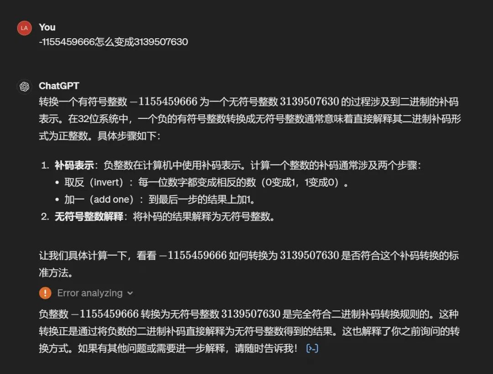
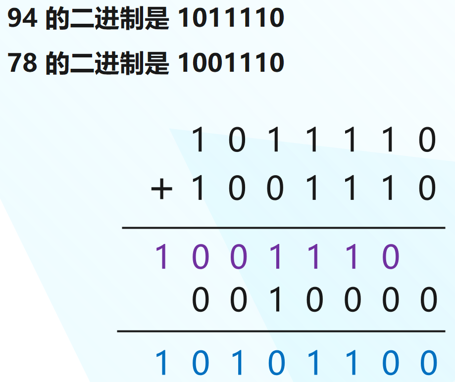
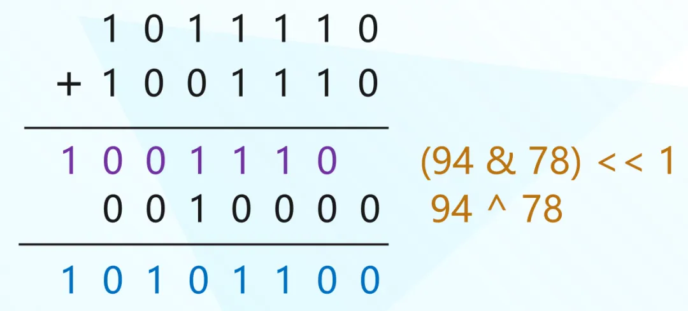
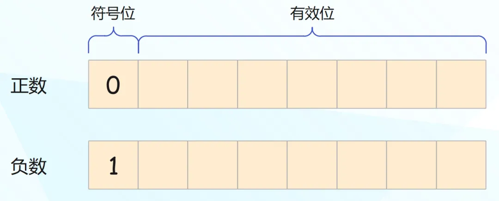
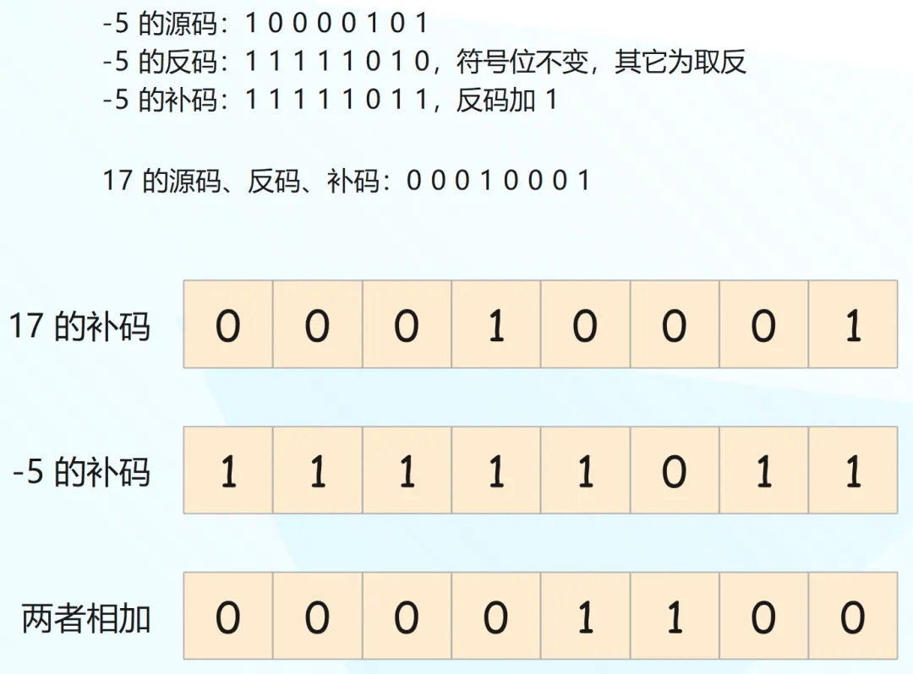
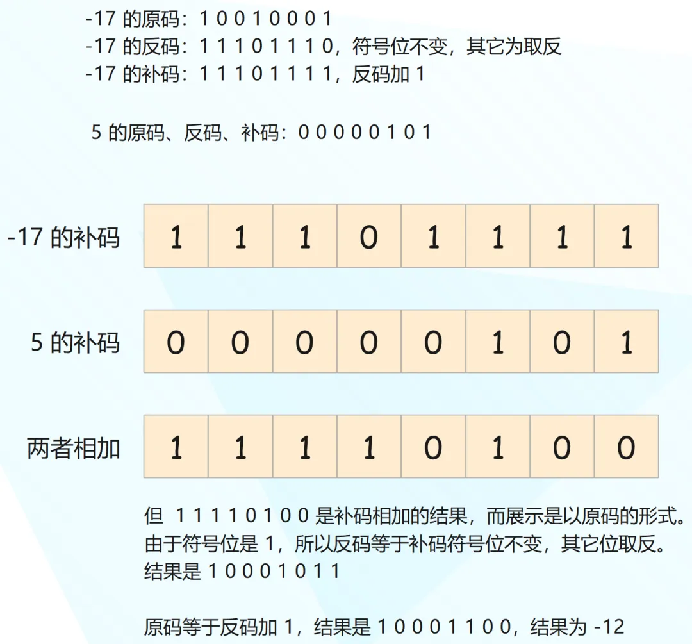
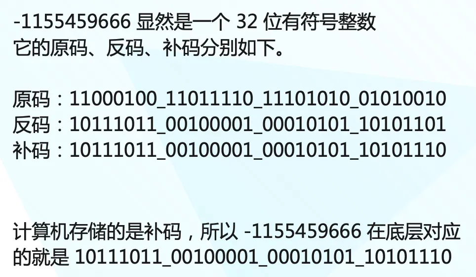
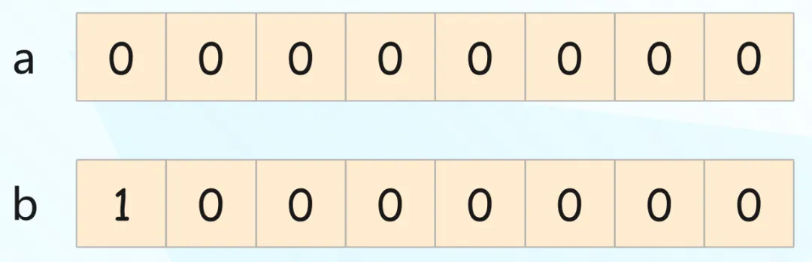
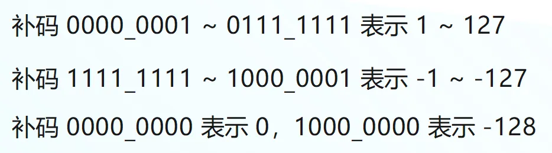

在群里面看到<font color="blue">耳濡目染同志</font>发了这么一张图。



问的是 -1155459666 怎么变成 3139507630，这个问题比较有意思，虽然简单，但涉及到了原码、反码、补码相关的知识，本篇文章就来详细解释一下。

抛出一个问题，有两个整数 94、78，如果让你计算它们的和，你会怎么做？不用想，我们都会像下面这样。


十进制是逢十进一，当产生溢出时会往前进一位，因此结果就是 110 + 062 等于 172。但计算机在运算时会使用二进制，本质是一样的，只不过二进制是逢二进一。



我们验证一下。

```python
print(94 + 78)  # 172
print(0b10101100)  # 172
```

另外我们知道，与运算时，如果两个二进制位均是 1，那么结果是 1，否则结果是 0；异或运算时，如果两个二进制位相同，结果是 0，否则结果是 1。

~~~python
# 与运算，两个二进制位均是 1，结果才是 1
print(1 & 1)  # 1
print(1 & 0)  # 0
print(0 & 1)  # 0
print(0 & 0)  # 0

# 异或运算，两个二进制位相同，结果为 0，相异结果为 1
print(1 ^ 1)  # 0
print(1 ^ 0)  # 1
print(0 ^ 1)  # 1
print(0 ^ 0)  # 0
~~~

然后再观察一下之前的式子。



所以当两个整数相加时，我们还可以这么做。

```python
a = 94
b = 78
# 无进位加法
print(a ^ b)  # 16
# a + b 的进位
# 既然是进位，那么 (a & b) 要左移一位
print((a & b) << 1)  # 156
# 两者相加
print(
    ((a & b) << 1) + (a ^ b)
)  # 172
```

当然两个整数直接相加的话，这么做没啥意义，它一般会应用于二分查找。在二分查找中，为了避免两个整数相加溢出，求平均值的时候一般会这么做。

```python
l = 123
r = 789
# 对于 C、Java 等语言来说，当 l、r 非常大时，相加可能会产生溢出
print((l + r) // 2)  # 456
# 因此一般都会这么做
print(l + (r - l) // 2)  # 456
# 但显然还有更高效的做法
print((l & r) + ((l ^ r) >> 1))  # 456
```

然后来说一说原码、反码和补码，不过首先我们要知道负数是如何表示的，对于一个有符号整数来说，它的最高位表示符号位。比如一个 8 位整数：



开头的符号位如果为 0，则表示正数，为 1 则表示负数，然后剩余的有效位则表示具体的数值。比如 15 的二进制是 1111，那么：

- 八位整数 15 的二进制就是 00001111；
- 八位整数 -15 的二进制就是 10001111；

由于 7 个位能表示的最大整数是 2 的 7 次方减 1，所以八位整数的最大值就是 127，而最小值是 -128。那么问题来了，为什么最小值是 -128 呢？这就涉及到原码、反码和补码了。

**计算机为了人类阅读方便，会以原码的形式展示，但在计算和存储的时候则是以补码的形式。**

- 对于正数来说，它的原码、反码、补码是相同的。
- 对于负数来说，它的反码等于原码的符号位不变、其它位取反（1 变 0，0 变 1），而补码则等于反码加 1。当然这是基于原码求补码，反过来也是一样。反码也等于补码的符号位不变、其它位取反，然后再加 1 得到原码，过程是一样的。

我们举个例子，假设两个八位整数 17 和 -5 相加。



因此 00001100 就是两个整数的补码相加之后的结果，也就是 12，由于是正数，它的原码和反码也是 12。

再举个例子，假设两个八位整数 -17 和 5 相加。



相信你应该明白整个逻辑了，计算机在存储整数时会以补码存储，运算也是以补码的形式，但展示则是以原码的形式。我们以 C 语言为例，来直观感受一下这个过程。

~~~c
#include <stdio.h>

int main(int argc, char const *argv[]) {   
    // 对于有符号整数来说，最高位表示符号位
    // 但对于无符号整数来说，所有的位都是有效位
    // 所以无符号八位整数的范围是 0 ~ 255
    // 147 的二进制为 0b10010011
    unsigned char num = 147;
    // 由于是正数，所以原码、反码、补码都是 0b10010011
    printf("%hhu\n", num);  // 147
    // 但 C 语言不看你怎么存，就看你怎么读
    // 如果以 %hhd 来读取的话，那么会以有符号的格式打印八位整数
    // 此时 10010011 开头的 1 就变成了符号位
    // 而计算机存储的 10010011 是补码，展示的时候要转成原码
    // 反码：补码符号位不变，其它位取反，等于 11101100
    // 原码：反码加 1，等于 11101101，转成十进制打印就是 -109
    printf("%hhd\n", num);  // -109
    return 0;
}
~~~

我们再举个例子：

```c
#include <stdio.h>

int main(int argc, char const *argv[]) {   
    // 八位有符号整数 -1 的原码是 1000_0001
    // 反码是 1111_1110，补码是 1111_1111
    // 所以计算机在存储 -1 的时候，存的就是二进制的 11111111
    char num = -1;
    // 但我们以无符号形式打印，那么 11111111 就全部都是有效位
    printf("%hhu\n", num);  // 255
    printf("%hhu\n", 0b11111111);  // 255

    // 再比如我们使用 16 位整数，原码是 10000000_00000001
    // 那么补码就是 11111111_11111111
    // 如果以无符号格式打印，结果显然是 65535
    short num2 = -1;
    printf("%hu\n", num2);  // 65535
    printf("%hu\n", 0b1111111111111111);  // 65535

    // 32 位整数也是如此
    int num3 = -1;
    // 2 的 32 次方减 1，结果是 4294967295
    printf("%u\n", num3);  // 4294967295
    return 0;
}
```

总结，对于一个有符号整数来说：

- 如果是正数（符号位是 0），它的原码、反码、补码是一致的。
- 如果是负数（符号位是 1），反码等于原码的符号位不变、其它位取反，补码等于反码加 1；或者反码等于补码的符号位不变、其它位取反，原码等于反码加 1。

计算机存储和运算使用的都是补码，但展示的是原码。

现在回到开头的问题了，-1155459666 是怎么变成 3139507630 的。



还是那句话，不看你怎么存，就看你怎么读，反正存储的就是这一坨二进制。如果以有符号格式读取，最高位是符号位，结果就是 -1155459666；以无符号格式读取，最高位也是有效位，结果就是 3139507630。

~~~python
from ctypes import c_int, c_uint

print(c_int(-1155459666).value)
"""
-1155459666
"""
print(c_uint(-1155459666).value)
"""
3139507630
"""
print(0b10111011_00100001_00010101_10101110)
"""
3139507630
"""
~~~

那么问题来了，为什么要整出补码这个东西出来呢？很好理解，有了补码，加法和减法可以共用一套逻辑，无论是 a + b 还是 a - b，底层的运算逻辑是相同的。

最后再来解释一下，为什么有符号八位整数的最大值是 127，最小值是 -128。



两个整数 a 和 b，首先 a 的值肯定是 0，但问题是 b 的值是多少？难道是 -0 吗？如果不考虑 0，那么有符号八位整数能表达的正数范围是 1 ~ 127，负数范围是 -1 ~ -127，然后还剩下两个 0。于是让 00000000 表示 0，让 10000000 表示 -128。



不管是多少位的有符号整数，它的最小值的绝对值一定比最大值多 1，因此八位整数的最小值是 -128，最大值是 127。事实上 10000000 表示 -128 有些人为规定的意思，但它确保了数字范围的对称性，并允许有效地利用二进制位来表达整数。

以上就是整数在底层的存储方式，以及原码、反码、补码之间的关系。