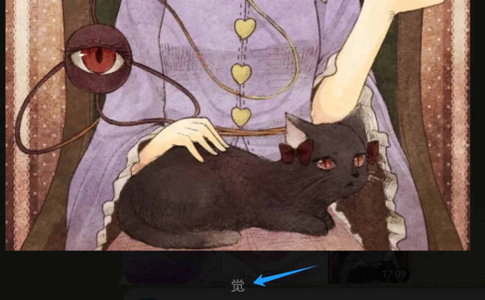

## 楔子

Telegram（电报）相信大家都知道，关于它的介绍和注册方式这里就跳过了，我假设你已经注册好了。本篇文章来聊一聊 Telegram 提供的机器人，以及如何用 Python 为机器人实现各种各样的功能。

## 创建机器人

首先我们使用浏览器打开 https://web.telegram.org，然后用手机上的 APP 扫码登录。


登录之后搜索 BotFather，机器人需要通过 BotFather 来创建，当然 BotFather 本身也是一个机器人，但它同时管理着其它的机器人。我们点击 BotFather，下面将通过和它聊天的方式来创建机器人，过程如下。

- 1）在页面中输入命令 /newbot 并回车，相当于给 BotFather 发指令，表示要创建机器人。注：命令要以 / 开头。
- 2）BotFather 收到之后会将机器人创建好，并提示我们给机器人起一个名字，这里我起名为：古明地觉。
- 3）回车之后，BotFather 会继续让我们给机器人起一个用户名，这个用户名会作为机器人的唯一标识，用于定位和查找。这里我起名为 Satori_Koishi_bot，注：用户名必须以 Bot 或 bot 结尾。

下面来实际演示一下。


我们点击 t.me/Satori_Koishi_bot，看看结果如何。


点击 t.me/Satori_Koishi_bot 之后，再点击屏幕中的 start（相当于发送了一条 /start 指令），就可以和机器人聊天了。因为我们还没有编写代码，来为机器人添加相应的功能，所以目前不会有任何事情发生。

然后我们给自定义的机器人添加一些描述信息，显然这依赖于 BotFather。向其发送 /mybots 指令，会返回我们创建的所有的机器人，当然这里目前只有一个。


我们点击它，看看结果：


里面提供了很多的选项，这里我们再点击 Edit Bot，来编辑机器人的相关信息。


不难发现，我们除了给当前机器人一个名字之外，其它的信息就没有了，所以 Telegram 提供了一系列按钮，供我们进行编辑。比如我们点击 Edit Botpic，编辑头像。


然后机器人的头像会发生改变，当然这些都属于锦上添花的东西，最重要的是 Edit Commands，它是机器人能够产生行为的核心，否则当前的机器人就是个绣花枕头，中看不中用。

下面我们点击 Edit Commands，添加一个 /help 命令。


添加格式为<font color="blue">命令 - 描述</font>，可同时添加多个。


目前机器人便支持了 /help 命令，另外如果点击 Edit Command 之后再输入 /empty，那么也可以将机器人现有的命令清空掉。

虽然 /help 命令有了，但发送这个命令之后，机器人不会有任何的反应，因为我们还没有给命令绑定相应的处理函数，下面就来看看如何绑定。当然啦，机器人不光要对命令做出反应，就算是普通的文本、表情、图片等消息，也应该做出反应。至于命令本质上就是一个纯文本，只不过它应该以 / 开头。

## 接收消息并处理

我们可以使用 Python 连接 Telegram 机器人，为它绑定处理函数，首先需要安装一个第三方库。

> pip3 install "python-telegram-bot[all]"

然后获取机器人的 Token，这个 Token 怎么获取呢？


像 BotFather 发送 /mybots 命令，点击指定机器人的 API Token 即可获取。


有了这个 Token 之后，就可以和机器人建立连接了。

~~~python
import asyncio
import telegram
from telegram.request import HTTPXRequest
# 代理，由于不方便展示，因此我定义在了一个单独的文件中
# 这里的 PROXY 是一个字符串，类似于 "http://username:password@ip:port"
from proxy import PROXY

BOT_API_TOKEN = "6485526535:AAEvGr9EDqtc4QPehkgohH6gczOTO5RIYRE"

async def main():
    # 传递机器人的 Token，内部会自动和它建立连接
    bot = telegram.Bot(
        BOT_API_TOKEN,
        # 指定代理
        request=HTTPXRequest(proxy=PROXY),
        get_updates_request=HTTPXRequest(proxy=PROXY),
    )
    async with bot:
        # 测试连接是否成功，如果成功，会返回机器人的信息
        print(await bot.get_me())

asyncio.run(main())
"""
User(api_kwargs={'has_main_web_app': False}, 
     can_connect_to_business=False, 
     can_join_groups=True, 
     can_read_all_group_messages=False, 
     first_name='古明地觉', 
     id=6485526535, 
     is_bot=True, 
     supports_inline_queries=False, 
     username='Satori_Koishi_bot')
"""
~~~

返回值包含了机器人的具体信息，还是比较简单的，只需指定一个 Token 即可访问。当然啦，由于网络的原因还需要使用代理。

然后通过该模块还可以给机器人发消息，但这显然不是我们的重点，因为消息肯定是通过 APP 或者浏览器发送的。我们要做的是，定义机器人的回复逻辑，当用户给它发消息时，它应该做些什么事情。

先来一个简单的案例，当用户输入 /start 命令时，回复一段文本。

~~~python
from telegram import Update
from telegram.ext import ApplicationBuilder, ContextTypes, CommandHandler
from proxy import PROXY

BOT_API_TOKEN = "6485526535:AAEvGr9EDqtc4QPehkgohH6gczOTO5RIYRE"

# 定义一个处理函数
# update 封装了用户发送的消息数据
# context 则封装了 Bot 对象和一些会话数据
# 这两个对象非常重要，后面还会详细说
async def start(update: Update, context: ContextTypes.DEFAULT_TYPE):
    # context.bot 便是机器人，可以调用它的 send_message 方法回复消息
    await context.bot.send_message(
        # 关于 chat_id 稍后解释
        chat_id=update.message.chat.id,
        # 回复的文本内容
        text="欢迎来到地灵殿"
    )

# 构建一个应用
application = ApplicationBuilder().token(BOT_API_TOKEN).proxy(PROXY).build()
# 创建一个 CommandHandler 实例，当用户输入 /start 的时候，执行 start 函数
start_handler = CommandHandler("start", start)
# 将 start_handler 加到应用当中
application.add_handler(start_handler)
# 开启无限循环，监听事件
application.run_polling()
~~~

我们来测试一下：


显然结果是成功的，不过目前这个机器人只能处理 /start 命令，如果希望它支持更多的命令，那么就定义多个 CommandHandler 即可。但是问题来了，如果我们希望这个机器人能处理普通文本的话，该怎么办呢？

```python
from telegram import Update
from telegram.ext import (
    ApplicationBuilder, ContextTypes,
    MessageHandler, filters
)
from proxy import PROXY

BOT_API_TOKEN = "6485526535:AAEvGr9EDqtc4QPehkgohH6gczOTO5RIYRE"

async def reply(update: Update, context: ContextTypes.DEFAULT_TYPE):
    await context.bot.send_message(
        chat_id=update.message.chat.id,
        # 通过 update.message.text 可以拿到用户发送的消息
        text=f"古明地觉已收到，你发的内容是：{update.message.text}"
    )

application = ApplicationBuilder().token(BOT_API_TOKEN).proxy(PROXY).build()
# 前面使用了 CommandHandler，它专门用来处理命令，第一个参数应该是字符串
# 比如第一个参数是 "start"，那么就给机器人增加了一个回复 /start 命令的功能
# 而 MessageHandler 可以用于回复所有类型的消息，比如文本、表情、图片、视频等等
# 具体能回复哪些，通过第一个参数指定。这里表示只要用户发送了文本消息，就执行 reply 函数
reply_handler = MessageHandler(filters.TEXT, reply)
application.add_handler(reply_handler)
application.run_polling()
```

测试一下：


结果没有问题，并且 /start 命令也被当成普通的文本处理了，因为命令本质上就是一个文本。然后代码中的 filters，它里面除了有表示文本类型的 TEXT，还有很多其它类型。

~~~python
# 命令
filters.COMMAND
# 普通文本（包括 emoji）
filters.TEXT
# Telegram 贴纸包中的贴纸
filters.Sticker.ALL
# 图片文件
filters.PHOTO
# 音频文件
filters.AUDIO
# 视频文件
filters.VIDEO
# 文档（例如 PDF、DOCX 等等）
filters.Document.ALL
# 语音（使用 Telegram 录制的语音）
filters.VOICE
# 地理位置
filters.LOCATION
# 联系人
filters.CONTACT
# 动画，通常是 GIF
filters.ANIMATION
# 通过 Telegram 的视频笔记功能录制的视频
filters.VIDEO_NOTE

# 如果希望同时支持多种类型，那么可以使用 | 进行连接
# 比如同时支持 "文本" 和 "图片"
filters.TEXT | filters.PHOTO
# 当然也可以取反，~filters.TEXT 表示除了文本以外的类型
~filters.TEXT
# | 和 ~ 都出现了，显然还剩下 &，而 & 也是支持的 
# 我们知道命令本质上就是一个以 / 开头的文本
# 如果我们希望只处理普通文本，不处理命令，该怎么办呢？
# 很简单，像下面这样指定即可，此时以 / 开头的文本（命令）会被忽略掉
filters.TEXT & ~filters.COMMAND

# 除了以上这些，filters 还支持其它类型，有兴趣可以看一下
# 当然 filters 还提供了一个 ALL，表示所有类型
filters.ALL
~~~

然后注意一下里面的 filters.Sticker 和 filters.Document，这两个类型比较特殊，它们内部还可以细分，这里我们就不细分了，直接 .ALL 即可。我们来测试一下，看看这些类型消息都长什么样子。

~~~python
from telegram import Update
from telegram.ext import (
    ApplicationBuilder, ContextTypes,
    MessageHandler, filters
)
from proxy import PROXY

BOT_API_TOKEN = "6485526535:AAEvGr9EDqtc4QPehkgohH6gczOTO5RIYRE"

async def get_message_type(update: Update, context: ContextTypes.DEFAULT_TYPE):
    # 获取消息
    message = update.message
    # 获取消息类型
    if message.text:
        if message.text[0] == "/":
            message_type = "filters.COMMAND"
        else:
            message_type = "filters.TEXT"
    elif message.sticker:
        message_type = "filters.Sticker"
    elif message.photo:
        message_type = "filters.PHOTO"
    elif message.audio:
        message_type = "filters.AUDIO"
    elif message.video:
        message_type = "filters.VIDEO"
    elif message.document:
        message_type = "filters.Document"
    elif message.voice:
        message_type = "filters.VOICE"
    elif message.location:
        message_type = "filters.LOCATION"
    elif message.contact:
        message_type = "filters.CONTACT"
    elif message.animation:
        message_type = "filters.ANIMATION"
    elif message.video_note:
        message_type = "filters.VIDEO_NOTE"
    else:
        message_type = "filters.<OTHER TYPE>"
    await context.bot.send_message(
        chat_id=update.message.chat.id,
        text=f"你发送的消息的类型是 {message_type}"
    )

application = ApplicationBuilder().token(BOT_API_TOKEN).proxy(PROXY).build()
reply_handler = MessageHandler(filters.ALL, get_message_type)
application.add_handler(reply_handler)
application.run_polling()
~~~

我们发几条消息，让机器人告诉我们消息的类型。


至于其它类型，感兴趣可以测试一下。

## update 和 context

处理函数里面有两个参数，分别是 update 和 context。它们非常重要，我们来打印一下，看看长什么样子。

```python
async def reply(update: Update, context: ContextTypes.DEFAULT_TYPE):
    pprint(update.to_dict())
    await context.bot.send_message(chat_id=update.message.chat.id,
                                   text="不想说话")

application = ApplicationBuilder().token(BOT_API_TOKEN).proxy(PROXY).build()
reply_handler = MessageHandler(filters.ALL, reply)
application.add_handler(reply_handler)
application.run_polling()
```

下面发送一条文本消息。


然后查看 update.to_dict() 的输出是什么，为了方便理解，我将字段顺序调整了一下。

~~~python
{
    'message': {
        # 是否创建了频道，因为是私聊，所以为 False
        'channel_chat_created': False,
        # 聊天照片是否已被删除，私聊一般也为 False
        'delete_chat_photo': False,
        # 是否创建了群组，因为是私聊，所以为 False
        'group_chat_created': False,
        # 是否创建了超级群组，因为是私聊，所以为 False
        'supergroup_chat_created': False,
        # "发送者" 发送的消息
        # 因为发送的是文本，所以这里是 text 字段
        'text': '这是一条文本消息',
        # 消息发送的时间
        'date': 1722623118,
        # 消息的 ID
        'message_id': 84,
        # 消息发送者的信息
        'from': {
            'first_name': '小云',
            'id': 6353481551,
            'is_bot': False,
            'language_code': 'zh-hans',
            'last_name': '同学'
        },
        # chat 表示会话环境，机器人要通过 chat 判断消息应该回复给谁
        # 因为目前是和机器人私聊，所以机器人的回复对象就是消息的发送者
        # 因此里面的 first_name、last_name、id 和消息发送者是一致的
        # 但如果是群聊，那么里面的 id 字段则表示群组的 id
        # 此外还会包含一个 title 字段，表示群组的名称
        'chat': {
            'first_name': '小云',
            'last_name': '同学',
            # 不管 chat 的类型是什么，里面一定会包含 id 字段
            # 这个 id 可能是用户的 id，也可能是群组的 id
            # 总之有了这个 id，机器人就知道要将消息回复给谁
            # 所以代码中的 send_message 方法至少要包含两个参数
            # 分别是 chat_id（发送给谁）和 text（发送的内容）
            'id': 6353481551,
            # chat 的类型，定义在 filters.ChatType 中
            # ChatType.PRIVATE：私人对话
            # ChatType.GROUP：普通群组聊天
            # ChatType.SUPERGROUP：超级群组聊天
            # ChatType.GROUPS：普通群组聊天或超级群组聊天
            # ChatType.CHANNEL：频道，用于向订阅者广播消息
            'type': '<ChatType.PRIVATE>'
        },
    },
    # 每发送一条消息，会话都在更新，所以 update_id 表示更新的唯一标识符
    # 用于跟踪更新，以确保消息处理没有丢失或重复
    'update_id': 296857735
}
~~~

以上就是 update.to_dict() 的输出结果，当用户向 bot 发送消息时，Telegram 服务器会将这些数据以 JSON 的形式发送给当前的应用程序，以便 bot 可以处理和响应这些消息。当然啦，我们这里使用的库会将数据封装成 Update 对象，因此获取数据时，可以有以下两种获取方式。

~~~python
chat_id = update.to_dict()["message"]["chat"]["id"]
chat_id = update.message.chat.id
~~~

以上是当用户发送文本消息时，Telegram 发送的数据，我们再试一下其它的，比如上传一个文档。

```python
{
    'message': {
        'channel_chat_created': False,
        'delete_chat_photo': False,
        'group_chat_created': False,
        'supergroup_chat_created': False,
        'chat': {'first_name': '小云',
                 'id': 6353481551,
                 'last_name': '同学',
                 'type': '<ChatType.PRIVATE>'},
        'date': 1722628661,
        # 因为发送的是文档，所以这里是 document 字段
        'document': {'file_id': 'BQACAgUAAxkBAANgZq06NVL6......',
                     'file_name': 'OpenAI.pdf',
                     'file_size': 2279632,
                     'file_unique_id': 'AgADLw8AAn36cFU',
                     'mime_type': 'application/pdf',
                     'thumb': {
                         'file_id': 'AAMCBQADGQEAA2BmrTo1Uv......',
                         'file_size': 22533,
                         'file_unique_id': 'AQADLw8AAn36cFVy',
                         'height': 320,
                         'width': 243},
                     'thumbnail': {
                         'file_id': 'AAMCBQADGQEAA2BmrTo1U......',
                         'file_size': 22533,
                         'file_unique_id': 'AQADLw8AAn36cFVy',
                         'height': 320,
                         'width': 243}},
        'from': {'first_name': '小云',
                 'id': 6353481551,
                 'is_bot': False,
                 'language_code': 'zh-hans',
                 'last_name': '同学'},
        'message_id': 96,
    },
    'update_id': 296857741
}
```

至于其它的类型也是类似的，可以自己试一下，比如上传一段视频，看看打印的输出是什么。

不过还有一个问题，就是当用户上传音频、视频、文档等，bot 如何获取它们呢？显然要依赖里面的 file_id。

```python
async def download(update: Update, context: ContextTypes.DEFAULT_TYPE):
    document = update.message.document

    file_id = document.file_id  # 文件 id
    file_size = document.file_size  # 文件大小
    file_name = document.file_name  # 文件名
    # 用户上传的文件会保存在 Telegram 服务器，我们可以基于文件 id 获取
    file_obj = await context.bot.get_file(file_id)
    # file_obj.file_path 便是文件的地址，直接下载即可
    with open(file_name, "wb") as f:
        resp = httpx.get(file_obj.file_path, proxy=PROXY)
        f.write(resp.content)
    await context.bot.send_message(
        chat_id=update.message.chat.id,
        text=f"{file_name} 下载完毕，大小 {file_size} 字节"
    )

application = ApplicationBuilder().token(BOT_API_TOKEN).proxy(PROXY).build()
download_handler = MessageHandler(filters.Document.ALL, download)
application.add_handler(download_handler)
application.run_polling()
```

我们上传几个文件试试。


结果没有问题，用户上传的文件也下载到了本地。

## 回复富文本消息

目前机器人回复的都是普通的纯文本，但也可以回复富文本消息。

```python
async def rich_msg(update: Update, context: ContextTypes.DEFAULT_TYPE):
    message = update.message
    if message.text == "baidu":
        text = '<a href="https://www.baidu.com">点击进入百度页面</a>'
    elif message.text == "zhihu":
        text = '<a href="https://www.zhihu.com">点击进入知乎页面</a>'
    elif message.text == "bilibili":
        text = '<a href="https://www.bilibili.com">点击进入 B 站页面</a>'
    else:
        text = 'Unsupported Website'
    await context.bot.send_message(
        chat_id=update.message.chat.id,
        text=text,
        # 按照 HTML 进行解析
        parse_mode="HTML"
    )
```

测试一下：


结果没有问题，另外我们看到 a 标签自带预览功能，如果不希望预览，那么也可以禁用掉。


将 disable_web_page_preview 参数指定为 False，即可禁用 a 标签的预览功能。另外发送的消息除了可以按照 HTML 格式解析，还可以按照 Markdown 格式解析，将 parse_mode 参数指定为 "Markdown" 或者 "MarkdownV2" 即可。

## 回复其它类型的消息

目前机器人回复的都是文本，那么能不能回复音频、视频、图片呢？显然是可以的，并且它们还可以和文本一起返回。

~~~python
# 发送图片
await context.bot.send_photo(
    chat_id=update.message.chat.id,
    # 可以是路径、句柄、bytes 对象
    # 已经上传到 Telegram 服务器的文件会有一个 file_id
    # 指定 file_id 也是可以的
    photo="path/to/image.jpg",
)

# 发送音频
await context.bot.send_audio(
    chat_id=update.message.chat.id,
    # 可以是 路径、句柄、bytes 对象、file_id
    audio="path/to/audio.mp3"
)

# 发送视频
await context.bot.send_video(
    chat_id=update.message.chat.id,
    # 可以是 路径、句柄、bytes 对象、file_id
    video="path/to/video.mp4"
)

# 发送文档
await context.bot.send_document(
    chat_id=update.message.chat.id,
    # 可以是 路径、句柄、bytes 对象、file_id
    document="path/to/document.pdf"
)

# 发送语音
await context.bot.send_voice(
    chat_id=update.message.chat.id,
    # 可以是 路径、句柄、bytes 对象、file_id
    voice=r"path/to/voice.ogg",
)

# 发送位置
await context.bot.send_location(
    chat_id=update.message.chat.id,
    latitude=40.4750280, longitude=116.2676535
)

# 发送联系人
from telegram import Contact
contact = Contact(
    phone_number='+8618510286802',
    first_name='芙兰朵露',
    # 以下两个参数也可以不指定
    last_name='斯卡雷特',
    user_id=5783657687
)
await context.bot.send_contact(
    chat_id=update.message.chat.id,
    contact=contact
)

# 发送贴纸
await context.bot.send_sticker(
    chat_id=update.message.chat.id,
    # 可以是 路径、句柄、bytes 对象、file_id
    sticker="CAACAgIAAxkBAAO5Zq5kRNKkIGZpH......"
)

# 发送 GIF
await context.bot.send_animation(
    chat_id=update.message.chat.id,
    # 可以是 路径、句柄、bytes 对象、file_id
    animation="CgACAgIAAxkBAAPBZq5lekVT95I......"
)
~~~

除了以上这些，还可以发送其它类型的消息，不过不常用，有兴趣的话可以自己看一下，这些方法都以 send_ 开头。然后我们来发几条消息，测试一下。


结果没有问题。

## 媒体组

现在我们已经知道如何让机器人回复不同种类的消息了，但如果我想实现更复杂的功能，比如同时发送多张图片、多个视频，并且还配带文字，要怎么做呢？可能有人觉得这还不简单，写个循环不就行了，比如要发送 5 个视频，那么调用 5 次 send_video 方法不就好了。

首先这是一种方法，但循环 5 次，那么这 5 个视频是作为不同的消息分开发送的。更多时候，我们是希望作为一个整体发送，那么此时可以使用媒体组功能。

```python
from telegram import Update, InputMediaPhoto
from telegram.ext import (
    ApplicationBuilder,
    ContextTypes,
    CommandHandler
)
from proxy import PROXY

BOT_API_TOKEN = "6485526535:AAEvGr9EDqtc4QPehkgohH6gczOTO5RIYRE"

async def send_media_group(update: Update,
                           context: ContextTypes.DEFAULT_TYPE):
    media_group = [
        # 可以是 URL、bytes 对象、文件句柄、file_id
        InputMediaPhoto(open('satori1.png', "rb"), caption="古"),
        InputMediaPhoto(open('satori2.png', "rb"), caption="明"),
        InputMediaPhoto(open('satori3.png', "rb"), caption="地"),
        InputMediaPhoto(open('satori4.png', "rb"), caption="觉")
    ]

    # 发送媒体组
    await context.bot.send_media_group(
        chat_id=update.message.chat.id,
        media=media_group
    )

application = ApplicationBuilder().token(BOT_API_TOKEN).proxy(PROXY).build()
download_handler = CommandHandler("satori", send_media_group)
application.add_handler(download_handler)
application.run_polling()
```

我们输入命令 /satori，应该会返回 4 张图片。


结果没有问题，并且这 4 张图片是整体作为一条消息发送的。然后我们在代码中还指定了一个 caption 参数，它是做什么的呢？我们点击一下图片就知道了。



点击图片放大查看时，captaion 会显示在图片下方。另外，如果发送了多张图片，但只有一张图片指定了 caption 参数，那么该 caption 会和图片一起显示，我们举例说明。

```python
async def send_media_group(update: Update,
                           context: ContextTypes.DEFAULT_TYPE):
    caption = "+v ❥(^_-) 解锁地灵殿隐藏福利"
    media_group = [
        # 可以是 URL、bytes 对象、文件句柄、file_id
        InputMediaPhoto(open('satori1.png', "rb")),
        InputMediaPhoto(open('satori2.png', "rb")),
        InputMediaPhoto(open('satori3.png', "rb"), caption=caption),
        InputMediaPhoto(open('satori4.png', "rb"))
    ]

    # 发送媒体组
    await context.bot.send_media_group(
        chat_id=update.message.chat.id,
        media=media_group
    )
```

只有一张图片指定了 caption 参数，我们看看效果。


此时图片会和文字一起显示，当然你也可以不指定 caption 参数，而是在发送完图片之后，再调用一次 send_message。这种做法也是可以的，只不过此时图片和文字会作为两条消息分开显示。

以上是发送图片，除了图片之外还可以发送音频、视频、文档，并且只支持这 4 种。但要注意：它们不能混在一起发，只有图片和视频可以，我们测试一下。

```python
from telegram import (
    Update,
    InputMediaPhoto,
    InputMediaAudio,
    InputMediaVideo,
    InputMediaDocument
)
from telegram.ext import (
    ApplicationBuilder,
    ContextTypes,
    CommandHandler
)
from proxy import PROXY

BOT_API_TOKEN = "6485526535:AAEvGr9EDqtc4QPehkgohH6gczOTO5RIYRE"

async def send_media_group(update: Update,
                           context: ContextTypes.DEFAULT_TYPE):
    video_caption = (
        "这游戏我玩不下去了，装备喂养和贴膜就算了，"
        "但自定义词条我是真忍不了，洗不出来，根本洗不出来。"
    )
    media_group = [
        InputMediaPhoto(open("satori1.png", "rb")),
        InputMediaVideo(open("DNF 装备销毁.mp4", "rb"), 
                        caption=video_caption),
        # 也支持发送音频和文档，但不能混在一起
        # InputMediaAudio(open("3rd eye.mp3", "rb")),
        # InputMediaDocument(open('OpenAI.pdf', 'rb'))
    ]

    # 发送媒体组
    await context.bot.send_media_group(
        chat_id=update.message.chat.id,
        media=media_group
    )

application = ApplicationBuilder().token(BOT_API_TOKEN).proxy(PROXY).build()
download_handler = CommandHandler("test_media_group", send_media_group)
application.add_handler(download_handler)
application.run_polling()
```

测试一下：


结果正常，只是因为视频和图片是一起返回的，所以没有预览功能，需要点击之后才会播放。并且我们只给视频指定了 caption 参数，所以文字直接显示在了下方，如果媒体组中有多个 caption，那么就不会单独显示了，需要点击放大之后才能看到。

当然啦，如果你不需要同时发送多个媒体文件，那么就没必要调用 send_media_group 方法了，直接使用之前的方法即可。

- send_photo；
- send_audio；
- send_video；
- send_document；

这些方法一次性只能发送一个媒体文件，比如发送视频。

~~~python
async def send_video(update: Update, context: ContextTypes.DEFAULT_TYPE):
    video_caption = (
        "这游戏我玩不下去了，装备喂养和贴膜就算了，"
        "但自定义词条我是真忍不了，洗不出来，根本洗不出来。"
    )
    await context.bot.send_video(
        chat_id=update.message.chat.id,
        video="DNF 装备销毁.mp4",
        caption=video_caption,
        # 让 caption 显示在上方，默认显示在下方
        show_caption_above_media=True,
    )

application = ApplicationBuilder().token(BOT_API_TOKEN).proxy(PROXY).build()
download_handler = CommandHandler("destroy", send_video)
application.add_handler(download_handler)
application.run_polling()
~~~

测试一下：


怎么样，是不是很有趣呢？另外 caption 还可以是富文本，只需将 parse_mode 参数指定为 "HTML"、"Markdown" 或 "MarkdownV2" 即可。

关于机器人如何回复不同种类的消息，以及同时回复多条消息，相关内容我们就说完了。有了这些功能，我们的机器人就已经很强大了，你也可以把它和公司的业务结合起来。

比如创建一个命令：/get，它的功能如下。


然后在代码中添加一个 `CommandHandler("get", get_table)`，便可让用户通过 Telegram 查询数据库表，当然这里只是打个比方，具体怎么做取决于你的想法。另外多说一句，如果你希望输入 / 之后能像上面那样有提示，那么需要通过 BotFather 进行设置。


要强调的是，这种方式只是起到一个提示作用，提示机器人支持 /get 命令。但机器人实际上是否支持，取决于代码中是否为机器人实现了 /get。所以当我们在代码中为机器人添加完命令之后，可以再通过 Edit Commands 进行设置，这样当用户输入 / 之后，机器人有哪些命令以及描述都会显示出来。

当然啦，如果你不通过 Edit Commands 进行设置的话，也是可以的，只是用户输入 / 之后不会有提示罢了，但命令是会回复的，只要在代码中实现了。同理，如果通过 Edit Commands 设置了，但代码中没实现，那么该命令也不会有效果。

## 自定义按钮

虽然目前的机器人已经很强大了，但是还不够，我们看一下 BotFather。


你会发现它下面带了很多的按钮，点击按钮之后会执行相应的逻辑，那我们要怎么实现这些按钮呢？

```python
from telegram import (
    Update,
    InlineKeyboardMarkup,
    InlineKeyboardButton,
)
from telegram.ext import (
    ApplicationBuilder,
    ContextTypes,
    CommandHandler
)
from proxy import PROXY

BOT_API_TOKEN = "6485526535:AAEvGr9EDqtc4QPehkgohH6gczOTO5RIYRE"

async def add_button(update: Update, context: ContextTypes.DEFAULT_TYPE):
    text = "作为<i>程序猿</i>，你最喜欢哪种编程语言呢？"
    # 设置按钮
    reply_markup = InlineKeyboardMarkup([
        # 第一行
        [InlineKeyboardButton(text="Python", url="https://www.python.org")],
        # 第二行
        [InlineKeyboardButton(text="Golang", url="https://golang.org")],
        # 第三行
        [InlineKeyboardButton(text="Rust", url="https://www.rust-lang.org")],
        # 第四行
        [InlineKeyboardButton(text="Zig", url="https://ziglang.org")],
    ])
    await context.bot.send_message(
        chat_id=update.message.chat.id,
        text=text,
        parse_mode="HTML",
        reply_markup=reply_markup
    )

application = ApplicationBuilder().token(BOT_API_TOKEN).proxy(PROXY).build()
download_handler = CommandHandler("language", add_button)
application.add_handler(download_handler)
application.run_polling()
```

测试一下：


此时按钮就实现了，由于在 InlineKeyboardButton 里面指定的是 url，所以这是跳转按钮，点击之后会打开指定的页面。并且按钮的右上角还有一个小箭头，表示按钮是跳转按钮。但除了跳转按钮之外，还有回调按钮，也就是点击按钮之后会执行回调函数，我们举例说明。

~~~python
from telegram import (
    Update,
    InlineKeyboardMarkup,
    InlineKeyboardButton,
)
from telegram.ext import (
    ApplicationBuilder,
    ContextTypes,
    CommandHandler,
    CallbackQueryHandler,
)
from proxy import PROXY

BOT_API_TOKEN = "6485526535:AAEvGr9EDqtc4QPehkgohH6gczOTO5RIYRE"

async def add_button(update: Update, context: ContextTypes.DEFAULT_TYPE):
    text = "o(╥﹏╥)o😂╭(╯^╰)╮"
    # 设置按钮
    reply_markup = InlineKeyboardMarkup([
        # 第一行，两个跳转按钮
        [InlineKeyboardButton(text="百度", url="https://www.baidu.com"),
         InlineKeyboardButton(text="谷歌", url="https://www.google.com"),],
        # 第二行，两个回调按钮
        [InlineKeyboardButton(text="油管", callback_data="youtube"),
         InlineKeyboardButton(text="B站", callback_data="bilibili"),],
    ])
    await context.bot.send_message(
        chat_id=update.message.chat.id,
        text=text,
        reply_markup=reply_markup
    )

async def callback(update: Update, context: ContextTypes.DEFAULT_TYPE):
    # 当点击回调按钮时，会执行相应的回调函数
    cb_data = update.callback_query.data  # 回调按钮中指定的 callback_data
    if cb_data == "youtube":
        text = "欢迎来到油管"
    elif cb_data == "bilibili":
        text = "欢迎来到 B 站"
    else:
        text = "Unknown Website"
    await context.bot.send_message(
        # 注意：这里是 update.callback_query.message.chat.id
        chat_id=update.callback_query.message.chat.id,
        text=text
    )

application = ApplicationBuilder().token(BOT_API_TOKEN).proxy(PROXY).build()
# 添加 Handler
application.add_handler(
    CommandHandler("website", add_button)
)
# 处理回调的 Handler，否则点击按钮不会有效果
application.add_handler(
    CallbackQueryHandler(callback)
)
application.run_polling()
~~~

测试一下效果：


点击油管和 B站的时候会执行回调函数，结果没有问题。但是我们发现，这些文字是单独发送的，那可不可以本地修改呢，也就是将按钮上方的文字替换掉。答案是可以的，我们来测试一下。

~~~python
from telegram import (
    Update,
    InlineKeyboardMarkup,
    InlineKeyboardButton,
)
from telegram.ext import (
    ApplicationBuilder,
    ContextTypes,
    CommandHandler,
    CallbackQueryHandler,
)
from proxy import PROXY

BOT_API_TOKEN = "6485526535:AAEvGr9EDqtc4QPehkgohH6gczOTO5RIYRE"

def get_reply_markup():
    reply_markup = InlineKeyboardMarkup([
        [InlineKeyboardButton(text="古明地觉", callback_data="satori")],
        [InlineKeyboardButton(text="古明地恋", callback_data="koishi")],
        [InlineKeyboardButton(text="雾雨魔理沙", callback_data="marisa")],
        [InlineKeyboardButton(text="琪露诺", callback_data="cirno")],
    ])
    return reply_markup

async def add_button(update: Update, context: ContextTypes.DEFAULT_TYPE):
    text = "点击想要攻略的角色"
    await context.bot.send_message(
        chat_id=update.message.chat.id,
        text=text,
        reply_markup=get_reply_markup()
    )

async def callback(update: Update, context: ContextTypes.DEFAULT_TYPE):
    cb_data = update.callback_query.data
    if cb_data == "satori":
        img = "你将要攻略古明地觉"
    elif cb_data == "koishi":
        img = "你将要攻略古明地恋"
    elif cb_data == "marisa":
        img = "你将要攻略雾雨魔理沙"
    elif cb_data == "cirno":
        img = "你将要攻略琪露诺"
    else:
        raise RuntimeError("Unreachable")
    # 点击按钮之后，要对上方的文字进行修改，替换成其它内容
    # 所以这相当于编辑已有消息，既然要编辑，那么除了 chat_id 之外还要指定 message_id
    # 因为是回调，所以要多调用一次 callback_query
    message_id = update.callback_query.message.message_id
    chat_id = update.callback_query.message.chat.id
    # 调用 edit_message_media 方法，编辑消息
    await context.bot.edit_message_text(
        text=img,
        chat_id=chat_id,
        message_id=message_id,
        reply_markup=get_reply_markup()
    )

application = ApplicationBuilder().token(BOT_API_TOKEN).proxy(PROXY).build()
application.add_handler(
    CommandHandler("gogogo", add_button)
)
application.add_handler(
    CallbackQueryHandler(callback)
)
application.run_polling()
~~~

测试一下：


然后点击按钮，看看文字内容有没有发生改变。


点击按钮，文字的内容被替换了。所以当机器人回复一条消息时，只需知道 chat_id 即可。但如果是修改某条消息，那么除了 chat_id 之外，还要知道 message_id。

修改文字调用的方法是 edit_message_text，但除了修改文字之外，还可以修改其它内容。


比如修改媒体文件，修改媒体文件的 caption，修改按钮等等。

## 修改消息综合案例

关于修改消息我们已经知道怎么做了，下面来做一个综合案例。假设当前有 N 张图片，用户默认会看到第一张，然后点击按钮可以查看下一张图片，当然也可以查看上一张。那么这个需求怎么实现呢？

```python
from telegram import (
    Update,
    InlineKeyboardMarkup,
    InlineKeyboardButton,
    InputMediaPhoto
)
from telegram.ext import (
    ApplicationBuilder,
    ContextTypes,
    CommandHandler,
    CallbackQueryHandler,
)
from proxy import PROXY

BOT_API_TOKEN = "6485526535:AAEvGr9EDqtc4QPehkgohH6gczOTO5RIYRE"
# 这里我就用 4 张图片为例
IMAGES = ["satori.png", "koishi.png", "marisa.png", "cirno.png"]

def get_navigation_buttons(index):
    reply_markup = InlineKeyboardMarkup([
        [InlineKeyboardButton(text="上一张", callback_data=f"prev:{index}"),
         InlineKeyboardButton(text="下一张", callback_data=f"next:{index}")],
    ])
    return reply_markup

async def get_pic(update: Update, context: ContextTypes.DEFAULT_TYPE):
    # 默认发送第一张图片
    await context.bot.send_photo(
        chat_id=update.message.chat.id,
        photo=IMAGES[0],
        caption=f"正在浏览第 1 / {len(IMAGES)} 张图片",
        reply_markup=get_navigation_buttons(0)
    )

async def callback(update: Update, context: ContextTypes.DEFAULT_TYPE):
    # 点击按钮，触发回调
    op, index = update.callback_query.data.split(":")
    if op == "prev":
        index = (int(index) - 1) % len(IMAGES)
    else:  # op == "next"
        index = (int(index) + 1) % len(IMAGES)
    # int(index) 减 1 和加 1 之后，就是上一张图片和下一张图片的索引
    # 但这里又对 len(IMAGES) 进行取模，主要是为了实现循环浏览
    # 比如第一张的上一张会返回最后一张，最后一张的下一张会返回第一张
    await context.bot.edit_message_media(
        chat_id=update.callback_query.message.chat.id,
        message_id=update.callback_query.message.message_id,
        media=InputMediaPhoto(
            open(IMAGES[index], "rb"),
            caption=f"正在浏览第 {index + 1} / {len(IMAGES)} 张图片"
        ),
        reply_markup=get_navigation_buttons(index)
    )

application = ApplicationBuilder().token(BOT_API_TOKEN).proxy(PROXY).build()
application.add_handler(
    CommandHandler("get_pic", get_pic)
)
application.add_handler(
    CallbackQueryHandler(callback)
)
application.run_polling()
```

测试一下：


此时点击<font color="blue">按钮下一张</font>，就会返回下一张图片，同理也可以返回上一张图片。如果已经是最后一张图片了，那么点击下一张，会返回第一张图片。

但问题来了，程序要如何得知用户正在浏览的是第几张图片呢？显然要借助于按钮。在创建按钮时，参数 callback_data 里面保存了 index，当点击下一张或上一张时，更新 index，返回新的图片，同时刷新按钮。

以上返回的是图片，你也可以换成视频，并增加一些点赞、是否喜欢等按钮。

## 小结

以上就是 Python 操作 Telegram 相关的内容，当然这里只介绍了一部分，还有一些更复杂的功能没有说，比如按钮的嵌套等等。另外目前是用户和机器人一对一私聊，但我们还可以创建一个组，让机器人回复组成员的消息。而关于这些内容，后续有空补上，本文就先到这儿，写的有点累了。