几年前在 B 站上看到了一个宝藏 up 主，名叫 "Jannchie见齐"，专门做动态条形图样式的数据可视化。

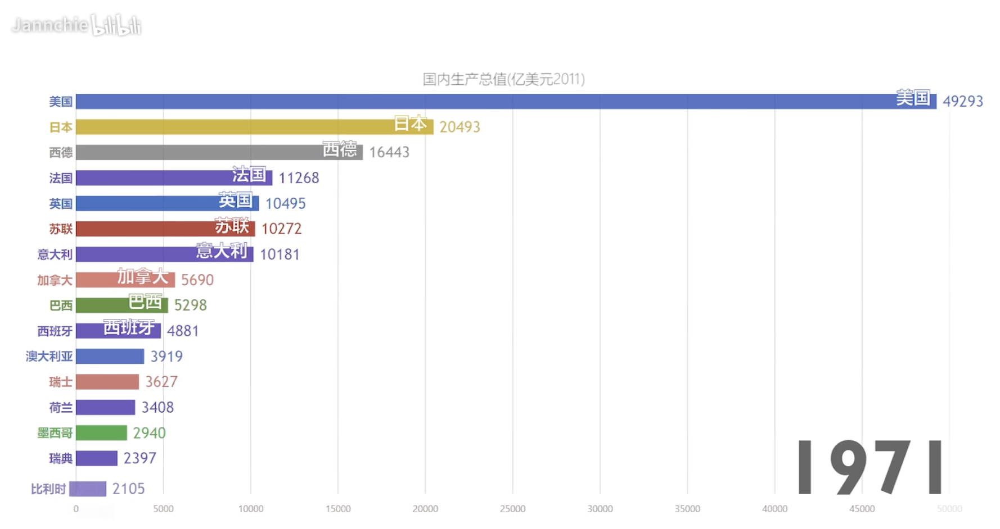

做出的效果还是很不错的，但工具使用的是 JS，不是 Python。于是尝试搜索了一下，看看 Python 有没有相关的库，也能轻松做出动态条形图的效果。幸运的是还真有相关的库，叫 bar_chart_race，那么下面就来看看它的用法。

老规矩，使用之前先安装，直接 pip install bar-chart-race 即可。

~~~python
import pandas as pd
import bar_chart_race as bcr

# 如果出现SSL错误, 则全局取消证书验证
"""
import ssl
ssl._create_default_https_context = \
  ssl._create_unverified_context
"""  

# 获取数据
df = pd.read_csv("covid19_tutorial.csv", index_col=["date"])
# 生成 GIF 图像
bcr.bar_chart_race(df, "covid19_horiz.gif")
~~~

我们看到代码非常简单，就是将数据转成 pandas 的 DataFrame，然后调用 bar_chart_race 即可生成 GIF 图像。

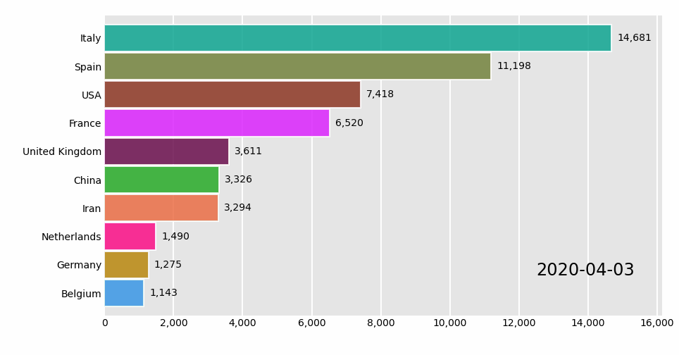

整体还是不错的，然后重点来看一下数据：

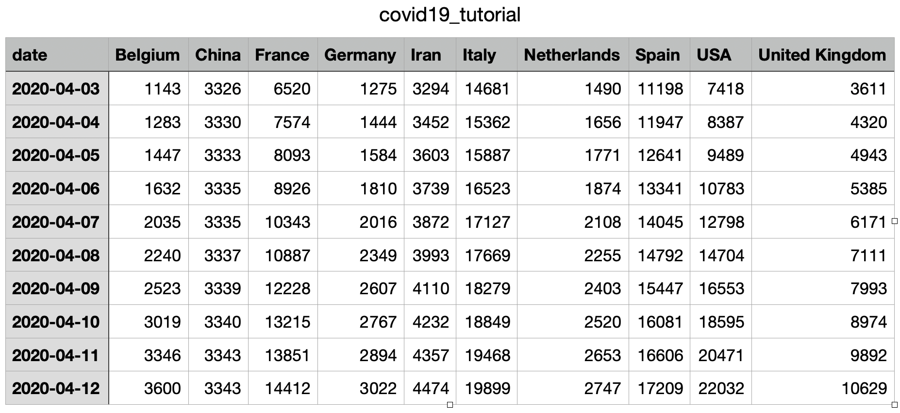

其中表头就是 GIF 图表中 Y 轴的部分，但要注意的是，我们的图表是随时间不断变化的，所以在生成 DataFrame 的时候必须将 date 字段设置为索引。然后数据随着时间不断变化，条形图之间会根据数据的大小进行排序。

当然了，以上只是默认生成的，bar_chart_race 里面还有很多的参数，我们来看一下。

### 动态条形图变动态柱状图

~~~python
import pandas as pd
import bar_chart_race as bcr

df = pd.read_csv("covid19_tutorial.csv", index_col=["date"])
bcr.bar_chart_race(df, "covid19_horiz.gif", orientation='v')
~~~

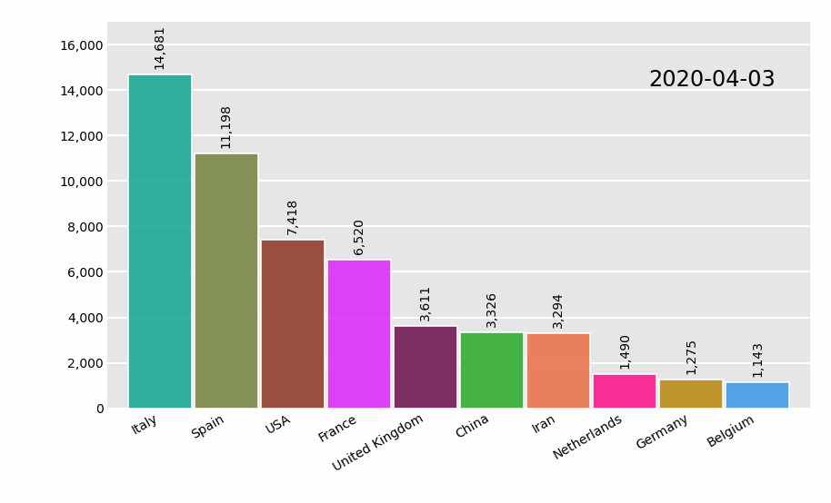

我们看到为了避免文字发生重叠，自动倾斜了，所以还是比较人性化的。

### 指定排序方式

排序方式默认为降序，也可以指定为升序。

~~~python
import pandas as pd
import bar_chart_race as bcr

df = pd.read_csv("covid19_tutorial.csv", index_col=["date"])
bcr.bar_chart_race(df, "covid19_horiz.gif", sort="asc")
~~~

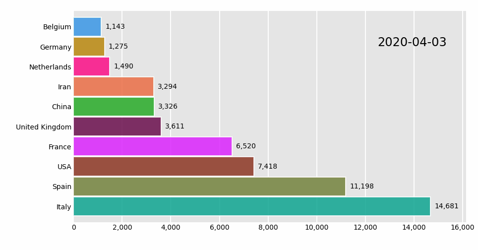

### 限制条目数

~~~python
import pandas as pd
import bar_chart_race as bcr

df = pd.read_csv("covid19_tutorial.csv", index_col=["date"])
bcr.bar_chart_race(df, "covid19_horiz.gif", n_bars=6)
~~~

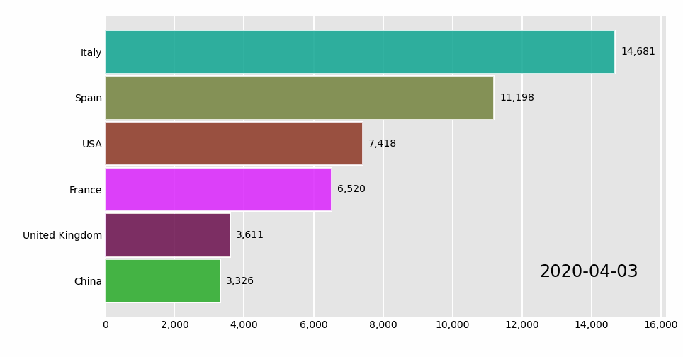

### 设置固定条目

~~~python
import pandas as pd
import bar_chart_race as bcr

df = pd.read_csv("covid19_tutorial.csv", index_col=["date"])
# 选取如下 5 个国家的数据
bcr.bar_chart_race(df, "covid19_horiz.gif", 
                   fixed_order=["Iran", "USA", "Italy", "Spain", "Belgium"])
~~~

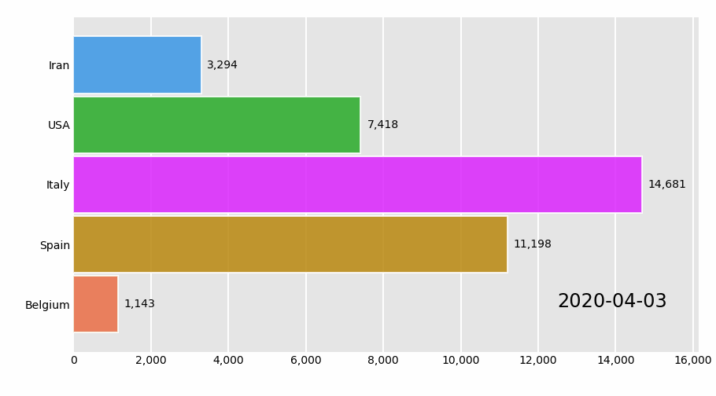

### 固定数值轴，使其不发生动态变化

~~~python
import pandas as pd
import bar_chart_race as bcr

df = pd.read_csv("covid19_tutorial.csv", index_col=["date"])
# 设置数值的最大值，固定数值轴
bcr.bar_chart_race(df, "covid19_horiz.gif", fixed_max=True)
~~~

### 设置图像帧数，默认 10 帧

~~~python
import pandas as pd
import bar_chart_race as bcr

df = pd.read_csv("covid19_tutorial.csv", index_col=["date"])
# 设置数值的最大值，固定数值轴
# 图像帧数：数值越小，越不流畅；越大，越流畅
bcr.bar_chart_race(df, "covid19_horiz.gif", steps_per_period=3)
~~~

可以看到，动图变得不流畅了。

### 设置帧率，单位时间默认为 500ms

~~~python
import pandas as pd
import bar_chart_race as bcr

df = pd.read_csv("covid19_tutorial.csv", index_col=["date"])
# 设置帧率为 200ms，总共 20 帧
bcr.bar_chart_race(df, "covid19_horiz.gif",  steps_per_period=20, period_length=200)
~~~

### 设置每帧增加的标签时间，默认为 False

~~~python
import pandas as pd
import bar_chart_race as bcr

df = pd.read_csv("covid19_tutorial.csv", index_col=["date"])
bcr.bar_chart_race(df, "covid19_horiz.gif",  interpolate_period=True)
~~~

### 图形样式设置

~~~python
import pandas as pd
import bar_chart_race as bcr

df = pd.read_csv("covid19_tutorial.csv", index_col=["date"])
"""
figsize: 设置画布大小，默认 (6, 3.5)
dpi: 图像分辨率，默认 144
label_bars: 显示柱状图的数值信息，默认为 True；
            指定为 False 则不显示；指定为字典，则自定义显示属性
period_label: 显示时间标签信息，默认为 True；
              指定为 False 则不显示；指定为字典，则自定义显示属性
period_fmt: 设置日期格式
title: 图表标题
title_size: 标题字体大小
shared_fontdict: 全局字体属性，例如 
                 {'family': 'Helvetica', 'weight': 'bold', 
                  'color': 'rebeccapurple'}
"""
bcr.bar_chart_race(df, "covid19_horiz.gif", figsize=(5, 3), 
                   dpi=100, label_bars=False,
                   period_label={"x": .99, "y": .1,
                                 "ha": "right", "color": "red"},
                   title='COVID-19 Deaths by Country')
~~~

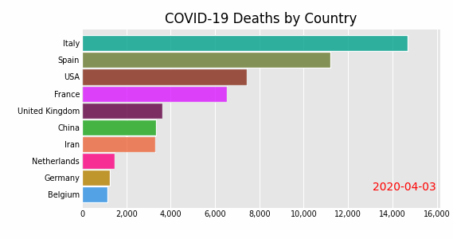

### 条形图属性，可以设置透明度，边框等

~~~python
import pandas as pd
import bar_chart_race as bcr

df = pd.read_csv("covid19_tutorial.csv", index_col=["date"])
# bar_kwargs：条形图属性
bcr.bar_chart_race(df, "covid19_horiz.gif", 
                   bar_kwargs={"alpha": .2, "ec": "black", "lw": 3})
~~~

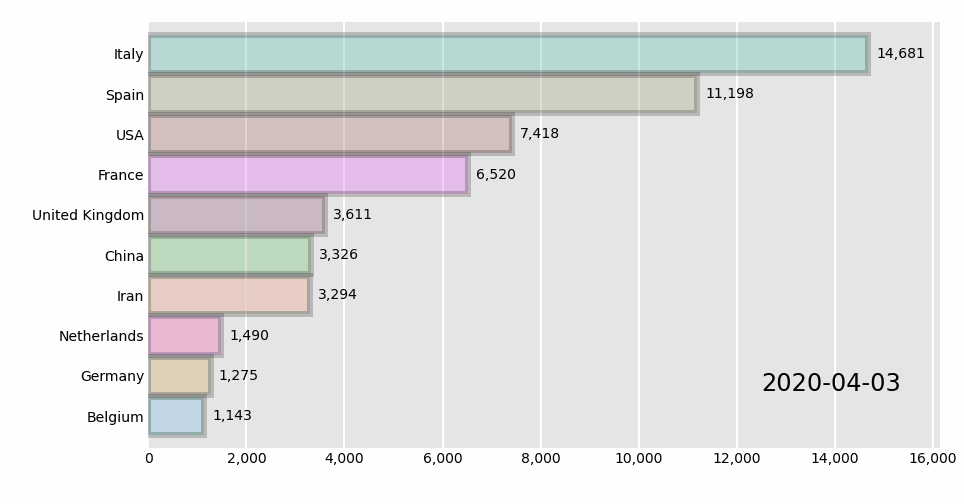

### 添加动态文本

~~~python
import pandas as pd
import bar_chart_race as bcr
import matplotlib.pyplot as plt

# 设置字体，否则无法显示中文
# plt.rcParams['font.sans-serif'] = ['SimHei']  # Windows
plt.rcParams['font.sans-serif'] = ['Hiragino Sans GB'] # Mac
plt.rcParams['axes.unicode_minus'] = False

df = pd.read_csv("covid19_tutorial.csv", index_col=["date"])

def summary(values, ranks):
    # 动态文本的内容
    """
    values 为 df 的每一行（Series），例如
        Belgium            1143.0
        China              3326.0
        France             6520.0
        Germany            1275.0
        Iran               3294.0
        Italy             14681.0
        Netherlands        1490.0
        Spain             11198.0
        USA                7418.0
        United Kingdom     3611.0
        Name: 2020-04-03, dtype: float64

    ranks 则是针对 values 的值进行了排名，例如
        Belgium            1.0
        China              5.0
        France             7.0
        Germany            2.0
        Iran               4.0
        Italy             10.0
        Netherlands        3.0
        Spain              9.0
        USA                8.0
        United Kingdom     6.0
        Name: 2020-04-03, dtype: float64
    """
    all_people = int(values.sum())
    ranks_country = ranks.sort_values().index
    s = (f'总死亡人数：{all_people}，'
         f'死亡人数最多的国家：{ranks_country[-1]}，'
         f'死亡人数最少的国家：{ranks_country[0]}')
    # 设置文本位置、数值、大小、颜色等
    return {'x': .99, 'y': .05, 's': s,
            'ha': 'right', 'size': 8}

# 添加文本
bcr.bar_chart_race(df, 'covid19_horiz.gif', period_summary_func=summary)
~~~

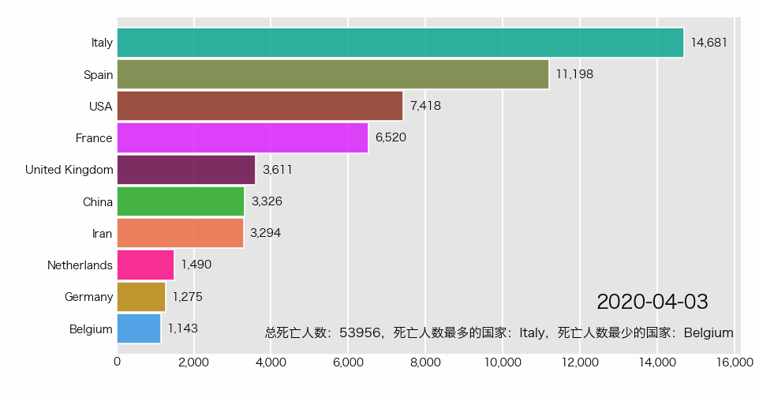

### 添加垂直条

~~~python
import pandas as pd
import bar_chart_race as bcr

df = pd.read_csv('covid19_tutorial.csv', index_col=["date"])
# 设置垂直条数值，分位数
def func(values, ranks):
    return values.quantile(.9)
# 添加垂直条
bcr.bar_chart_race(df, 'covid19_horiz.gif', perpendicular_bar_func=func)
~~~

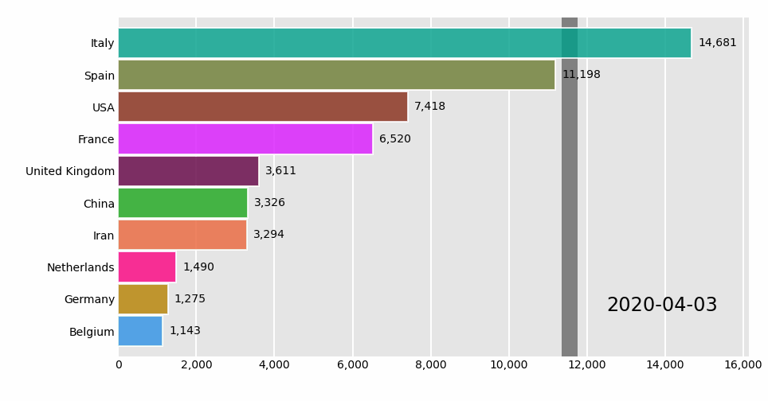

### 设置柱状图颜色

~~~python
import pandas as pd
import bar_chart_race as bcr

df = pd.read_csv('covid19_tutorial.csv', index_col=["date"])
"""
# 具体有哪些颜色，可以通过如下方式查看
from bar_chart_race._colormaps import colormaps
print(list(colormaps.keys()))
"""
bcr.bar_chart_race(df, 'covid19_horiz.gif', cmap="plotly3")
~~~

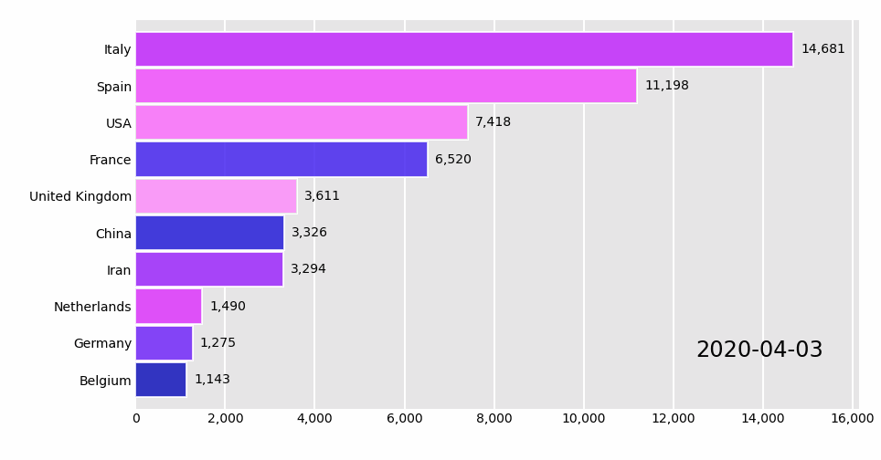

以上就是绝大部分配置，当然源码中注释写的也比较详细，可以点进去看一下。