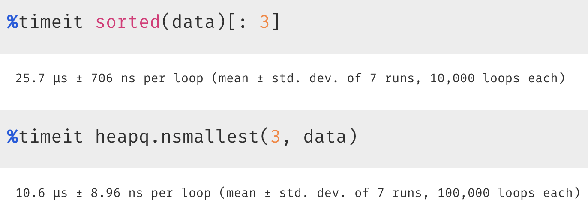
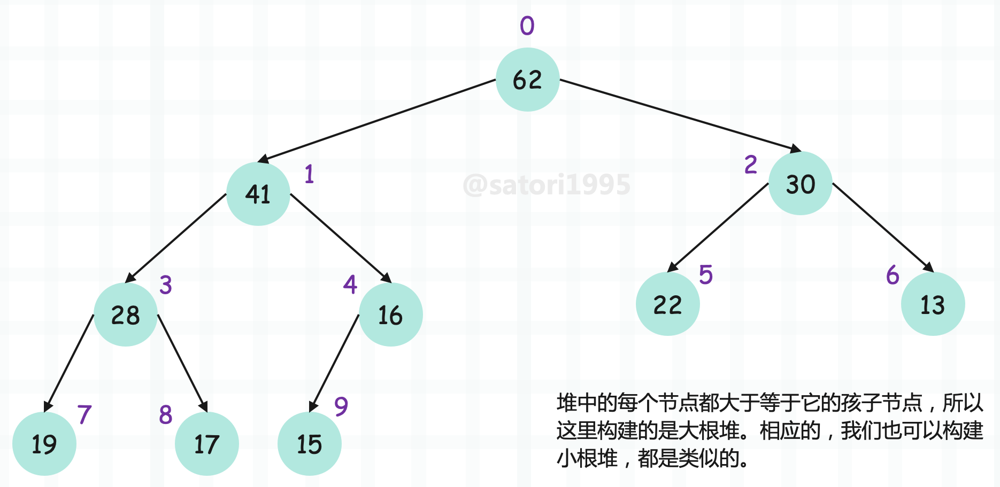
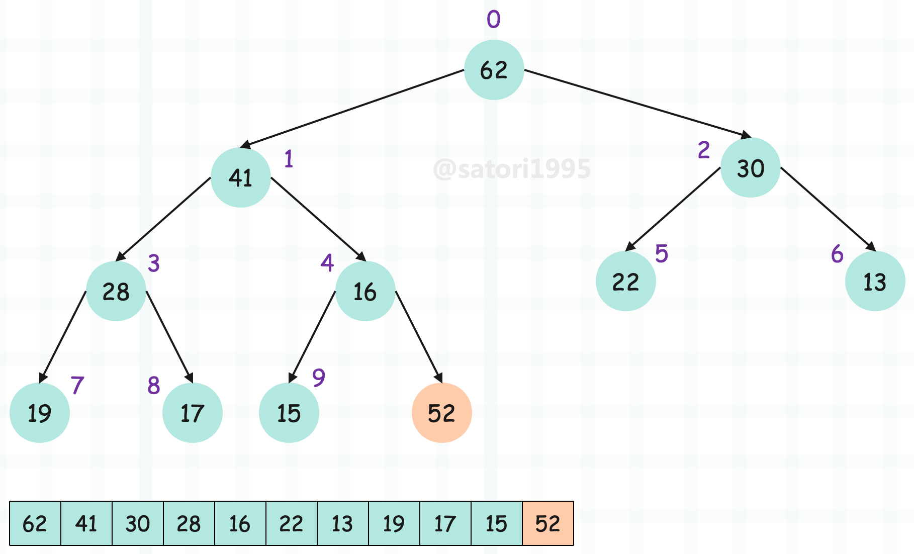
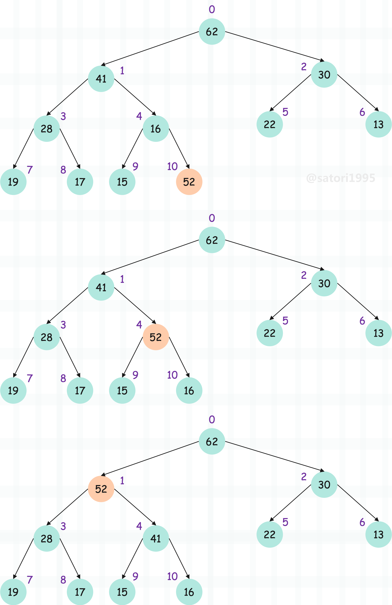
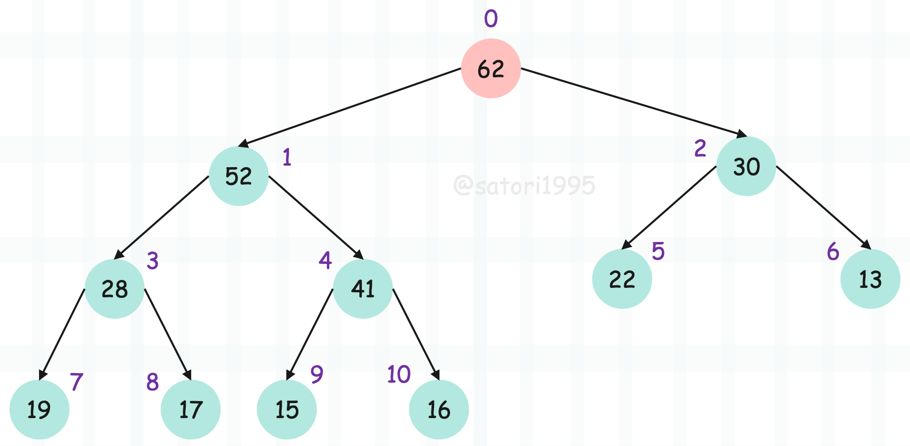
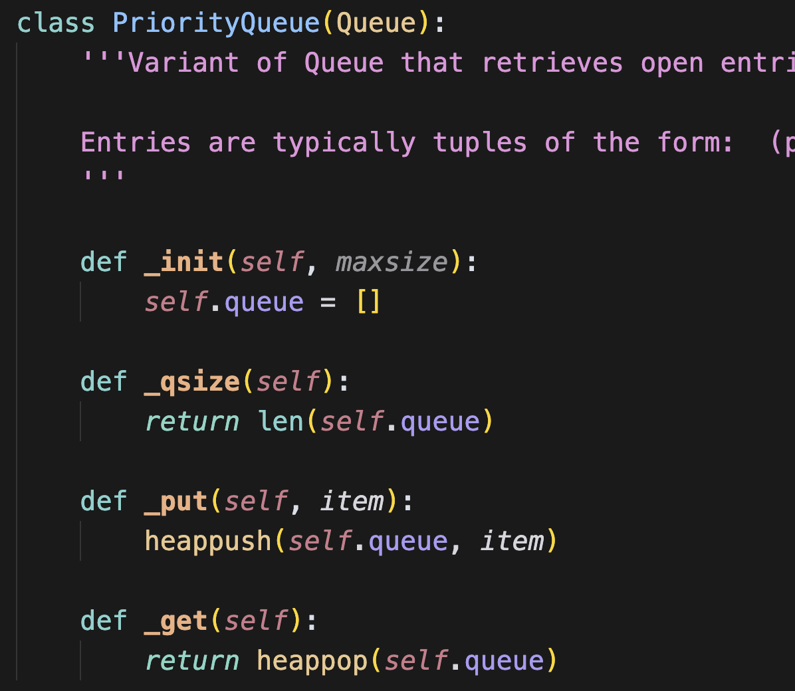

## 楔子

在工作中我们经常会遇到这样一个需求，就是获取可迭代对象中的前 K 个最大或最小的元素。我们之前介绍过排序，所以一个最简单的办法就是先排序，排完了再选择前 K 个元素即可。

~~~Python
data = [3, 1, 2, 5, 4]

# 选择前 3 个最大的元素，和前 3 个最小的元素
sorted_data = sorted(data)
print(f"TOP 3 MAX：{sorted_data[-3:]}")
print(f"TOP 3 MIN：{sorted_data[: 3]}")
"""
TOP 3 MAX：[3, 4, 5]
TOP 3 MIN：[1, 2, 3]
"""

# 或者这么做
sorted_data = sorted(data, reverse=True)
print(f"TOP 3 MAX：{sorted_data[: 3]}")
print(f"TOP 3 MIN：{sorted_data[-3:]}")
"""
TOP 3 MAX：[5, 4, 3]
TOP 3 MIN：[3, 2, 1]
"""
~~~

显然这是一种解决办法，但如果列表的长度非常大，排序就会带来不小的开销。而且有时我们只要前几个元素即可，比如长度为 10000 的列表，我们只想要前三个最大或最小的元素，那么此时对整个列表进行排序显然会存在性能上的浪费。

> sorted 函数的时间复杂度是 O(NlogN)

所以接下来我们要介绍一个模块叫 heapq，通过该模块我们能快速地获取前 K 个元素。

~~~Python
import random
import heapq

data = [random.randint(10, 10000) for _ in range(1000)]

# 选择前 3 个最大的元素
print(heapq.nlargest(3, data))
print(sorted(data, reverse=True)[: 3])
"""
[9997, 9995, 9984]
[9997, 9995, 9984]
"""

# 选择前 3 个最小的元素
print(heapq.nsmallest(3, data))
print(sorted(data)[: 3])
"""
[23, 39, 52]
[23, 39, 52]
"""
~~~

得到的结果是一样的，但是性能差异如何呢？我们来测一下：

可以看到性能差异还是蛮大的，并且列表长度越大，性能差距越明显。而根本原因就在于 sorted 会对列表进行全局排序，而 heapq 没有。因此在获取前 K 个元素、并且 K 和列表长度差距比较大的时候，不妨使用 heapq 的 nsmallest 和 nlargest 函数，性能会有明显提升。

> 但如果 K 和列表长度相差不大，那么先 sorted 排序，再使用切片的方式会更好一些。

nsmallest 和 nlargest 这两个函数都接收 3 个参数，第一个参数表示要获取前多少个元素、第二个参数表示可迭代对象（一般是列表）、第三个参数是 key（和 sorted 函数里面的 key 含义相同）。

~~~python
import random
import heapq

data = [{"number": random.randint(10, 10000)} for _ in range(1000)]

# data 内部都是字典
# 获取前 3 个 number 字段的值最大的字典
print(heapq.nlargest(3, data, key=lambda x: x["number"]))
print(sorted(data, key=lambda x: x["number"], reverse=True)[: 3])
"""
[{'number': 9998}, {'number': 9963}, {'number': 9956}]
[{'number': 9998}, {'number': 9963}, {'number': 9956}]
"""
~~~

特别提示，如果 K 为 1，那么使用内置函数 min 和 max 是最佳选择。

~~~Python
import random
import heapq

data = [{"number": random.randint(10, 10000)} for _ in range(1000)]

# data 内部都是字典
# 获取前 3 个 number 字段的值最大的字典
print(heapq.nlargest(1, data, key=lambda x: x["number"]))
print(sorted(data, key=lambda x: x["number"], reverse=True)[0])
print(max(data, key=lambda x: x["number"]))
"""
[{'number': 9997}]
{'number': 9997}
{'number': 9997}
"""
~~~

所以结论如下，当获取最大或最小元素的个数为 K，列表（可迭代对象）长度为 L 时：

- K 等于 1，使用内置函数 max 或 min；
- K 不等于 1、且远小于 L，使用 heapq 模块的 nlargest 或 nsmallest 函数；
- K 和 L 差别不大，使用 sorted 先全局排序、然后再通过切片方式截取；

当然啦，以上都属于基础知识，比较简单。其实选择前 K 个元素就是我们常说的 TOP K 问题，如果只是单纯地想解决 TOP K 问题的话，上面已经给出了方案。这里我主要是想通过 TOP K 来引出一种数据结构，也就是堆。

堆是一种非常高效的数据结构，我们可以用它实现优先队列，堆实现的优先队列在元素入队、出队的时间复杂度上均为 O(logN)。

## 什么是堆？

首先堆本身是一棵树，如果这棵树是二叉树，那么实现的堆就被称为二叉堆。当然除了二叉堆，还有三叉堆等等，只不过二叉堆是一种最主流的堆的实现方式。因此，堆（二叉堆）就是一棵满足一些特殊性质的二叉树，那么问题来了，它都满足哪些性质呢？

- 堆是一棵完全二叉树；
- 堆里的每一个节点都大于等于（或小于等于）它的孩子节点；
  - 如果每个节点都大于等于它的孩子节点，或者说每个节点都不大于它的父节点，那么这个堆就是大根堆；
  - 如果每个节点都小于等于它的孩子节点，或者说每个节点都不小于它的父节点，那么这个堆就是小根堆；

注意：堆要求的是每个节点和其孩子节点之间要满足相应的大小关系，如果两个节点之间没有父子关系，那么它们谁大谁小无关紧要。比如图上的大根堆，第三层的最后一个节点是 13，可第四层的节点却都比它大，但它们之间没有父子关系，所以当前这个堆是成立的。

正是因为堆的这个性质，我们可以使用数组来表示堆，直接按照层序遍历的方式将每一层的元素放在数组中即可，比如：

`[62, 41, 30, 28, 16, 22, 13, 19, 17, 15]`

很明显，堆顶（数组索引为 0）的元素永远是值最大或最小的元素，如果构建的是大根堆，堆顶元素最大；构建的是小根堆，堆顶元素最小。

但是问题来了，如果我有一个节点，要如何找到它的父节点或者孩子节点呢？结论如下，假设当前节点所在的索引为 i。

- 父节点的索引：(i - 1) / 2
- 左孩子节点的索引：2 \* i + 1
- 右孩子节点的索引：2 \* i + 2

我们以索引为 3 这个元素（值为 28）为例，它父节点的索引是 (3 - 1) / 2 = 1，也就是 41 这个元素。左孩子节点的索引是 2 \* 3 + 1 = 7，也就是 19 这个元素。右孩子节点的索引显然是 8，也就是 17 这个元素。可以对照上图，检验一下是否有误，或者你也可以创建一个更大的堆，自己测试一下，但前提必须是完全二叉树才具备这个性质。

显然通过这种方式，我们就不需要两个指针来维持节点之间的父子关系了，使用数组索引即可，并且通过索引定位元素的速度也会更快。

## 向堆中添加元素（Sift Up）

我们来看看如何往堆中添加元素，首先堆是一个完全二叉树，往堆中添加一个元素，从树的层面来看，就是往最后一层的最右端添加一个元素，如果最后一层已经满了，那么就新加一层。如果从数组的层面来看，就相当于 append 一个元素。

假设我们往刚才的堆中添加一个 52，那么堆的示意图就会变成如下这样：

添加的过程非常简单，因为往堆里面添加一个节点，就是往数组里面 append 一个元素，但显然还没有结束。因为堆有两个性质，虽然我们添加元素之后仍然满足是一棵完全二叉树，但是不满足子节点都不大于它的父节点（这里我们构建的是大根堆），因为 52 明显大于它的父节点 16。

因此还要进行调整，将新添加的节点放到属于它的位置，具体过程也很简单：将该节点和它的父节点进行比较，如果比它的父节点大，那么就进行交换；交换之后再和它新的父节点进行比较，如果还大于新的父节点则继续交换，直到不大于为止。

所以从尾部添加的节点，一直向上浮动，直到找到属于它的位置，因此这个过程也被称为 Sift Up（上浮），具体示意图如下：

当交换之后，发现不大于它的父节点，那么该节点就可以停下来了。可能有人问，它父节点之上的节点该怎么办？比如爷爷节点。答案是不需要关心，因为大根堆的性质就是每个子节点不大于父节点。所以当新添加的节点不大于它的父节点时，也更不可能大于父节点之上的爷爷节点。

下面我们就编写代码实现一下：

~~~python
class BinaryHeap:
    """
    大根堆
    """
    def __init__(self):
        # 通过数组来模拟堆，为避免直接修改堆
        # 这个数组不对外暴露，而是专门提供一个接口
        self.__data = []
    
    def show_heap(self):
        return self.__data
    
    @staticmethod
    def get_parent(i: int) -> int:
        # 根据节点的索引找到其父节点的索引
        return (i - 1) // 2

    def heappush(self, item: int):
        # 往堆中添加一个节点，对于数组而言，直接 append 即可
        self.__data.append(item)
        # 但是还没有结束，添加完之后不满足堆的性质
        # 我们还要对堆进行调整，由 sift_up 函数负责，它接收一个索引
        # 表示对指定索引的节点进行上浮，显然这里是最后一个
        self.sift_up(len(self.__data) - 1)
    
    def sift_up(self, i: int):
        # 对指定索引位置的节点进行上浮
        while i > 0:
            parent = self.get_parent(i)
            # 当该元素不是根节点的时候，将其和父节点进行比较
            # 如果大于父节点，两者进行交换
            if self.__data[i] > self.__data[parent]:
                self.__data[i], self.__data[parent] = self.__data[parent], self.__data[i]
                # 交换之后该节点成为了父节点，然后将 parent 赋值为 i
                # 因为它还要继续作为新的子节点和新的父节点比较
                i = parent
            else:
                # 如果不大于父节点，说明该元素已经找到属于它的位置了
                # 直接将循环结束掉即可
                break
        
heap = BinaryHeap()
for item in [62, 41, 30, 28, 16, 22, 13, 19, 17, 15]:
    heap.heappush(item)
print(heap.show_heap())
"""
[62, 41, 30, 28, 16, 22, 13, 19, 17, 15]

                        62
            41                       30
      28          16           22          13
  19      17  15
"""

# 这个时候再添加一个元素 52
heap.heappush(52)
print(heap.show_heap())
"""
[62, 52, 30, 28, 41, 22, 13, 19, 17, 15, 16]

                        62
            52                       30
      28          41           22          13
  19      17  15      16
"""
~~~

可以看到结果是没有问题的，以上我们添加元素就成功了，下面我们再来看看如何从堆中取出元素。

## 从堆中取出元素（Sift Down）

正如添加节点从堆底添加，取出节点只能从堆顶取出（也就是只能取根节点），不能取其它位置的节点。

但问题是，如果直接将堆顶的节点取走的话，就会形成两个独立的堆，两个堆的根节点分别是它的左右节点。我们还要手动将两个堆合并在一起，会比较麻烦，因此可以换个思路，将堆顶和堆底的元素进行交换。交换之后，弹出堆底的元素，这样就得到了最大值。

但该做法同时也破坏了堆的第二个性质，因为之前的堆底元素现在跑到了堆顶，肯定不满足父节点和子节点之间的大小关系，所以还要进行调整。

对于大根堆而言，将该节点和左右子节点中大的那一个进行比较，如果比子节点小，那么进行交换。交换之后再和它新的子节点进行比较，如果还小于新的子节点则继续交换，直到不小于为止。

所以从顶部的节点，一直向下沉，直到找到属于它的位置，因此这个过程也被称为 Sift Down（下沉），具体示意图如下：

注意：堆顶节点和堆底节点交换之后，就被弹出了，所以图中的 62 不再是堆节点，因此我们刻意画的淡了一些。

下面完善一下之前的代码：

~~~python
class BinaryHeap:
    """
    大根堆
    """
    def __init__(self):
        self.__data = []
    
    def show_heap(self):
        return self.__data
    
    @staticmethod
    def get_parent(i: int) -> int:
        # 根据节点的索引找到其父节点的索引
        return (i - 1) // 2
    
    @staticmethod
    def get_left_child(i: int) -> int:
        # 根据节点的索引找到左孩子节点的索引
        return 2 * i + 1
    
    @staticmethod
    def get_right_child(i: int) -> int:
        # 根据节点的索引找到右孩子节点的索引
        return 2 * i + 2

    def heappush(self, item: int):
        self.__data.append(item)
        self.sift_up(len(self.__data) - 1)
    
    def sift_up(self, i: int):
        while i > 0:
            parent = self.get_parent(i)
            if self.__data[i] > self.__data[parent]:
                self.__data[i], self.__data[parent] = self.__data[parent], self.__data[i]
                i = parent
            else:
                break
            
    def heappop(self):
        # 弹出堆顶元素
        if len(self.__data) == 0:
            raise IndexError("pop from empty heap")
        # 将第一个元素和最后一个元素进行交换
        self.__data[0], self.__data[-1] = self.__data[-1], self.__data[0]
        # 弹出最后一个元素
        item = self.__data.pop()
        # 不过在返回之前，记得调整一下堆，由 sift_down 函数负责
        # 此函数接收一个索引，表示对指定节点的索引进行下沉
        # 显然这里是第一个
        self.sift_down(0)
        return item
    
    def sift_down(self, i: int):
        # 对索引为 i 的节点进行下沉，这里需要判断孩子节点是否存在的情况
        # 如果左孩子节点的索引越界，说明该节点已经是叶子节点了
        while self.get_left_child(i) < len(self.__data):
            left_child = self.get_left_child(i)
            right_child = self.get_right_child(i)
            # 获取子节点大的那一个，注意：需要考虑右节点是否存在的情况
            if right_child < len(self.__data) and self.__data[right_child] > self.__data[left_child]:
                child = right_child
            else:
                child = left_child
            # 将该节点和孩子节点进行比较，如果比孩子节点小，那么交换位置
            # 并继续和新的孩子节点进行比较
            if self.__data[i] < self.__data[child]:
                self.__data[i], self.__data[child] = self.__data[child], self.__data[i]
                i = child
            # 否则直接跳出循环
            else:
                break

heap = BinaryHeap()
data = [4, 8, 1, 5, 3, 9, 2, 7, 6]
# 依次添加到堆中
for item in data:
    heap.heappush(item)
# 从堆中弹出，由于每次都会弹出最大值
# 所以得到的新列表是降序排序的    
print([heap.heappop() for _ in range(len(data))])
"""
[9, 8, 7, 6, 5, 4, 3, 2, 1]
"""
~~~

显然是没有问题的，因此我们这里就实现了一个堆排序，只不过这个堆排序还不太完美，不完美之处有两个地方：

+ 默认是从大到小排序的，应该提供一个参数供外界选择究竟是从大到小还是从小到大；
+ 开辟了一个额外的数组，合适的做法应该是接收一个数组，然后原地排序；

那么下面我们完善一下堆排序。

~~~python
def get_left_child(i: int):
    return 2 * i + 1

def get_right_child(i: int):
    return 2 * i + 2

def sift_down_large(data: list, i: int, length: int):
    # 大根堆下沉，但是参数多了一个 length，这是为啥呢？
    # 因为之前是将堆顶和堆底的元素交换之后，就将堆底的元素弹出去了
    # 以至于我们需要单独开辟一个数组去接收
    # 但很明显，我们这里要求原地排序，那么交换之后的元素在堆底不可以动
    # 因此每 sift_down 一次，length 要减去 1
    while get_left_child(i) < length:
        left_child = get_left_child(i)
        right_child = get_right_child(i)
        # 判断是否有右孩子，如果有右孩子，那么选择值较大的那一个孩子节点
        if right_child < length and data[right_child] > data[left_child]:
            child = right_child
        else:
            child = left_child
        # 如果比孩子节点的值小，那么两者进行交换，因为大根堆要求父节点不小于子节点
        if data[i] < data[child]:
            data[i], data[child] = data[child], data[i]
            i = child
        else:
            break

def sift_down_small(data: list, i: int, length: int):
    # 小根堆下沉
    while get_left_child(i) < length:
        left_child = get_left_child(i)
        right_child = get_right_child(i)
        # 判断是否有右孩子，如果有右孩子，那么选择值较小的那一个孩子节点
        if right_child < length and data[right_child] < data[left_child]:
            child = right_child
        else:
            child = left_child
        # 如果比孩子节点的值大，那么两者进行交换，因为小根堆要求父节点不大于子节点
        if data[i] > data[child]:
            data[i], data[child] = data[child], data[i]
            i = child
        else:
            break

def heapify_large(data: list):
    # 将一个数组整理成大根堆的形状
    # 从最后一个非叶子节点进行 sift_down 即可
    for i in range((len(data) - 1) >> 1, -1, -1):
        sift_down_large(data, i, len(data))

def heapify_small(data: list):
    # 将一个数组整理成小根堆的形状
    for i in range((len(data) - 1) >> 1, -1, -1):
        sift_down_small(data, i, len(data))
        
def heap_sort(data: list, reverse: bool = False):
    # 堆排序，首先将 data 整理成堆的形状
    if reverse:
        heapify_small(data)
    else:
        heapify_large(data)
    # i 从最后一个元素开始
    for i in range(len(data) - 1, -1, -1):
        # 交换完之后的元素就不可以动了
        data[0], data[i] = data[i], data[0]
        # 并且也不能再参与后续的 sift_down，因此依旧调整堆，但是范围变了
        # 比如第一次交换，那么最后一个元素为最大值
        # sift_down 的时候，整个范围就是 [0: len(data) - 1]
        # 同理第二次 sift_down 的时候，范围就是 [0: len(data) - 2]
        if reverse:
            sift_down_small(data, 0, i)
        else:
            sift_down_large(data, 0, i)

import random
data = [random.randint(0, 100) for _ in range(10)]
print(data)
"""
[51, 4, 38, 31, 87, 18, 39, 8, 98, 61]
"""
heap_sort(data)
print(data)
"""
[4, 8, 18, 31, 38, 39, 51, 61, 87, 98]
"""

data = [random.randint(0, 100) for _ in range(10)]
print(data)
"""
[78, 11, 83, 30, 99, 61, 45, 63, 17, 81]
"""
heap_sort(data, reverse=True)
print(data)
"""
[99, 83, 81, 78, 63, 61, 45, 30, 17, 11]
"""
~~~

以上我们就实现了堆排序，那么问题来了，你觉得 heapq 模块里的 nlargest 和 nsmallest 是怎么实现的呢？

很简单，假设我们要选取 k 个最小的元素，那么首先可以从数组中截取前 k 个元素，构建一个大根堆。然后从第 k + 1 个元素开始遍历数组，如果当前元素大于等于堆顶元素，那么它肯定就不是前 k 小的元素，如果当前元素小于堆顶的元素，那么两者进行交换，然后进行一次 Sift Down 操作。当数组遍历完毕之后，堆中的 k 个元素就是最小的前 k 个元素。同理，如果想选择前 k 个最大的元素，那么就构建一个小根堆。

> 或者将整个数组构建成一个堆，然后heappop k 次即可，这样也能选择前 k 个元素。

## 优先队列

其实在排序的时候，堆排序不是效率最高的排序，它比三路快排要慢一些。但是堆存在的目的绝不仅仅是为了排序，由于它可以动态添加元素、删除元素，并且时间复杂度都为 O(logN) 级别，所以堆的强大之处就在于非常适合实现优先队列。

事实上 heapq 也已经为我们提供了堆的相关操作：

~~~Python
"""
heapq.heapify(data)
    将数组 data 整理成堆的形状，只支持小根堆

heapq.heappush(data, item)
    向堆中添加元素，并维护堆的形状
    要求 data 已经是一个小根堆

heapq.heappop(data, item)
    从堆中弹出元素，并维护堆的形状
    要求 data 已经是一个小根堆
"""
~~~

而 Python 的优先队列，底层就是借助于 heapq 实现的，我们看一下：

里面的 item 是一个元组，第一个元素是优先级（值越小、优先级越高），第二个元素是具体的数据，这就是优先队列，是不是比你想象中的要简单许多呢？

## 小结

堆是一种非常高效的数据结构，它可以动态地添加、删除元素，并且时间复杂度均为 O(logN) 级别。这个特性就决定了它非常适合实现优先队列，维护一个堆，在往堆中添加元素的时候，只需要加一个优先级即可，也就是将优先级和数据组合成一个元组添加到堆中。如果构建的是小根堆，值越小、优先级越高；构建的是大根堆，值越大，优先级越高。

另外我们说，当获取最大值或最小值时，推荐使用内置函数 max 和 min。但如果数组 data 一直在动态变化，并且要随时获取里面的最大值或最小值，那么相比使用内置函数 max、min，更好的做法是将 data 维护成一个堆。然后添加元素使用 heappush，获取元素直接 data[0] 即可。因为这整体是一个 O(logN) 的操作，而是 min、max 是一个 O(N) 的操作。

最后，堆可以用来实现排序，效率也很高，但相比三路快排还差了那么一点。但堆存在的目的不在于排序，而在于它的动态性。优先队列就不必说了，还有 TOP K。虽然三路快排和堆都可以实现 TOP K，但前者要求数据必须一次性全部给出，而堆则没有这个要求，换句话说堆可以满足对流式数据的处理。

比如 1T 的文件，一行就是一串数字，如果想在 16G 内存的机器上查找最大的 100 个数字，用快排是无法实现的，因为无法将文件一次性加载到内存中。但堆可以实现这个需求，先读取 100 行维护一个小根堆，然后从 101 行继续读取，依次和堆顶进行比较。如果小于堆顶元素，那么它一定不是前 100 个最大的数字；如果大于堆顶元素，那么就替换掉，然后 sift_down，维护堆的形状。这样总有一刻，能够选出最大的 100 个数字。

所以当数组 data 不断变化时，将其维护成一个堆，然后通过 heappush 添加元素、heappop 弹出堆顶元素、data[0] 获取堆顶元素，往往是最佳选择。并且添加和弹出都是 logN 级别的时间复杂度，也正是这个特性，它适合优先队列以及流式数据（数据无法一次性全部给出）的处理。