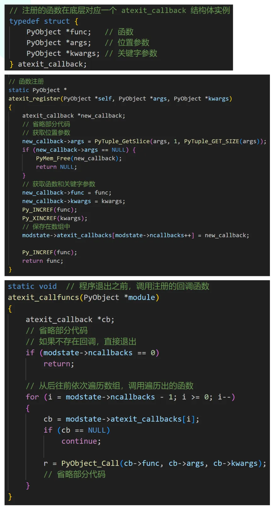
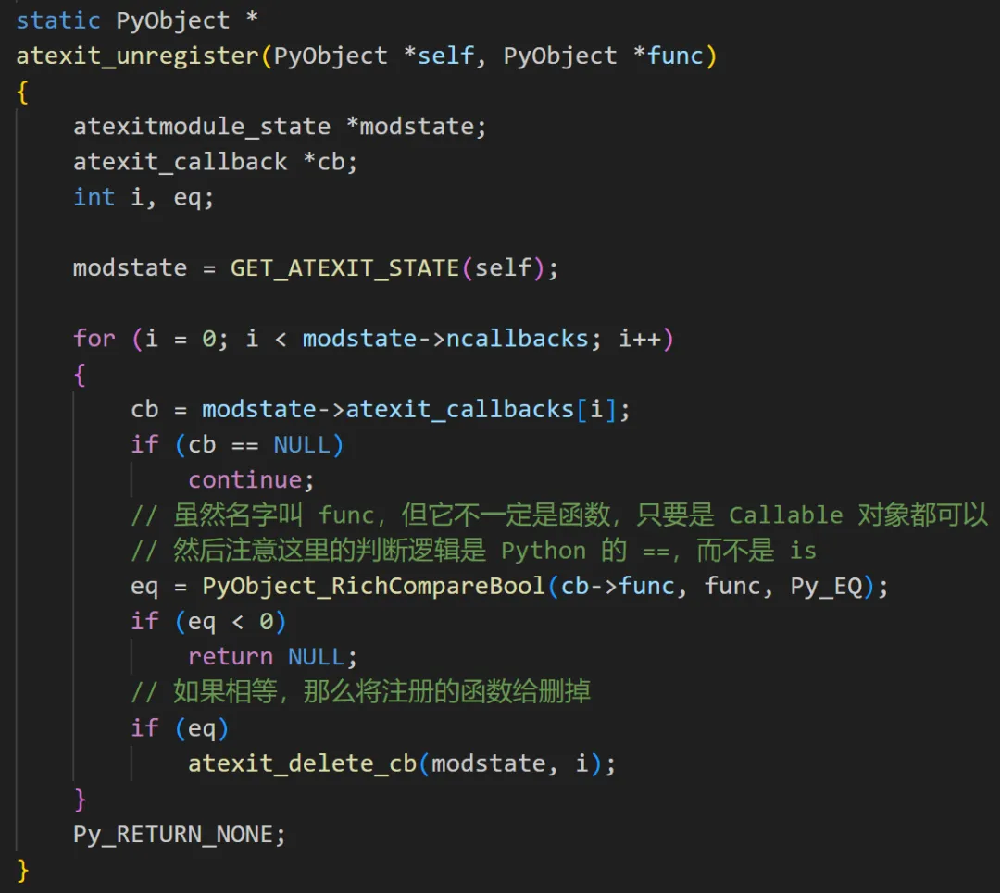
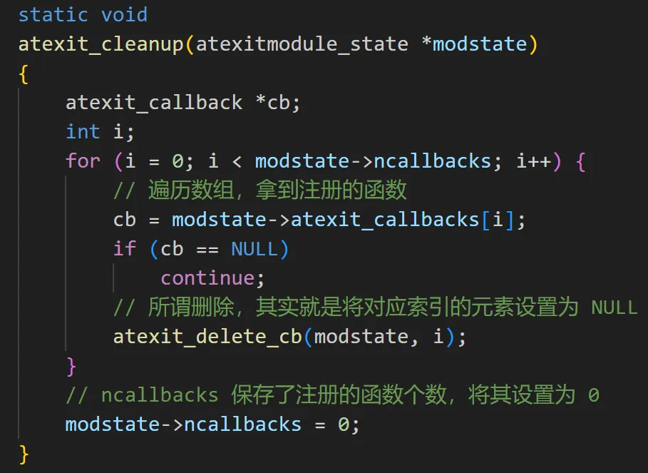
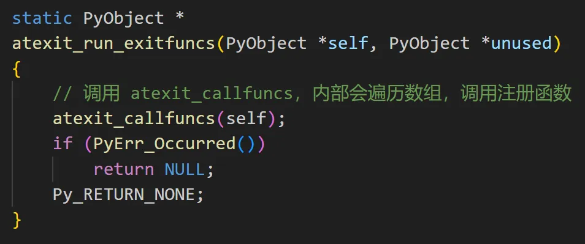

在 Go 里面可以通过 defer 语句让函数在结束时执行预定义好的一些操作，举个例子。

```go
package main

import "fmt"

func main() {
    defer fmt.Println("高老师总能分享出好东西")
    fmt.Println("执行结束")
    /*
    执行结束
    高老师总能分享出好东西
    */
}
```

这个功能非常方便，比如打开文件之后可以执行 `defer fp.Close()`，这样函数结束时会自动关闭文件句柄。那么在 Python 里面可不可以实现类似的功能呢？本次来聊一聊 atexit 模块，它能帮我们实现类似的效果。

```python
import atexit

def exit_func(words):
    print(words)

# 将函数注册进去
atexit.register(exit_func, "高老师总能分享出好东西")
print("Hello")
print("World")
"""
Hello
World
高老师总能分享出好东西
"""
```

通过 atexit.register 将函数注册进去之后，会在程序结束之前执行，当然也可以同时注册多个。

```python
import atexit

def exit_func(words):
    print(words)

# 将函数注册进去
atexit.register(exit_func, "高老师总能分享出好东西")
atexit.register(exit_func, "S 老师今年 18，单身带俩娃")
atexit.register(exit_func, "只因^(*￣(oo)￣)^只因大(出海版)")
print("Hello")
print("World")
"""
Hello
World
只因^(*￣(oo)￣)^只因大(出海版)
S 老师今年 18，单身带俩娃
高老师总能分享出好东西
"""
```

如果同时注册了多个函数，那么会按照先入后出的顺序执行。非常简单，其实 atexit 模块就是将我们注册的函数保存在了一个数组中，程序结束的时候，从后往前依次执行。



既然可以注册函数，那么也可以取消注册。

```python
import atexit

def exit_func1(words):
    print(words)

def exit_func2(words):
    print(words)

atexit.register(exit_func1, "高老师总能分享出好东西")
atexit.register(exit_func1, "S 老师今年 18，单身带俩娃")
atexit.register(exit_func2, "只因^(*￣(oo)￣)^只因大(出海版)")

# 取消注册，所有注册的 exit_func1 函数都会被删除
atexit.unregister(exit_func1)
"""
只因^(*￣(oo)￣)^只因大(出海版)
"""
```

而它的逻辑也很简单，就是遍历数组，如果和指定的函数相等，那么就删掉。我们看一下源代码。



如果你想将注册的函数全部取消掉，那么也可以调用 _clear() 函数。

```python
import atexit

def exit_func1(words):
    print(words)

def exit_func2(words):
    print(words)

atexit.register(exit_func1, "高老师总能分享出好东西")
atexit.register(exit_func1, "S 老师今年 18，单身带俩娃")
atexit.register(exit_func2, "只因^(*￣(oo)￣)^只因大(出海版)")

atexit._clear()
```

此时程序不会有任何输出，因为注册的函数全部被清空了，同样可以看一下它的源代码。



最后就是函数的调用时机，我们注册的函数在程序结束时才会调用，可不可以让它们在任意时刻调用呢？

```python
import atexit

def exit_func1(words):
    print(words)

def exit_func2(words):
    print(words)

atexit.register(exit_func1, "AAA")
atexit.register(exit_func1, "BBB")
# 调用注册的函数，调用之后函数会被删除
atexit._run_exitfuncs()
print("++++++++++++++++")

atexit.register(exit_func2, "CCC")
atexit._run_exitfuncs()
print("----------------")
"""
BBB
AAA
++++++++++++++++
CCC
----------------
"""
```

输出结果表明，一旦调用了 \_run\_exitfuncs，所有注册的函数会立即被调用。我们看一下源代码。



以上就是 atexit 模块的用法，那我们如何基于它实现 Golang 的 defer 呢？

```python
from typing import Callable
import atexit

def defer(func: Callable, *args, **kwargs):
    atexit.register(func, *args, **kwargs)

def get_file_content(file_path):
    fp = open(file_path, encoding="utf-8")
    defer(fp.close)  # 注册函数
    content = fp.read()
    # do something
    ...
    atexit._run_exitfuncs()  # 触发注册函数执行

get_file_content("config.py")
```

不过这个例子明显有点刻意了，因为必须要在函数的结尾调用 atexit.\_run\_exitfuncs，而之所以要实现 Go 的 defer，就是为了避免遗忘某些逻辑。

如果每次都要在函数结尾调用 atexit.\_run\_exitfuncs，那还不如不用，于是我们可以考虑使用装饰器。

```python
from typing import Callable
from functools import wraps
import atexit

def defer(func: Callable, *args, **kwargs):
    atexit.register(func, *args, **kwargs)

# 给函数赋予 defer 功能
def enable_defer(func):
    @wraps(func)
    def inner(*args, **kwargs):
        ret = func(*args, **kwargs)
        atexit._run_exitfuncs()
        return ret
    return inner

@enable_defer  # 通过装饰器，让函数支持 defer 功能
def get_file_content(file_path):
    fp = open(file_path, encoding="utf-8")
    # 注册函数
    defer(fp.close)
    defer(print, "get_file_content 函数实现了 defer 功能")

    content = fp.read()
    print("函数执行结束")

get_file_content("config.py")
print("程序结束")
"""
函数执行结束
get_file_content 函数实现了 defer 功能
程序结束
"""
```

输出结果表明，在函数结束后，通过 defer 注册的函数执行了。

以上就是用 Python 实现 Go 的 defer，不过在工作中还是不建议这么做，没啥必要，这里只是想分享一下 atexit 模块。