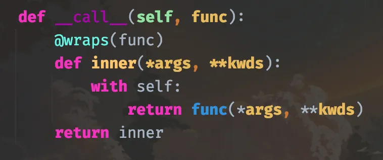
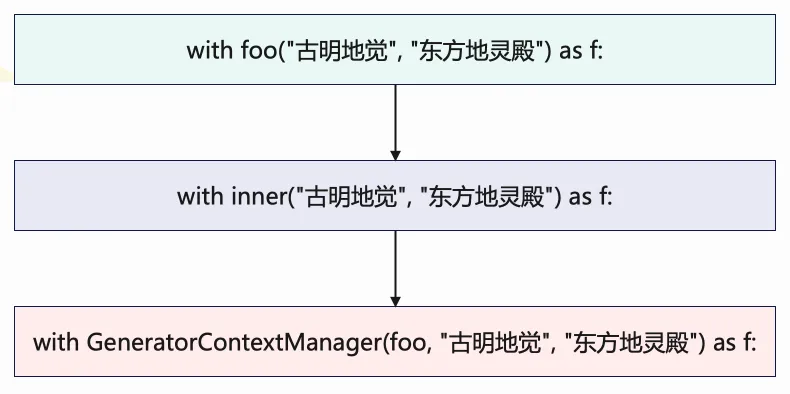

## 楔子

本篇文章来聊一下 Python 的 with 语句，它用于实现上下文管理器。我们使用 with 语句最多的场景，应该就是操作文件了，比如打开一个文件的时候会通过类似于 <font color="blue">with open() as f:</font> 这种形式打开，而这么做好处就是当 with 语句结束后会自动关闭文件。

那么 with 语句的原理是什么呢？我们怎么样才能使用 with 语句呢？这次就全方位地剖析一下。并且 Python 的标准库里面有一个模块叫做 contextlib，从名字上也能看出来这是一个用于上下文管理的模块。我们后面也会通过分析 contextlib 的源码，来手动实现一下 contextlib 的功能。

## 上下文管理器 API

上下文管理器（context manager）负责管理一个代码块的资源，会在进入代码块时创建资源，在退出代码块时清理资源。比如文件就支持上下文管理器 API，可以确保文件读写后自动关闭。

**我们来模拟一下文件的读取：**

~~~python
class Open:

    def __init__(self, filename, mode='r', encoding=None):
        self.filename = filename
        self.mode = mode
        self.encoding = encoding

    def __enter__(self):
        print("开始执行 __enter__")
        return self

    def read(self):
        print(f"以 `{self.mode}` 模式打开文件 `{self.filename}`")

    def __exit__(self, exc_type, exc_val, exc_tb):
        print("最后执行 __exit__，用于清理资源")


with Open("1.txt") as f:
    f.read()
"""
开始执行 __enter__
以 `r` 模式打开文件 `1.txt`
最后执行 __exit__，用于清理资源
"""
~~~

with Open() as f: 的整个流程就是先实例化一个 Open 对象，然后通过实例对象来调用 \_\_enter\_\_ 方法，将其返回值赋给 with 语句中的 f，接着执行 with 语句块内的代码，最后执行 \_\_exit\_\_ 方法。

因此需要注意：with Open() as f 里面的 f，不一定是 Open 的实例对象，它到底是什么，取决于 \_\_enter\_\_ 方法返回了什么。

~~~python
class Open:

    def __enter__(self):
        return "古明地觉"

    def __exit__(self, exc_type, exc_val, exc_tb):
        pass


# 如果是 f = Open(), 那么毫无疑问 f 就是类 Open 的实例对象
# 但是对于 with Open() as f 而言，则不一样
# 我们说这个 f 到底是什么, 它取决于 __enter__ 中返回了什么
with Open() as f:
    print(f)
"""
古明地觉
"""
~~~

我们看到 print(f) 打印的是一个字符串，这是因为 \_\_enter\_\_ 返回的就是一个字符串。首先 with Open() as f: 这一行代码所做的事情就是先实例化一个 Open 对象，虽然这个实例对象我们无法用变量进行接收，但它确实存在。然后该实例对象再调用 \_\_enter\_\_，将 \_\_enter\_\_ 的返回值赋给 f，所以在 with 代码块中打印 f 得到的是一个字符串。

因此要记住：f 是由 \_\_enter\_\_ 的返回值决定的，只不过大多数情况下，\_\_enter\_\_ 里面返回的都是 self 本身，所以 f 指向的也是该类的实例对象。

**当然，我们先实例化一个对象，再使用 with 也是可以的。**

~~~python
class Open:

    def __enter__(self):
        return "古明地觉"

    def __exit__(self, exc_type, exc_val, exc_tb):
        pass


o = Open()
# 会将 o.__enter__() 赋值给 f
with o as f:
    print(f"{f}, 世界第一可爱")
"""
古明地觉, 世界第一可爱
"""

# with Open() as f: 相当于将实例化和调用 __enter__ 放在一起执行
# 但也可以先实例化，然后对实例对象单独使用 with 语句
# 比如 with o as f:, 那么会执行 o.__enter__(), 将其返回值赋值给 f
# 当 with 语句结束，再通过实例对象 o 来调用 __exit__，进行资源的释放等操作

# 当然 with 也可以不搭配 as，即独立存在
with o:
    pass
~~~

因此 with 语句的流程我们就很清晰了，以 with A() as a: 为例，总共分为三步：

- 创建 A 的实例对象，然后调用 \_\_enter\_\_ 方法，将其返回值交给 a；
- 执行 with 语句块的代码；
- 最后由该实例对象再调用 \_\_exit\_\_ 进行一些收尾工作；

> 因此一个对象能否使用 with 语句，取决于实例化该对象的类（或者继承的基类）是否同时实现了 \_\_enter\_\_ 和 \_\_exit\_\_ 两个魔法函数，两者缺一不可。

\_\_enter\_\_ 我们清楚了，然后再来看看 \_\_exit\_\_。我们看到它的参数除了 self 之外，还有三个参数，分别是 exc_type, exc_val, exc_tb。显然这三个参数分别是异常类型、异常值、异常的回溯栈， 从名字上也能看出来。

~~~python
class Open:

    def __enter__(self):
        return "古明地觉"

    def __exit__(self, exc_type, exc_val, exc_tb):
        print("__exit__执行:")
        print(exc_type)
        print(exc_val)
        print(exc_tb)
        return True

with Open() as f:
    print(f)
"""
古明地觉
__exit__执行:
None
None
None
"""
# 我们看到 exc_type, exc_val, exc_tb 三者全部为 None
# 因为它们是和异常有关的，而当前没有出现异常，所以为 None

# 但如果出现异常了呢？
with Open() as f:
    print(f)
    1 / 0
    print(123)
    print(456)
    print(789)
print("你猜我会被执行吗？")
"""
古明地觉
__exit__执行:
<class 'ZeroDivisionError'>
division by zero
<traceback object at 0x0000024CD4E4C080>
你猜我会被执行吗？
"""
~~~

我们看到在没有出现异常的时候，exc_type, exc_val, exc_tb 打印的值全部是 None。然而一旦 with 语句里面出现了异常，那么会立即执行 \_\_exit\_\_，并将异常的类型，异常的值，异常的回溯栈传入到 \_\_exit\_\_ 中。

因此：当 with 语句正常结束之后会调用 \_\_exit\_\_，如果 with 语句里面出现了异常则会立即调用 \_\_exit\_\_。

但是 \_\_exit\_\_ 方法返回了个 True 是什么意思呢？当 with 语句里面出现了异常，理论上是会报错的，但由于要执行 \_\_exit\_\_ 方法，所以相当于暂时把异常塞进了嘴里。如果 \_\_exit\_\_ 方法最后返回了一个布尔类型为 True 的值，那么会把塞进嘴里的异常吞下去，程序不报错正常执行。如果返回布尔类型为 False 的值，则会在执行完 \_\_exit\_\_ 方法之后再把异常吐出来，引发程序崩溃。

这里我们返回了 True，因此程序正常执行，最后一句话被打印了出来。但是 1 / 0 这行代码后面的几个 print 却没有打印，为什么呢？

因为我们说上下文管理执行是有顺序的：

- 先实例化 Open 的实例对象，调用 \_\_enter\_\_ 方法，将返回值交给 f；
- 执行 with 语句块的代码；
- 最后调用 \_\_exit\_\_；

只要 \_\_exit\_\_ 方法执行结束，那么这个 with 语句就算结束了。而 with 语句里面如果有异常，那么会立即进入 \_\_exit\_\_，因此异常下面的代码是无论如何都不会被执行的。

但当 \_\_exit\_\_ 返回 True 时，整个 with 语句块下面的代码是不受影响的。

> 另外，如果是 \_\_enter\_\_ 和 \_\_exit\_\_ 里面出现了异常，那么 with 语句肯定是会报错的。

目前我们就把 with 语句说完了，下面进行 contextlib 的分析。contextlib 是一个专门用于上下文管理的内置模块，我们来分析一下它内部是怎么实现的。

## 上下文管理器作为函数修饰符

contextlib 有一个类 ContextDecorator，增加了对常规上下文管理器类的支持，使得上下文管理器，也可以作为函数的装饰器，我们来看一下。

```python
import contextlib

class Context(contextlib.ContextDecorator):
    def __init__(self, how):
        self.how = how

    def __enter__(self):
        print(f"__enter__, {self.how}")
        return self

    def __exit__(self, exc_type, exc_val, exc_tb):
        print(f"__exit__, {self.how}")
        return True


@Context("我要去装饰了")
def foo(name):
    print("执行函数 foo")
    return f"我的名字叫: {name}"

ret = foo("古明地觉")
"""
__enter__, 我要去装饰了
执行函数 foo
__exit__, 我要去装饰了
"""
print(ret)
"""
我的名字叫: 古明地觉
"""
```

我们看到上下文管理器还可以作为函数的装饰器，先执行了\_\_enter\_\_，然后执行 foo 函数内部的代码，最后执行 \_\_exit\_\_，而打印返回值也没有问题。

那么内部是如何实现的呢？首先我们装饰 foo 的时候，是使用 Context 的实例对象去装饰的，相当于给这个实例对象加上了括号，并把 foo 函数作为参数传进去了。既然实例对象加上了括号（调用），这就意味着该实例对象对应的类一定实现了 \_\_call\_\_，但我们定义的类没有，所以继承的父类肯定有。

我们看一下父类的 \_\_call\_\_ 函数的逻辑：



当 Context 实例对象在对 foo 装饰的时候，会执行这里（父类）的 \_\_call\_\_，函数 foo 会被传给参数 func，然后返回 inner。所以 foo 在被装饰完之后就变成了这里的 inner，只不过由于有 @wraps(func) 这个装饰器在，所以装饰之后的函数名、\_\_doc\_\_ 等元信息没有改变。

那么当调用 foo("古明地觉") 的时候，就等价于调用这里的 inner("古明地觉")，而里面 `with self: 中的 self`，显然就是 Context 的实例对象。所以就很清晰了，with self 会先执行 Context 实例的 \_\_enter\_\_，然后执行 func、也就是原本的 foo，最后执行 \_\_exit\_\_。

当然也可以把父类中 \_\_call\_\_ 的实现放在自己定义的类中，这样直接用就可以了，就不用再继承 contextlib 里面的父类了。

整体的逻辑就是上面分析的那样，可以仔细理一遍这里的流程。但是有一点需要注意，就是返回值问题，虽然 \_\_exit\_\_ 是最后执行的，但返回的仍是函数 foo 的返回值。

```python
@Context("我要去装饰了")
def foo(name):
    print("执行函数 foo")
    1 / 0
    return f"我的名字叫: {name}"


ret = foo("古明地觉")
"""
__enter__, 我要去装饰了
执行函数 foo
__exit__, 我要去装饰了
"""
print(ret)
"""
None
"""
```

我们看到返回值是 None，因为执行 foo 时出现了异常，导致立刻执行了 \_\_exit\_\_。既然函数返回之前出现异常了，那么就相当于返回了 None，而不是 \_\_exit\_\_ 里面的 True。

## 从生成器到上下文管理器

采用传统方式创建上下文管理器并不难，只需要创建一个包含 \_\_enter\_\_ 和 \_\_exit\_\_ 的类即可。不过某些时候，如果只有很少的上下文需要管理，那么定义一个类便会有些麻烦。在这些情况下，可以使用 contextmanager 修饰符将一个生成器函数转换为上下文管理器。

~~~python
import contextlib

@contextlib.contextmanager
def foo(name, where):
    print(f"我的名字是: {name}, 居住在: {where}")
    yield "baka⑨"
    print(f"{where}是一个很美的地方")


with foo("古明地觉", "地灵殿") as f:
    print(f.upper())
"""
我的名字是: 古明地觉, 居住在: 地灵殿
BAKA⑨
地灵殿是一个很美的地方
"""
~~~

只要给函数加上这个装饰器，那么调用函数的时候便可以使用 with 语句。函数里面的 yield 相当于将函数分隔为两个战场：通过 with 调用函数时，yield 和它上面的代码相当于 \_\_enter\_\_ 会先执行，然后将 yield 后面的值交给 f，接着执行 with 语句块；最后执行 yield 下面的代码块，相当于 \_\_exit\_\_。

> 注意：如果使用 contextmanager 装饰的话，函数中只能出现、且必须出现一个 yield。

下面来手动实现 contextmanager 函数，contextlib 中实现的比较复杂，主要是最后对异常进行了很多的检测。我们可以适当简化，把主要的逻辑实现一下。

~~~python
from functools import wraps

def contextmanager(func):

    class GeneratorContextManager:

        def __init__(self, func, *args, **kwargs):
            self.gen = func(*args, **kwargs)

        def __enter__(self):
            try:
                assert hasattr(self.gen, "__next__")
                return next(self.gen)
            except AssertionError:
                raise RuntimeError("函数中必须出现、且只能出现一个yield")

        def __exit__(self, exc_type, exc_val, exc_tb):
            try:
                next(self.gen)
            except StopIteration:
                return False
            else:
                raise RuntimeError("函数中必须出现、且只能出现一个yield")

    @wraps(func)
    def inner(*args, **kwargs):
        return GeneratorContextManager(func, *args, **kwargs)
    return inner

@contextmanager
def foo(name, where):
    print(f"我的名字是: {name}, 居住在: {where}")
    yield "baka⑨"
    print(f"{where}是一个很美的地方")

with foo("古明地觉", "地灵殿") as f:
    print(f.upper())
"""
我的名字是: 古明地觉, 居住在: 地灵殿
BAKA⑨
地灵殿是一个很美的地方
"""
~~~

结果没有问题，以上我们就手动实现了一个 contextmanager，下面还是分析一下整体的流程。

当使用 contextmanager 装饰的时候，foo 函数就变成了内层函数 inner。然后通过 with 语句调用的时候：



最终会创建一个 GeneratorContextManager 对象，而 self.gen 显然是基于生成器函数 foo 创建的生成器。因为是在 with 语句里面，实例对象创建完之后要执行 \_\_enter\_\_。然后在里面通过 next(self.gen) 驱动生成器执行，此时 foo 里面 yield 上半部分的代码就开始执行了。当执行到 yield 时，生成器暂停，然后 \_\_enter\_\_ 会将 yield 后面的值赋给变量 f。

接着就开始执行 with 代码块了，因为 yield 返回的是一个字符串，所以 f 也是一个字符串，我们转成大写并打印。

with 语句块结束之后，跳转到 \_\_exit\_\_，在里面通过 next(self.gen) 继续驱动生成器执行。此时 foo 里面 yield 下半部分的代码开始执行，当出现 StopIteration 时代表执行完毕。如果没有出现 StopIteration，那么说明 yield 的下面还有 yield，此时程序会报错。

以上就是整个流程，本质上还是转成了类的上下文管理。

最后，由于 contextlib 中的 contextmanager 返回的上下文管理器继承自 ContextDecorator，所以它也可被用作函数修饰符。

~~~python
import contextlib

@contextlib.contextmanager
def foo(name, where):
    print(f"我的名字是: {name}, 居住在: {where}")
    yield "baka⑨"
    print(f"{where}是一个很美的地方")

@foo("古明地觉", "地灵殿")
def bar():
    print("猜猜我会在什么地方输出")

bar()
"""
我的名字是: 古明地觉, 居住在: 地灵殿
猜猜我会在什么地方输出
地灵殿是一个很美的地方
"""
~~~

当执行 bar 的时候，还是会先执行 foo 里面 yield 的上半部分，然后执行 bar 函数，最后执行 foo 里面 yield 的下半部分。并且此时 yield 后面的内容是什么也已经无关紧要了，因为根本用不到了。

当然我们也可以手动实现上面的功能，建议当做练习自己尝试一下，并不难。

## 关闭打开的句柄

诸如文件之类的 io 流，都会有一个 close 操作。因此为了确保关闭，可以使用 contextlib 中的一个叫做 closing 的类。

```python
import contextlib

class Open:

    def __init__(self):
        self.status = "open"

    def main(self):
        return "执行了很复杂的逻辑"

    def close(self):
        self.status = "closed"


with contextlib.closing(Open()) as f:
    print(f.main())  # 执行了很复杂的逻辑
    print(f"状态: {f.status}")  # 状态: open

# with 语句结束后
print(f"状态: {f.status}")  # 状态: closed
```

contextlib.closing 接收一个类的实例对象，其实主要就帮我们做了两件事：一个是可以通过 with 语句的方式来执行，另一个是执行完毕之后自动帮我们调用 close 方法。这里我们不手动实现了，非常简单，感觉没啥卵用，直接看源码中是如何实现的吧。

```python
class closing(AbstractContextManager):

    def __init__(self, thing):
        # 这里的 thing 显然是我们之前传入的 Open 的实例对象 f
        self.thing = thing
    def __enter__(self):
        # 先调用 __enter__ 返回之前的实例
        return self.thing
    def __exit__(self, *exc_info):
        # 最后调用我们实例的 close 方法
        self.thing.close()
```

因此当使用 closing 的时候，我们的类必须定义 close。

## 忽略异常

很多情况下，忽略产生的异常很有用，如果这个异常无法百分百避免、并且该异常又没啥卵用，那么就可以忽略掉。而要忽略异常，最常用的办法就是利用一个 try except 语句。

但在我们当前的主题中，try except 也可以被替换成 contextlib.suppress()，以更显示地抑制 with 块中产生的异常。

~~~python
import contextlib

def foo():
    print(123)
    1 / 0
    print(456)


with contextlib.suppress(ZeroDivisionError, TypeError):
    foo()
    print(789)
"""
123
"""
~~~

在 foo 中出现了除零错误，但是程序并没有报错，相当于异常被镇压了。注意：如果 with 块中出现的异常，无法匹配 suppress 接收的异常，那么异常还是会抛出来的。但是对于当前的例子来说，除零错误显然是被成功捕获了，最终只输出了 123。并且不仅 1/0 下面的 456 没有打印，连 foo() 下面的 789 也没有打印。

因为只要出现了异常，就会进入到 \_\_exit\_\_ 中，我们看一下源码是如何实现的。

```python
class suppress(AbstractContextManager):
    def __init__(self, *exceptions):
        self._exceptions = exceptions

    def __enter__(self):
        pass

    def __exit__(self, exctype, excinst, exctb):
        return exctype is not None and issubclass(exctype, self._exceptions)
```

非常简单，没有发生异常就不说了。如果发生异常，但只要能和给定的异常相匹配的话，程序也不会报错。

## 异步上下文管理器的实现

Python 在 3.5 的时候引入了 async 和 await，可以通过 async def 定义一个原生的协程函数，通过 await 驱动一个协程执行。

**而异步上下文则可以通过 async with 来实现。**

```python
import asyncio

class A:

    def __init__(self, name):
        self.name = name

    async def __aenter__(self):
        print("__aenter__")
        return self

    async def __aexit__(self, exc_type, exc_val, exc_tb):
        print("__aexit__")
        return True


# 必须定义一个协程函数，然后通过事件循环驱动协程执行
async def main():
    async with A("古明地觉") as f:
        print(f.name)


asyncio.run(main())
"""
__aenter__
古明地觉
__aexit__
"""
```

异步上下文管理需要定义 \_\_aenter\_\_ 和 \_\_aexit\_\_。

~~~python
import contextlib
import asyncio

@contextlib.asynccontextmanager
async def foo():
    print(123)
    yield 456
    print(789)

async def main():
    async with foo() as f:
        print(f == 456)

asyncio.run(main())
"""
123
True
789
"""
~~~

关于异步上下文管理，其实和普通的同步上下文管理是类似的，其它相关内容有兴趣可以自己实现一下。

## 小结

以上就是 with 语句的用法，非常基础的内容了，当然我们还介绍了一个模块 contextlib，在工作中也可以多多使用它。